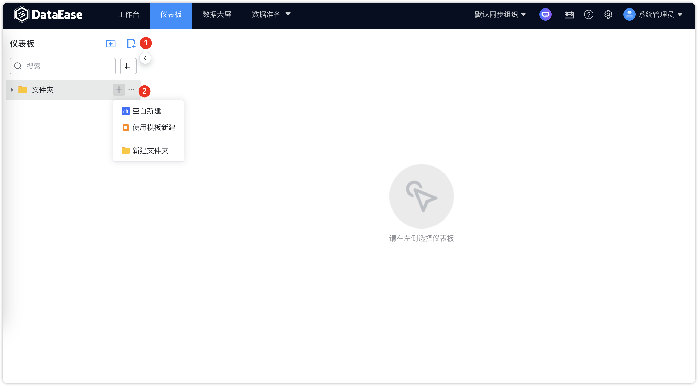
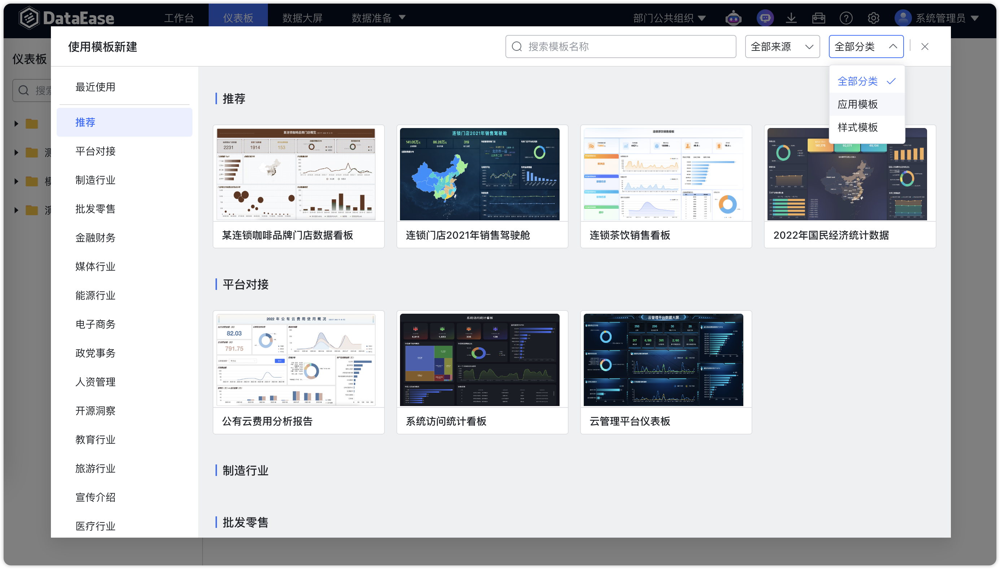
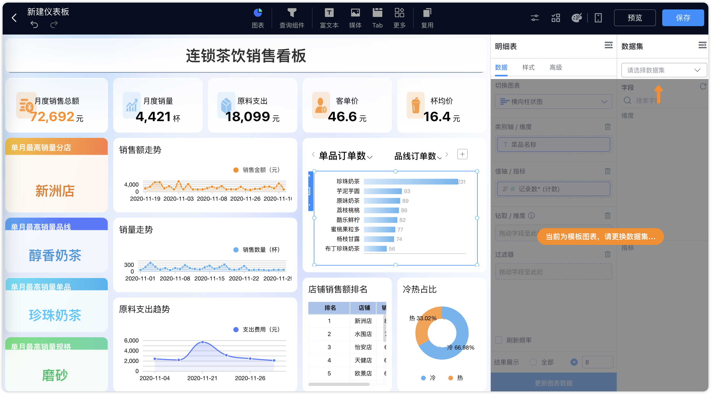

## 1 自定义仪表板

!!! Abstract ""
	点击【序号 1】 、【序号 2】位置新建仪表板，根据下图所示操作，在目录下新建仪表板；

{ width="900px" }  

## 2 复制仪表板

!!! Abstract ""
	按下图所示，选择对应的仪表板进行复制，保存复制的仪表板。

{ width="900px" }  
{ width="900px" }

## 3 使用模板创建

!!! Abstract ""
	按下图所示，选择对应模板，点击进行应用创建仪表板。
	注意：模板图表需要更换为自己的数据集。

{ width="900px" }  
{ width="900px" }

