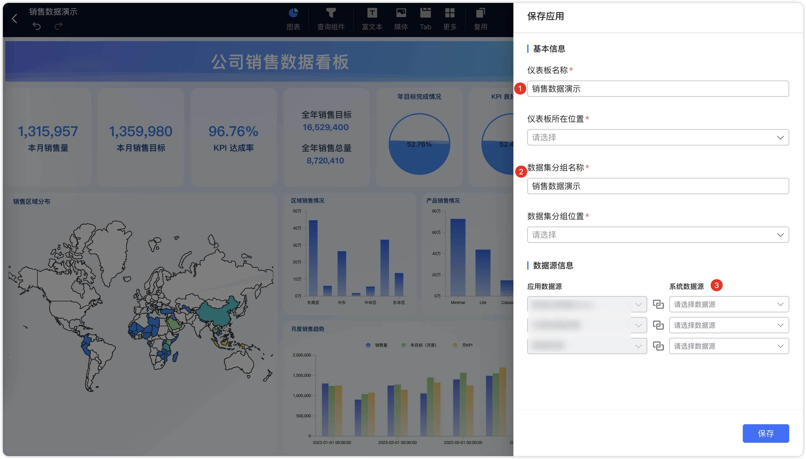

## 1 自定义仪表板

!!! Abstract ""
	点击【序号 1】 、【序号 2】位置新建仪表板，根据下图所示操作，在目录下新建仪表板；

{ width="900px" }  

## 2 复制仪表板

!!! Abstract ""
	按下图所示，选择对应的仪表板进行复制，保存复制的仪表板。

{ width="900px" }  

{ width="900px" }

## 3 使用模板创建

!!! Abstract ""
	按下图所示，选择对应模板，点击进行应用创建仪表板。  
	**注意：**

	- 样式模板提供模板样式不附带数据，模板图表需要更换为自己的数据集。
	- 应用模板提供和数据源相关配置项，自动生成和创建应用所对应的数据集的资源。。

{ width="900px" }  

!!! Abstract ""
	样式模板图表需要更换为自己的数据集。

{ width="900px" }

!!! Abstract ""
	使用应用创建的资源，会自动弹出相关配置项，需要用户进一步填写。

{ width="900px" }

