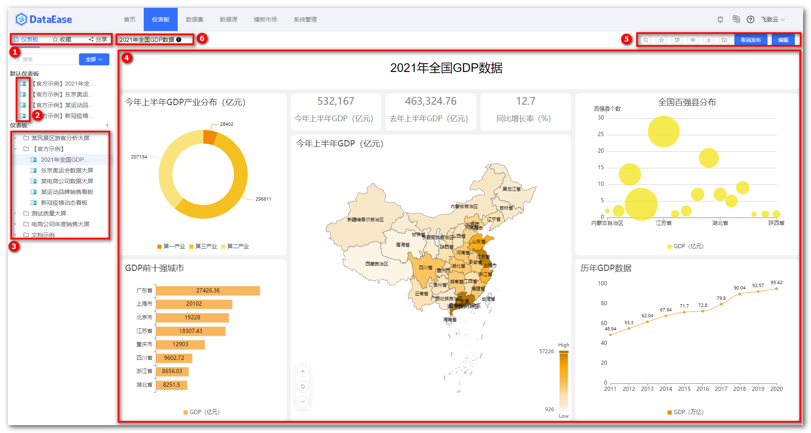

## 1 仪表板概述

!!! Abstract ""
	选择【仪表板】菜单，进入仪表板功能模块。此模块支持仪表板的添加、编辑、重命名、预览、查看等，仪表板制作完成后，还可支持仪表板的收藏、分享、下载等等。

## 2 界面功能区

!!! Abstract ""
	如下图所示：

	- 【序号 1】查看仪表板，仪表板收藏和分享情况；
	- 【序号 2】移动端标识，具有移动端布局的仪表板增加标识，表示该仪表板存在移动端的布局；
	- 【序号 3】点击【仪表板】，切换到仪表板目录区，已创建好的仪表板放到此区域目录下；
	- 【序号 4】仪表板预览区，从仪表板目录区选择仪表板，在此区域预览；
	- 【序号 5】仪表板操作区，可对仪表板刷新、收藏、预览、导出为 PDF、导出为模板、导出为图片、导出为应用、保存为系统模板、设置仪表板发布功能、编辑；
	- 【序号 6】查看仪表板信息，在仪表板预览界面点击此感叹号，仪表板信息则弹出提示。

{ width="900px" }
