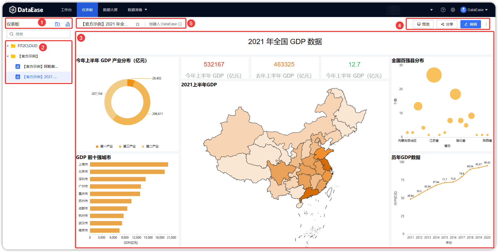

## 1 仪表板概述

!!! Abstract ""
	选择【仪表板】菜单，进入仪表板功能模块。此模块支持仪表板的添加、编辑、重命名、预览、查看等，仪表板制作完成后，还可支持仪表板的收藏、分享、下载等等。

## 2 界面功能区

!!! Abstract ""
	如下图所示：

	- 【序号 1】创建仪表板和文件夹；
	- 【序号 2】已创建好的仪表板放到此区域目录下，可对仪表板进行编辑、复制、分享、移动、重命名、删除；
	- 【序号 3】仪表板预览区，从仪表板目录区选择仪表板，在此区域预览；
	- 【序号 4】仪表板操作区，可对仪表板分享、预览、数据刷新、导出为 PDF 和图片；
	- 【序号 5】查看仪表板信息，在仪表板预览界面点击此感叹号，仪表板信息则弹出提示。

{ width="900px" }
