## 功能概述
> 选择【仪表盘】菜单，进入仪表板功能模块。此模块支持仪表盘的添加、编辑、重命名、预览、查看等，仪表板制作完成后，还可支持仪表盘的收藏、分享、下载等等。

## 1 仪表盘新建
### 1.1 开始创建仪表盘
> 点击【新建仪表盘】，根据下图所示操作，在【demo】目录下新建仪表盘。

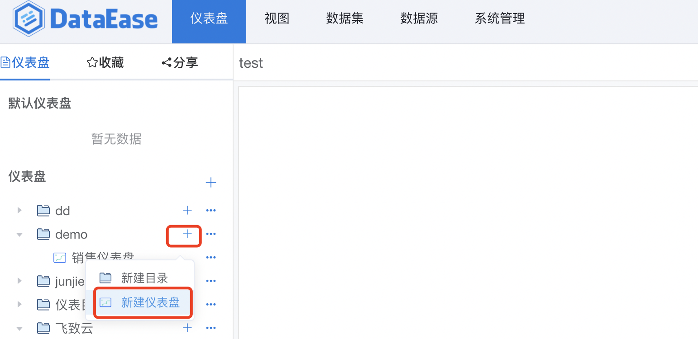
### 1.2 创建仪表盘
> 共三种模版（自定义、导入模版、复用模版），选择模版后，输入仪表盘名称，点击【确定】，仪表盘即创建成功。
#### 1.2.1 自定义
> 自定义模版，即按照下图所示，新建空白仪表盘。

#### 1.2.2 导入模版
> 导入模版，按下图所示，上传之前下载至本地的模板。

#### 1.2.3 复用模版
> 复用模版，按下图所示，选择系统内保存的模板，新建仪表盘。

## 2 仪表盘编辑
### 2.1 开始编辑仪表盘
> 按照下图所示操作，点击【编辑】，进入仪表盘编辑页面，进行视图和组件的各种组合，设计需要的仪表盘看板。

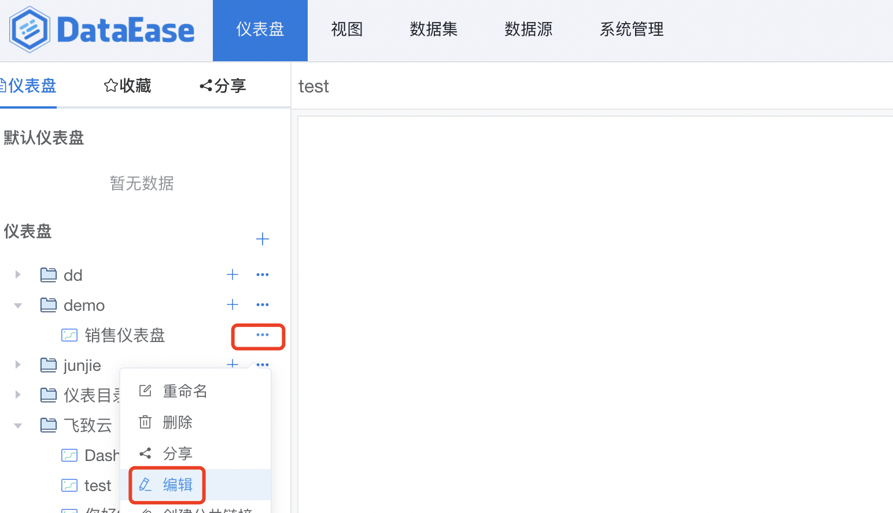
### 2.2 添加视图
> 点击左侧【视图】，弹出视图选择框，可拖拉视图至仪表盘的画板中，仪表盘中即添加此视图。

### 2.3 添加组件
#### 2.3.1 添加组件
> 点击左侧【组件】，弹出组件选择框，可拖拉组件至仪表盘的画板中，弹出组件编辑框。

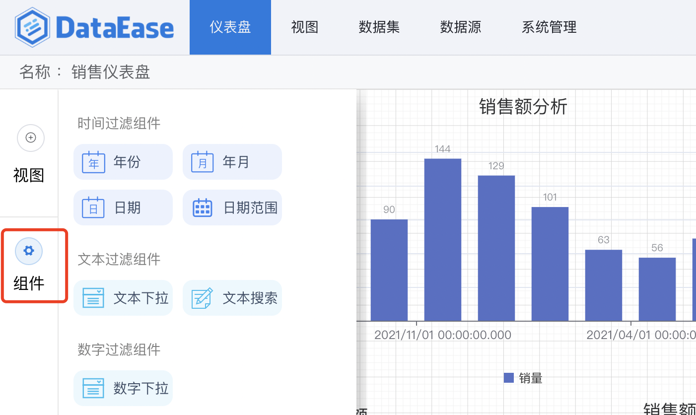
#### 2.3.1 编辑组件
> 可选择【按表选择】，或者【按组件选择】，如下图所示，页面左侧列出可选择的组件列表，拖拉所需字段至【字段】，作为过滤条件的值。

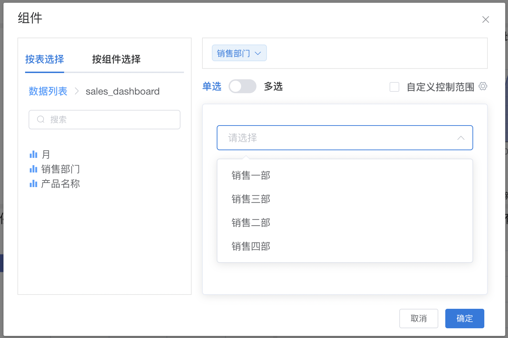
### 2.4 仪表盘设计
#### 2.4.1 仪表盘样式设计
> 在仪表盘画板中，如下图右上角所示，不仅可以调整仪表盘画布的大小、画布比例，还可以调整仪表盘的样式、上传图片、清空画布、保存、预览等

#### 2.4.1 视图或组件基础功能
> 在仪表盘设计窗口，视图或者组件的基本操作如下图所示： 序号1：编辑，点击进行视图或者组件的编辑窗口 序号2：复制，点击对视图或者组件进行复制 序号3：粘贴，点击进行视图或者组件的粘贴 序号4：编辑，点击进行视图或者组件的剪切 序号5：删除，删除视图或者组件 序号6：锁定，锁定后的视图或者组件，不可编辑或者删除等，如果需要编辑，须先解锁 序号7：置顶，画布中组件或者视图可以多层叠放，置顶后位于最顶层 序号8：置底，画布中组件或者视图可以多层叠放，置底后位于最底层 序号9：上移，画布中组件或者视图可以多层叠放，点击【上移】，层级上移一层 序号10：下移，画布中组件或者视图可以多层叠放，点击【下移】，层级下移一层

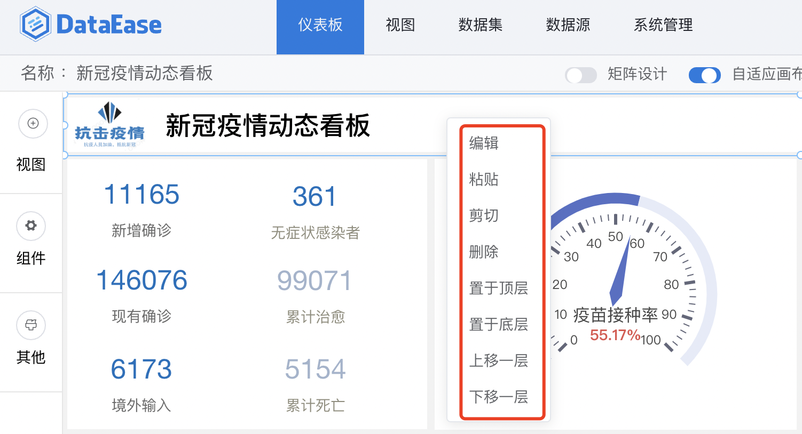
## 3 仪表盘的使用
### 3.1 仪表盘-查看
> 点击下图中所示位置，查看仪表盘

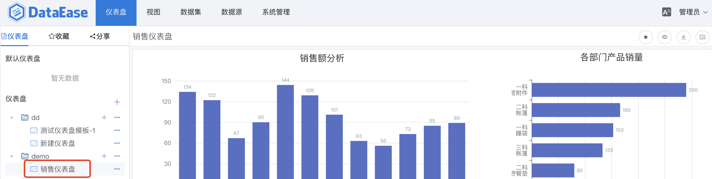
### 3.2 仪表盘-预览
> 点击下图中所示位置，全屏预览仪表盘

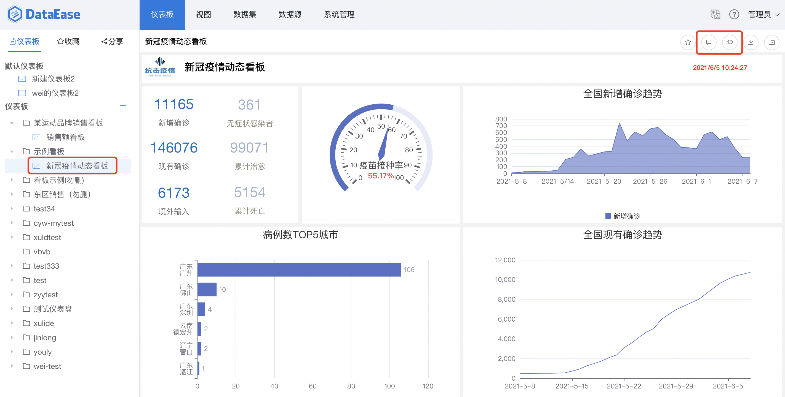
### 3.3 仪表盘-分享
> 点击下图中所示位置，点击【分享】。

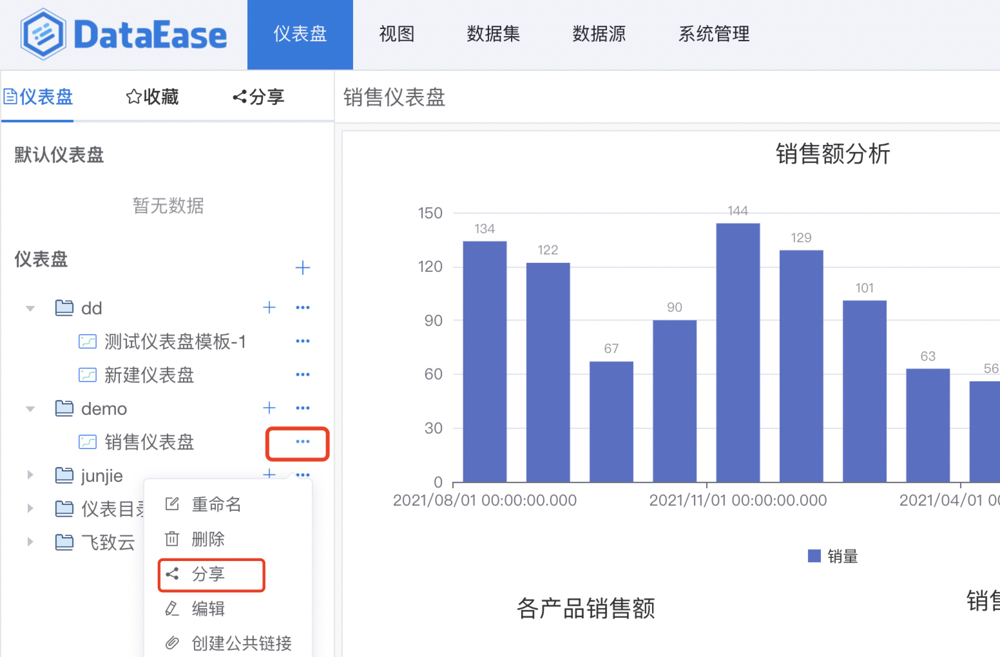
> 分享仪表盘给系统内的组织、角色、或者用户。
>
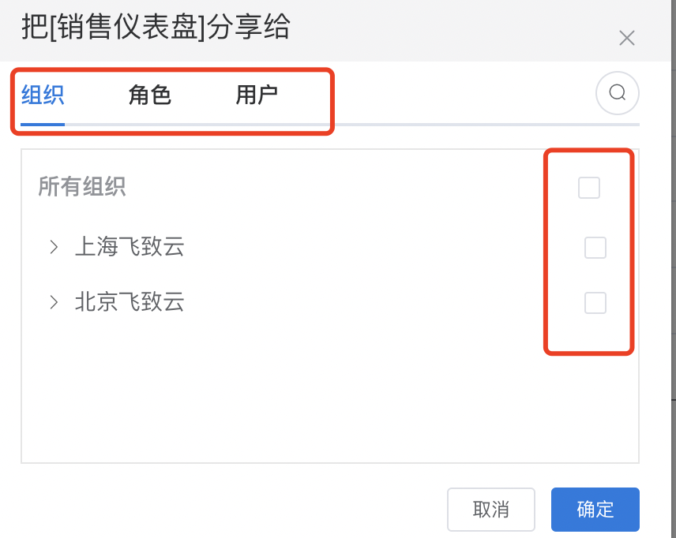
### 3.4 仪表盘-收藏
> 点击下图中所示位置，收藏仪表盘。

> 收藏后，可在下图所示位置查看收藏列表。

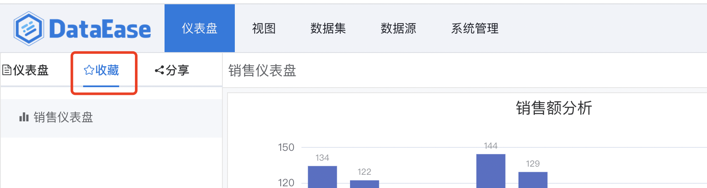
### 3.5 仪表盘-导出为模版
> 点击下图中所示位置，导出模板到本地，可在本地的下载目录中查看，亦可用此模板创建仪表盘。

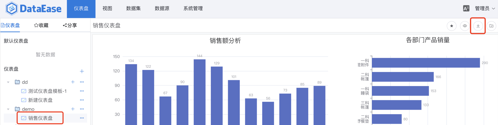
### 3.6 仪表盘-保存为模版
> 点击下图中所示位置，保存为模板，在创建仪表盘时使用。

### 3.7 仪表盘-创建公共链接
> 点击下图中所示位置，创建公共链接

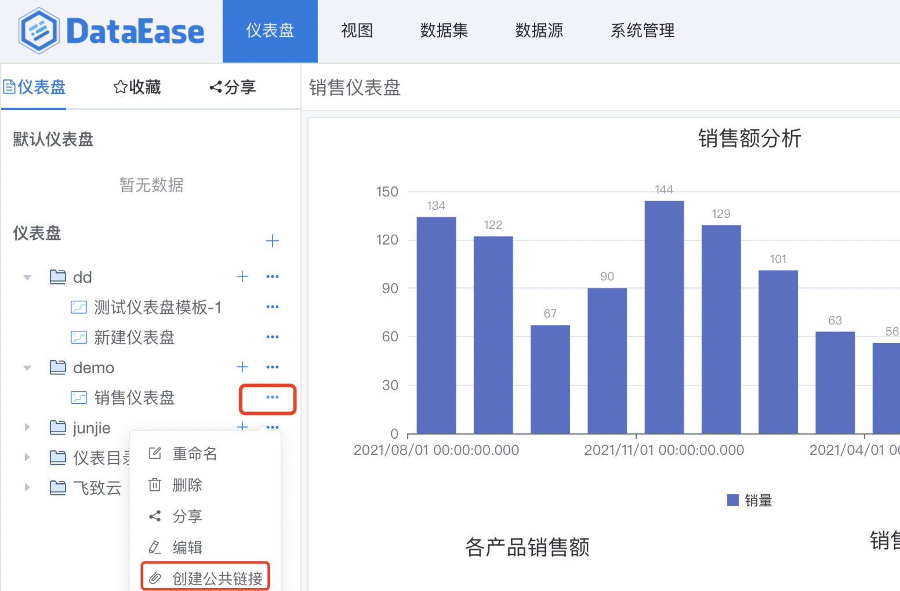
> 打开下图中所示链接分享的按钮，链接自动生成，点击【复制链接】，可把链接分享给任何组织或个人。

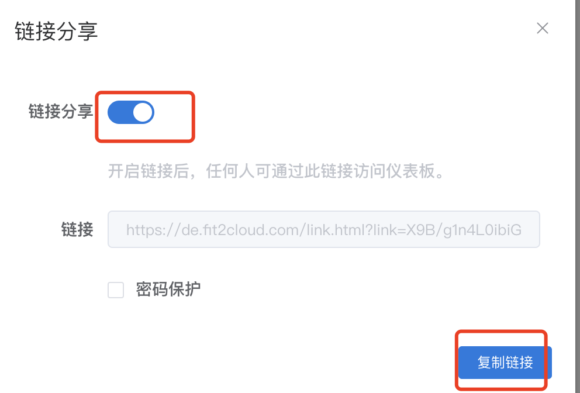

