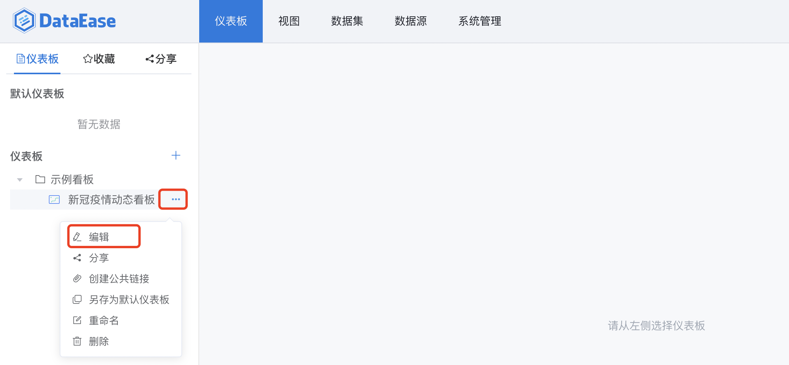
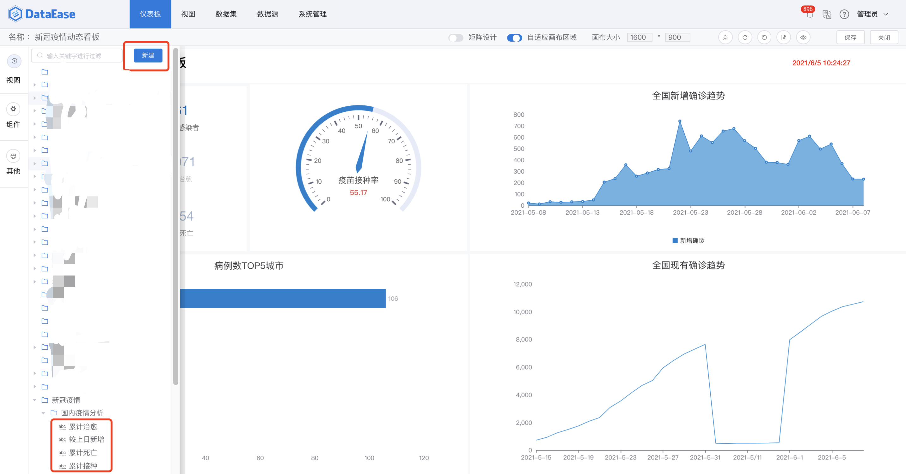
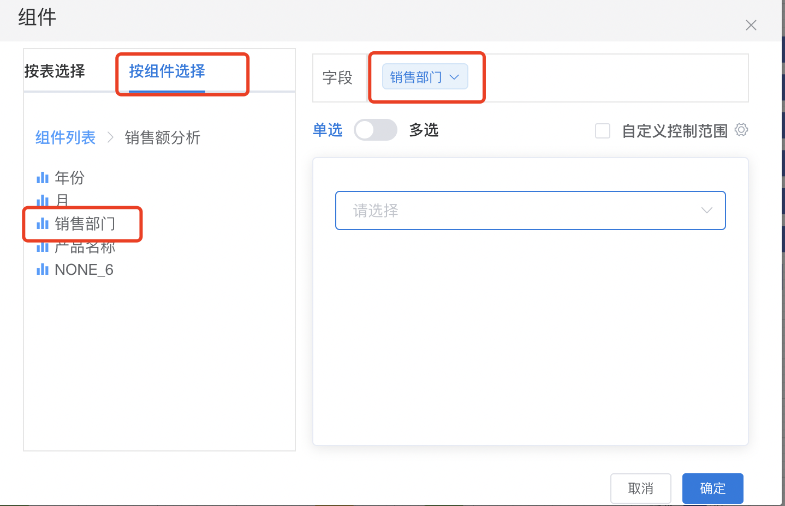
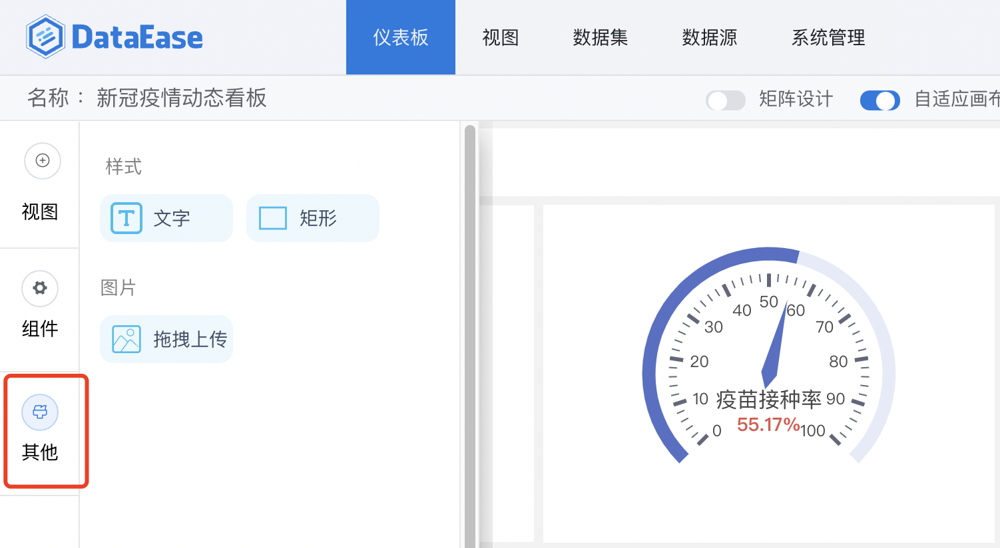
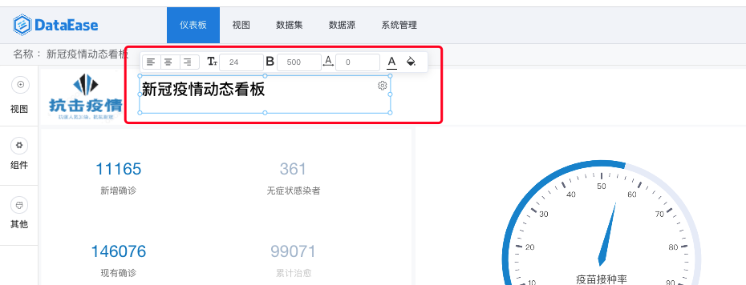
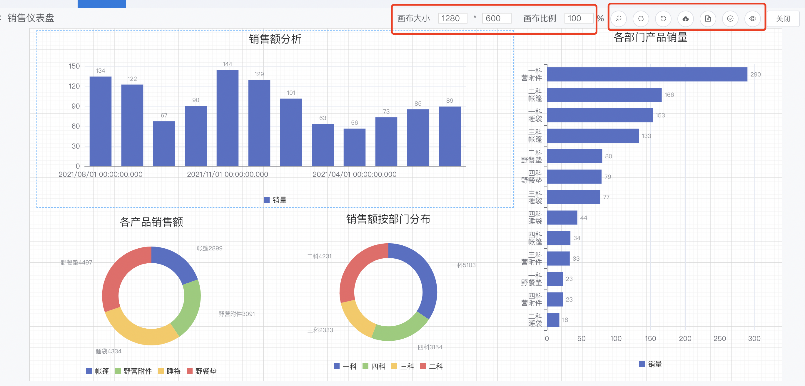
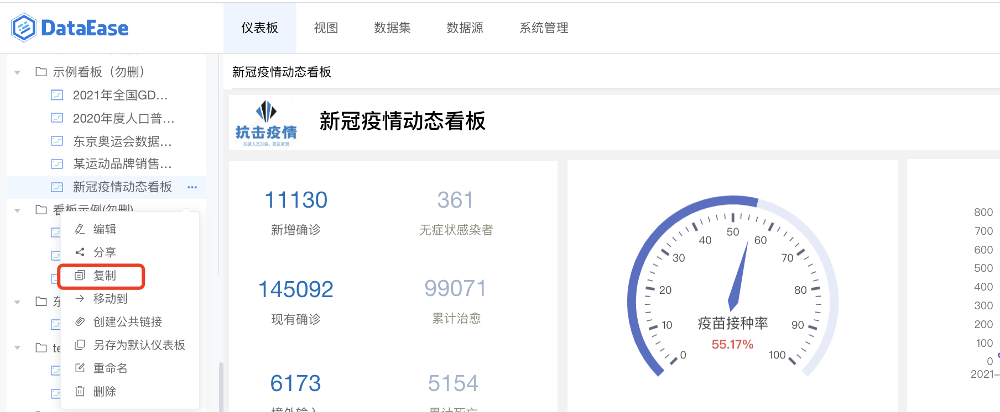

## 功能概述
> 选择【仪表板】菜单，进入仪表板功能模块。此模块支持仪表板的添加、编辑、重命名、预览、查看等，仪表板制作完成后，还可支持仪表板的收藏、分享、下载等等。

## 1 仪表板新建
### 1.1 开始创建仪表板
> 点击【新建仪表板】，根据下图所示操作，在目录下新建仪表板。

### 1.2 创建仪表板
> 支持两种模版（自定义模板、复用模版），选择模版后，输入仪表板名称，点击【确定】，仪表板即创建成功。

#### 1.2.1 自定义
> 自定义模版，即按照下图所示，新建空白仪表板。

#### 1.2.2 复用模版
> 复用模版，按下图所示，选择系统内保存的模板，新建仪表板。

## 2 仪表板编辑
### 2.1 开始编辑仪表板
> 按照下图所示操作，点击【编辑】，进入仪表板编辑页面，进行视图和组件的各种组合，设计需要的仪表板看板。

### 2.2 添加视图
> 点击左侧【视图】，弹出视图选择框,可通过以下两种方式添加视图： 1、新建视图 2、选择已有视图

### 2.3 添加组件
#### 2.3.1 添加组件
> 点击左侧【组件】，弹出组件选择框，可拖拉组件至仪表板的画板中，弹出组件编辑框。

#### 2.3.2 编辑组件
> 可选择【按表选择】，或者【按组件选择】，如下图所示，页面左侧列出可选择的组件列表，拖拉所需字段至【字段】，作为过滤条件的值。

### 2.4 添加其他组件
#### 2.4.1 添加其他组件
> 点击左侧【其他】，弹出其他组件选择框，可拖拉组件至仪表盘的画板中。

#### 2.4.2 编辑组件
> 可编辑组件，设置文本的大小、颜色、粗细、背景色等，

### 2.5 仪表盘设计
#### 2.5.1 仪表盘样式设计
> 在仪表盘画板中，如下图右上角所示，不仅可以调整仪表盘画布的大小、画布比例，还可以调整仪表盘的样式、清空画布、保存、预览等

#### 2.5.2 视图或组件基础功能
> 在仪表盘设计窗口，点击视图或者组件的右上角，展开功能操作菜单，如下图所示： 序号1：编辑，点击进行视图或者组件的编辑窗口 序号2：复制，点击进行视图或者组件的复制 序号3：删除，删除视图或者组件 序号4：置顶，画布中组件或者视图可以多层叠放，置顶后位于最顶层 序号5：置底，画布中组件或者视图可以多层叠放，置底后位于最底层 序号6：上移，画布中组件或者视图可以多层叠放，点击【上移】，层级上移一层 序号7：下移，画布中组件或者视图可以多层叠放，点击【下移】，层级下移一层 序号8：联动设置，对某个视图设置联动，使其他视图跟随其变动

### 2.6 视图联动
#### 2.6.1 联动设置
> 如下图，点击展开功能菜单，开始【联动设置】。

#### 2.6.2 设置联动字段
> 如下图，当设置两个视图联动时，设置相对应的数据集的联动字段。设置完成后，点击【确定】，联动设置完成。

#### 2.6.3 联动展示
> 第一步，点击【浙江省】，并选择【联动】。请注意：如果视图同时设置了联动和钻取，那么当点击时由用户选择执行联动，或者钻取；当只设置了联动时，默认执行联动；当只设置了钻取时，默认执行钻取。

> 第二步，联动结果展示，如下图，设置了联动的视图，只展示浙江省的数据。

> 第三步，可点击下图所示位置，清除局部联动和所有联动。

## 3 仪表板的使用
### 3.1 仪表板-查看
> 点击下图中所示位置，查看仪表板

### 3.2 仪表板-预览
> 支持两种预览方式，第一种：新打开页面预览，第二种：全屏预览仪表盘

> 预览模式下，视图可放大，可查看明细并下载

### 3.3 仪表板-分享
> 点击下图中所示位置，点击【分享】。

> 分享仪表板给系统内的组织、角色、或者用户。

> 可在下图所示位置，查看其它组织或用户分享给自己的仪表板。

### 3.4 仪表板-收藏
> 点击下图中所示位置，收藏仪表板。

> 收藏后，可在下图所示位置查看收藏列表。

### 3.5 仪表板-导出为模版
> 点击下图中所示位置，导出模板到本地，可在本地的下载目录中查看，亦可用此模板创建仪表板。

### 3.6 仪表板-保存为模版
> 点击下图中所示位置，保存为模板，在创建仪表板时使用。

### 3.7 仪表板-创建公共链接
> 点击下图中所示位置，创建公共链接

> 打开下图中所示链接分享的按钮，链接自动生成，点击【复制链接】，可把链接分享给任何组织或个人。

### 3.8 仪表板-复制
> 点击下图所示【复制】，在当前目录下创建一个一样的仪表板。

### 3.9 仪表板-移动
> 使用方式，请查阅通用功能 [「移动」](../general/#_4)
### 3.10 仪表板-导出pdf
> 点击下图中所示位置，点击可弹出pdf的预览窗口

> 预览导出的pdf样式，另外还支持带参数下载，比如：仪表板名称、导出时间、导出人等。点击【导出pdf】，下载pdf文件至本地；点击【取消】，取消下载pdf文件。

