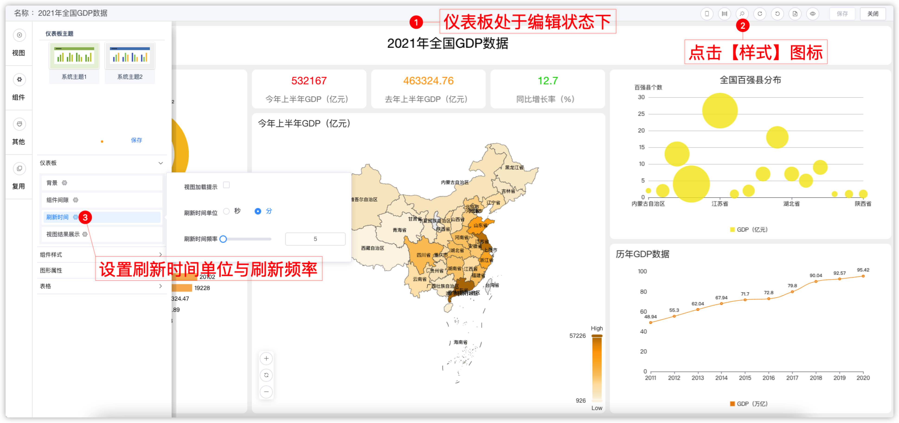
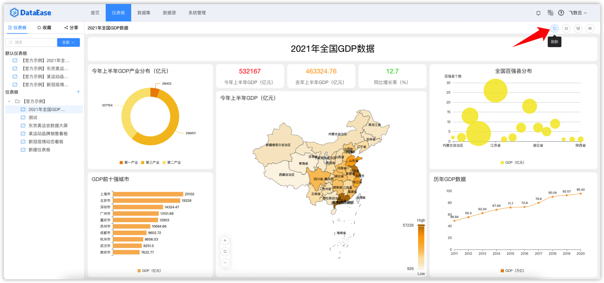

## 1 查看

!!! Abstract ""
	点击下图中所示位置，查看仪表板。

{ width="900px" }

## 2 分享

!!! Abstract ""
	点击下图中所示位置，点击【分享】。

{ width="900px" }

!!! Abstract ""
	可在下图所示的位置，选择分享的组织、角色或用户。

{ width="900px" }

!!! Abstract ""
	可在下图所示位置：

	1.查看其它组织或用户分享给自己的仪表板；  
	2.我分享给其他组织、角色、用户的仪表板，并支持编辑（添加、删除）分享对象、甚至一键取消分享。

{ width="900px" }

## 3 创建公共链接

!!! Abstract ""
	点击下图中所示位置，创建公共链接。

{ width="900px" }

!!! Abstract ""
	打开下图中所示链接分享的按钮，链接自动生成，点击【复制链接】，可把链接分享给任何组织或个人。  
	**分享链接可设置有效期及密码保护。**

{ width="900px" }

!!! Abstract ""
	公共连接支持第三方系统参数，具体设置可参考【仪表板基础功能】的【外部参数设置】说明。

{ width="900px" }

## 4 保存为模板

!!! Abstract ""
	点击下图中所示位置，保存为模板，在创建仪表板时使用。

{ width="900px" }

!!! Abstract ""
	若保存模板时提示"请选择所属类别"，请用户在模板管理自行添加新的模板分类。

{ width="900px" }

## 5 导出为模板

!!! Abstract ""
	点击下图中所示位置，导出模板到本地，可在本地的下载目录中查看，亦可用此模板创建仪表板。

{ width="900px" }

## 6 导出为 PDF

!!! Abstract ""
	点击下图中所示位置，点击可弹出 pdf 的预览窗口。

{ width="900px" }

!!! Abstract ""
	预览导出的 pdf 样式，另外还支持带参数下载，比如：仪表板名称、导出时间、导出人等。点击【导出 pdf 】，下载 pdf 文件至本地；点击【取消】，取消下载 pdf 文件。

{ width="900px" }

## 7 预览

!!! Abstract ""
	支持两种预览方式，第一种：新打开页面预览，第二种：全屏预览仪表盘。

{ width="900px" }

## 8 查看明细

!!! Abstract ""
	预览模式下，视图可放大，可查看明细并下载。

{ width="900px" }

{ width="900px" }

## 9 收藏 

!!! Abstract ""
	点击下图中所示位置，收藏仪表板。

{ width="900px" }

!!! Abstract ""
	收藏后，可在下图所示位置查看收藏列表。

{ width="900px" }

## 10 刷新

!!! Abstract ""
	仪表板刷新提供手动与自动两种方式，其中自动刷新配置如下，完成配置后需保存仪表板进入预览界面查看效果。

{ width="900px" }

!!! Abstract ""
	同时，仪表板提供手动刷新按钮，用户需要时可自行点击进行刷新。

{ width="900px" }
