## 1 查看

!!! Abstract ""
	切换到仪表板模块时，系统会自动展示位于第一个的默认仪表板，用户可根据需要设定最关注的仪表板为默认的第一个仪表板；  
	默认仪表板栏支持置顶功能，进入仪表板页面后，若默认的仪表板栏存在仪表板，则显示第一个默认的仪表板；
	用户可通过置顶的功能调整默认显示的仪表板。

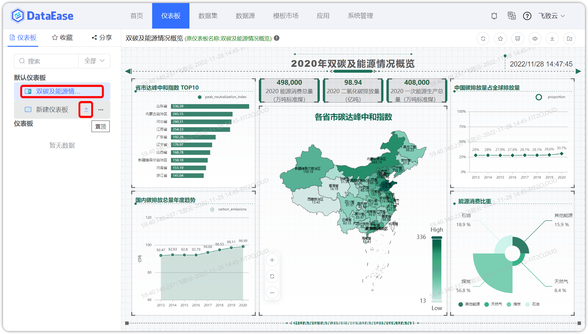{ width="900px" }

!!! Abstract ""
	点击下图中所示位置，查看仪表板。

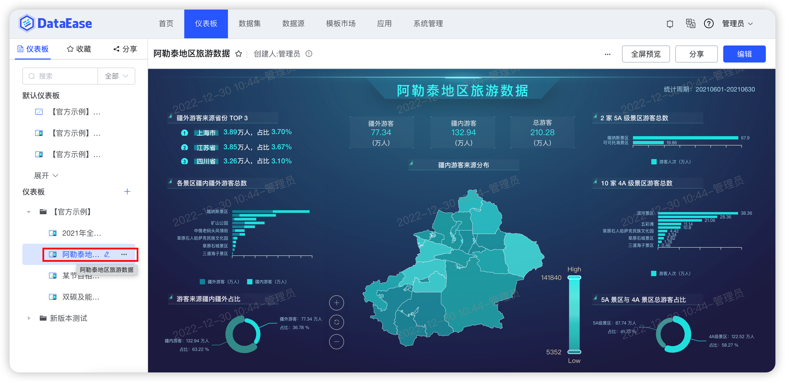{ width="900px" }

## 2 分享

!!! Abstract ""
	点击下图中所示位置，点击【分享】。

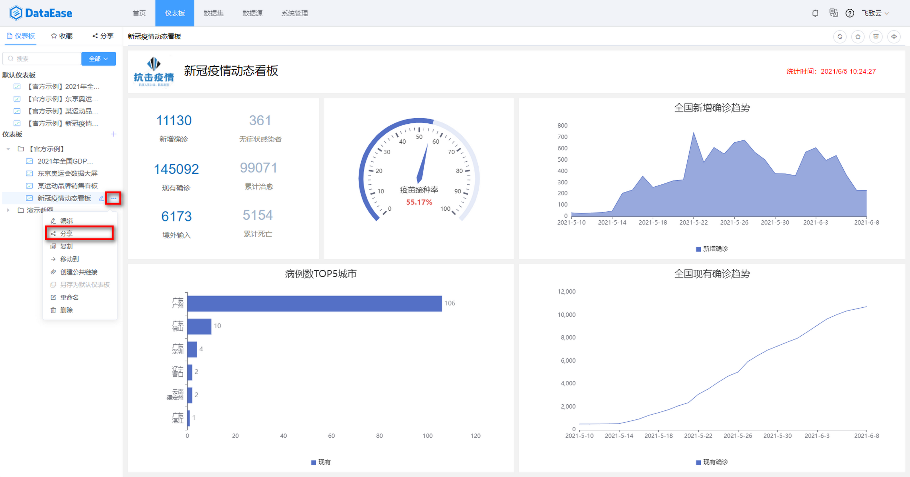{ width="900px" }

!!! Abstract ""
	可在下图所示的位置，选择分享的组织、角色或用户。

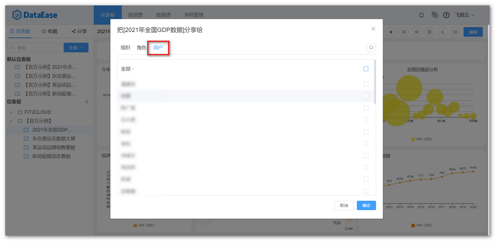{ width="900px" }

!!! Abstract ""
	可在下图所示位置：

	1.查看其它组织或用户分享给自己的仪表板；  
	2.我分享给其他组织、角色、用户的仪表板，并支持编辑（添加、删除）分享对象、甚至一键取消分享。

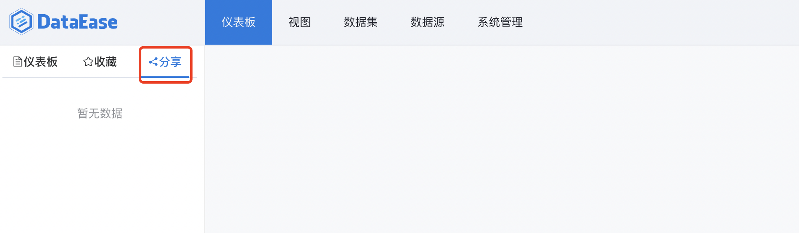{ width="900px" }

## 3 公共链接

### 3.1 创建公共链接

!!! Abstract ""
	点击下图中所示位置，创建公共链接。

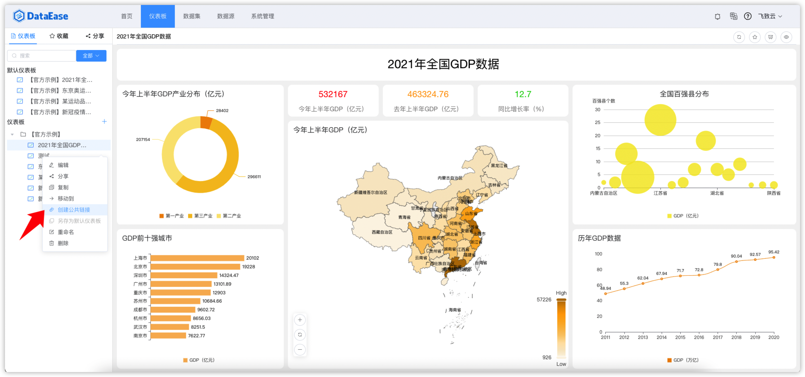{ width="900px" }

!!! Abstract ""
	打开下图中所示链接分享的按钮，链接自动生成，点击【复制链接】，可把链接分享给任何组织或个人。  
	**分享链接可设置有效期及密码保护。**

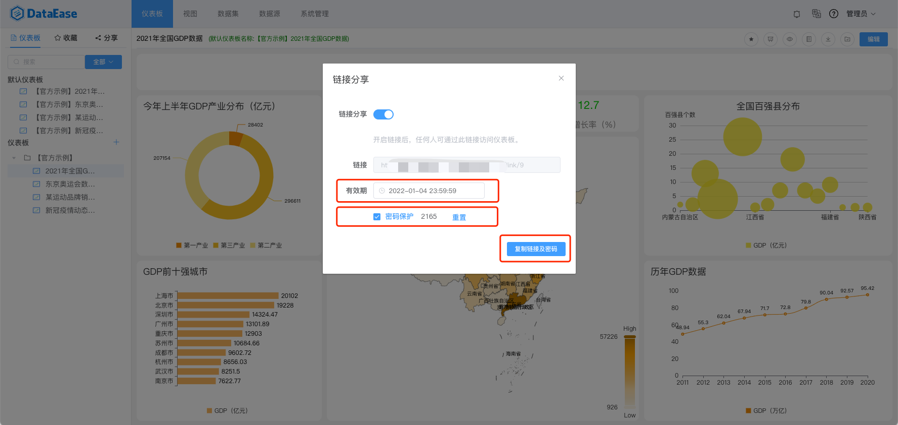{ width="900px" }

### 3.2 公共链接传参

!!! Abstract ""
	公共连接支持第三方系统参数，具体设置可参考【仪表板基础功能】的【外部参数设置】说明。

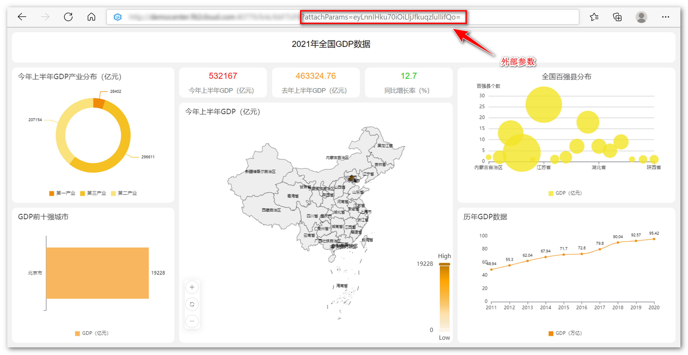{ width="900px" }

### 3.3 公共链接返回

!!! Abstract ""
	公共链接跳转后支持返回；  
	访问公共链接后，在页面的右上角的区域有一个较小的功能菜单区，当鼠标移动到右上角时，会出现功能菜单，包括返回上一级、清除所有联动（有联动的时候）、下载；  
	可以通过点击“返回上一级”以回到点击公共链接前的页面；  
	应用场景：使用公共链接做嵌入式，访问后需要返回原系统。

{ width="900px" }

### 3.4 公共链接导出 PDF 

!!! Abstract ""
	公共链接支持导出 PDF；  
	访问公共链接后，在页面的右上角的区域有一个较小的功能菜单区，当鼠标移动到右上角时，会出现功能菜单，包括返回上一级、清除所有联动（有联动的时候）、下载；  
	点击“下载”，则可在公共链接访问仪表板时导出该仪表板的 PDF。

{ width="900px" }

## 4 仪表板发布

!!! Abstract ""
	支持仪表板发布功能，仪表板在未发布的状态下，名称及图标呈现灰色，点击在预览界面的【发布】按钮，点击后未发布的仪表板即发布，同时按钮会变为【取消发布】。

	处于发布状态的仪表板，以下情况可以访问：

	- 被分享的用户
	- 仪表板公共链接
	- 有该仪表板使用及更多权限的用户

	处于取消发布状态的仪表板，以下情况可以访问：

	- 有该仪表板管理及更多权限的用户

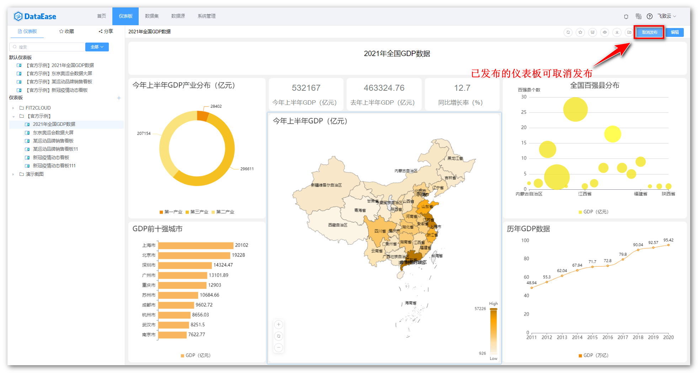{ width="900px" }

!!! Abstract ""
	点击【取消发布】则仪表板恢复到未发布状态，取消发布后的仪表板，没有访问权限的用户会看到仪表板显示为【已下架】。

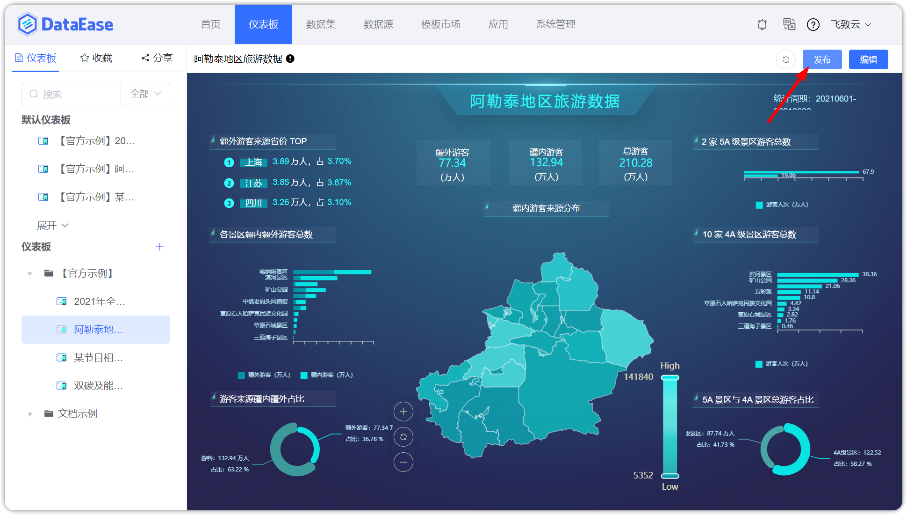{ width="900px" }

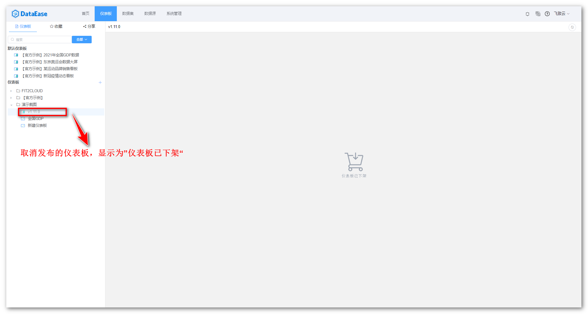{ width="900px" }

## 5 保存为模板

!!! Abstract ""
	点击下图中所示位置，保存为模板，在创建仪表板时使用。

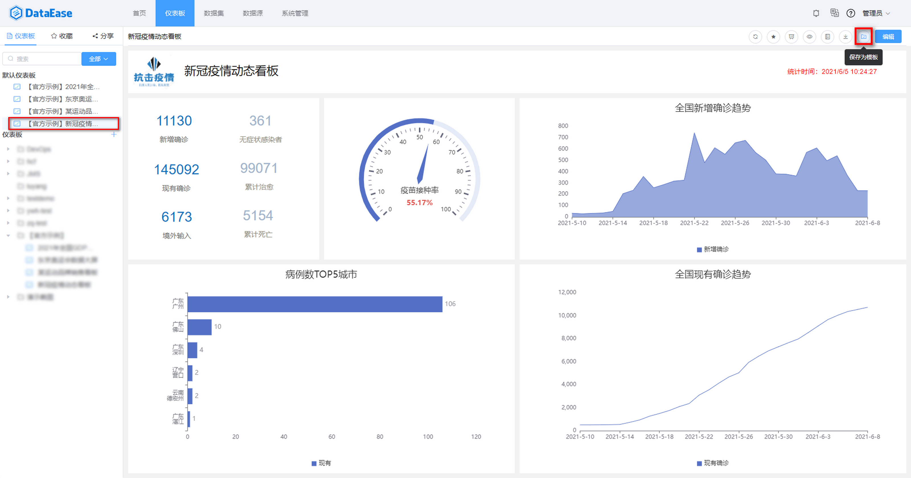{ width="900px" }

## 6 仪表板导出 
### 6.1 导出为模板

!!! Abstract ""
	点击下图中所示位置，导出模板到本地，可在本地的下载目录中查看，亦可用此模板创建仪表板。

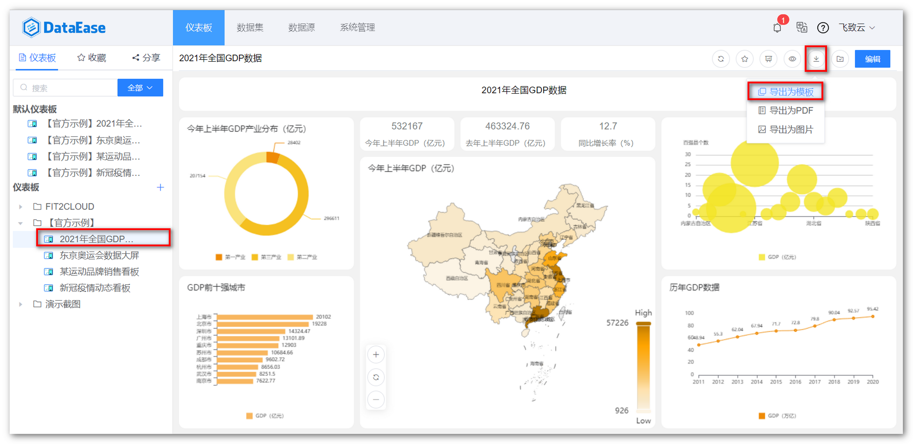{ width="900px" }

### 6.2 导出为 PDF

!!! Abstract ""
	点击下图中所示位置，点击可弹出 PDF 的预览窗口。

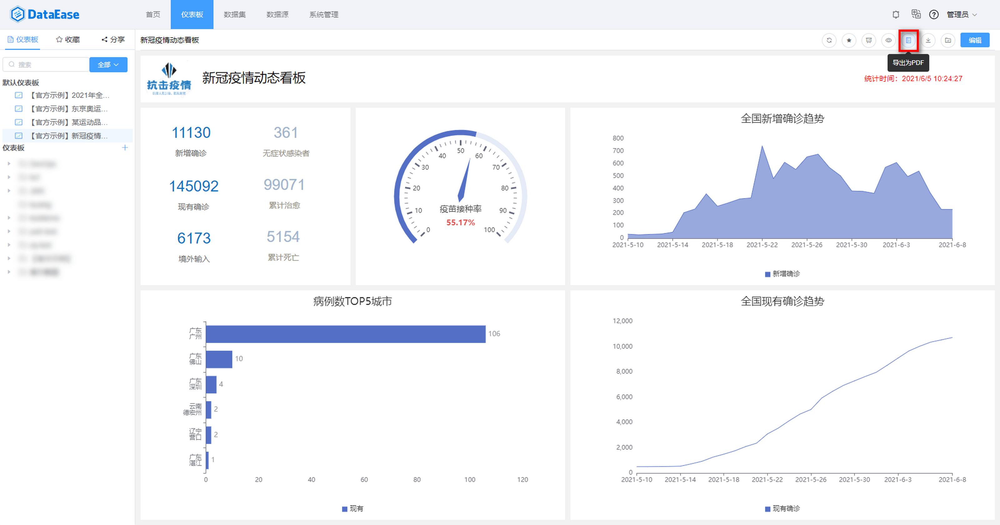{ width="900px" }

!!! Abstract ""
	预览导出的 PDF 样式，另外还支持带参数下载，比如：仪表板名称、导出时间、导出人等，点击【导出为 PDF 】，下载 PDF 文件至本地，点击【取消】，取消下载 PDF 文件。

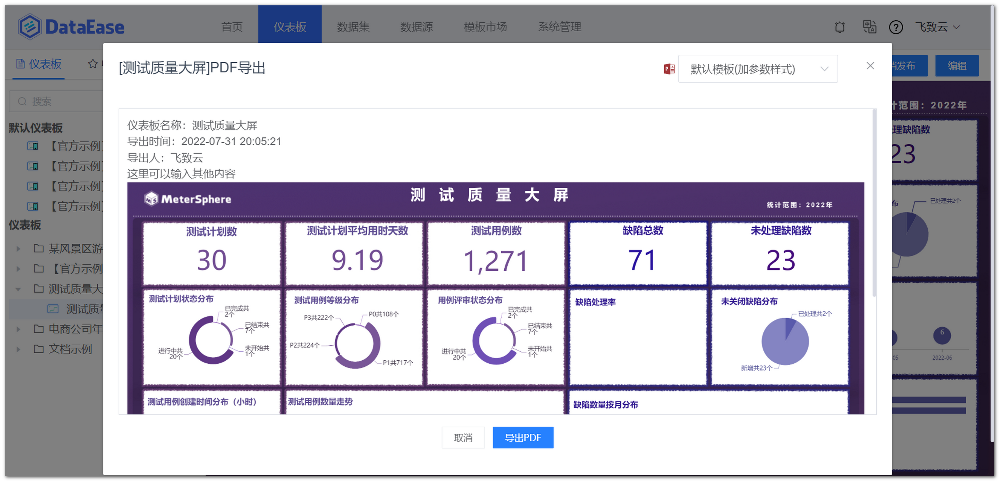{ width="900px" }

### 6.3 导出为图片

!!! Abstract ""
	仪表板支持导出图片，点击下图所示的位置，可导出图片。

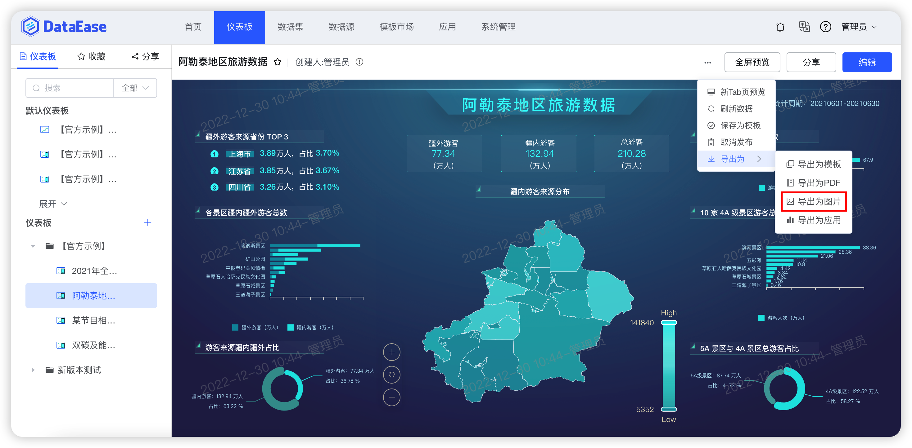{ width="900px" }

### 6.4 导出为应用

!!! Abstract ""
	支持将仪表板【导出为应用】，可将仪表板及其用到的数据集、数据源关联关系一并导出成一个应用文件，文件名称为：XXX-APP.DEAPP。

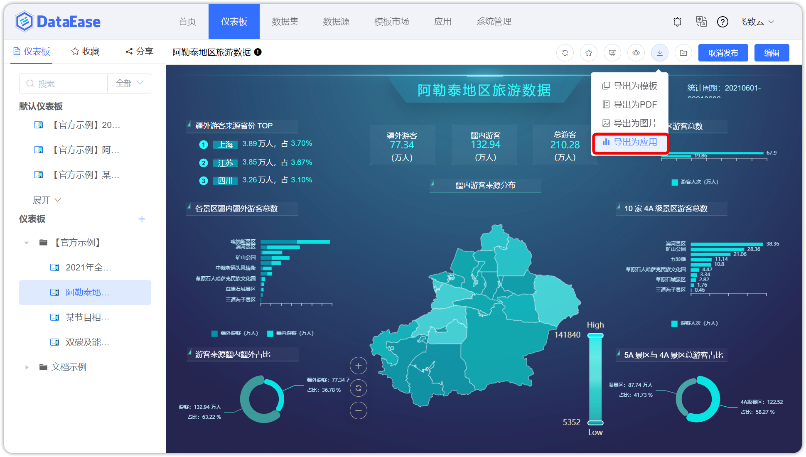{ width="900px" }

## 7 预览

!!! Abstract ""
	支持两种预览方式，第一种：新打开页面预览，第二种：全屏预览仪表盘。

{ width="900px" }

## 8 查看明细与放大

### 8.1 导出视图 Excel

!!! Abstract ""
	预览模式下，视图放大页面支持导出视图图片，查看视图明细页面支持导出视图图表数据。

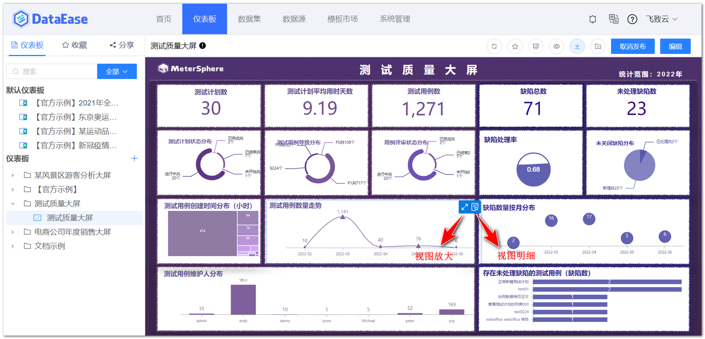{ width="900px" }

!!! Abstract ""
	视图明细效果，支持对视图进行 Excel 导出。

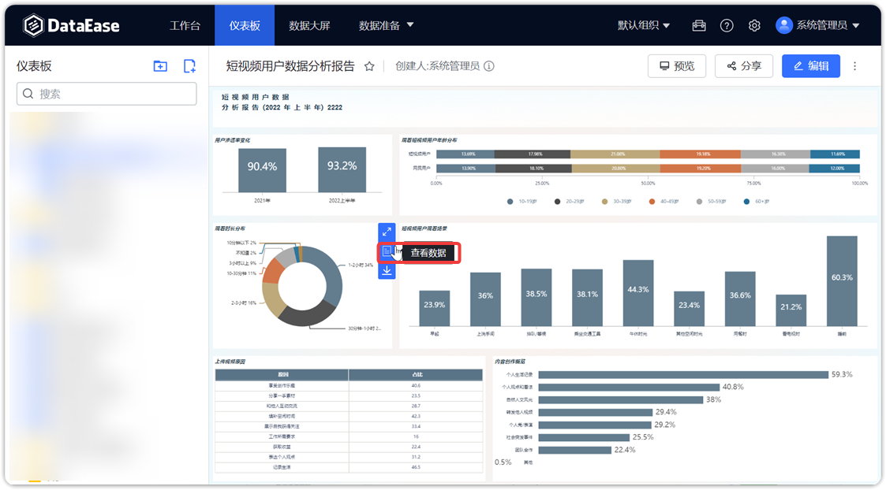{ width="900px" }  

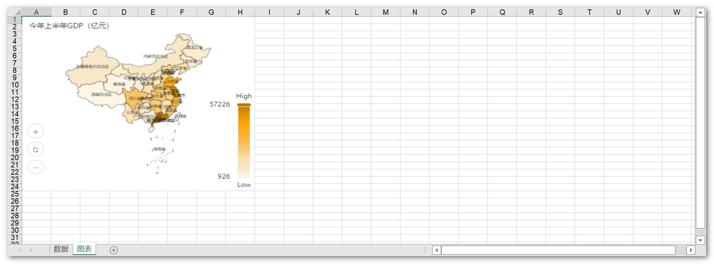{ width="900px" }

### 8.2 导出视图图片

!!! Abstract ""
	在视图放大效果下，支持导出视图图片。  
	**注意：** 表格类视图不支持，因为该视图本身形式就是表格，按 Excel 导出即可。

{ width="900px" }

## 9 收藏 

!!! Abstract ""
	点击下图中所示位置，收藏仪表板。

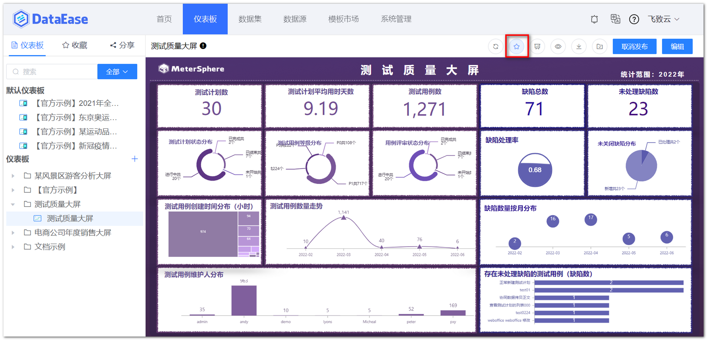{ width="900px" }

!!! Abstract ""
	收藏后，可在下图所示位置查看收藏列表。

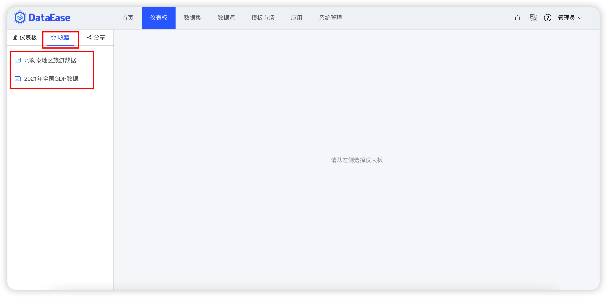{ width="900px" }

## 10 刷新

!!! Abstract ""
	仪表板刷新提供手动与自动两种方式，其中自动刷新配置如下，支持开关控制，可开启固定刷新功能，实时刷新数据，若当前仪表板一般长时间无数据更新，不需要固定刷新功能则可关闭此功能，完成配置后需保存仪表板进入预览界面查看效果。

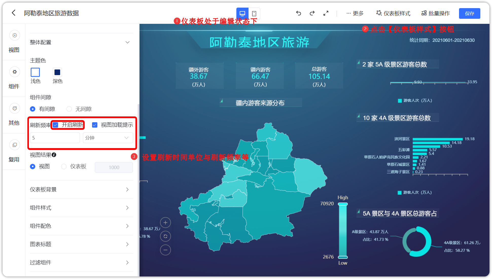{ width="900px" }

!!! Abstract ""
	同时，仪表板提供手动刷新按钮，用户需要时可自行点击进行刷新。

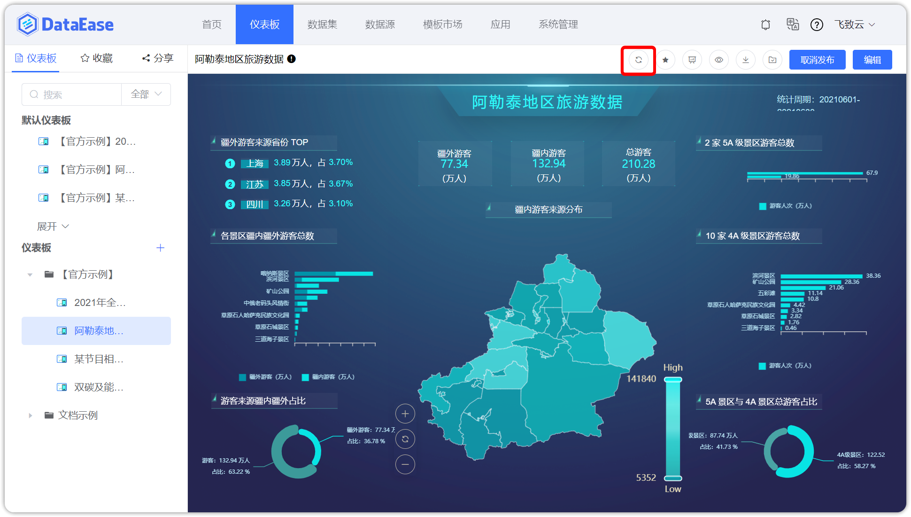{ width="900px" }

