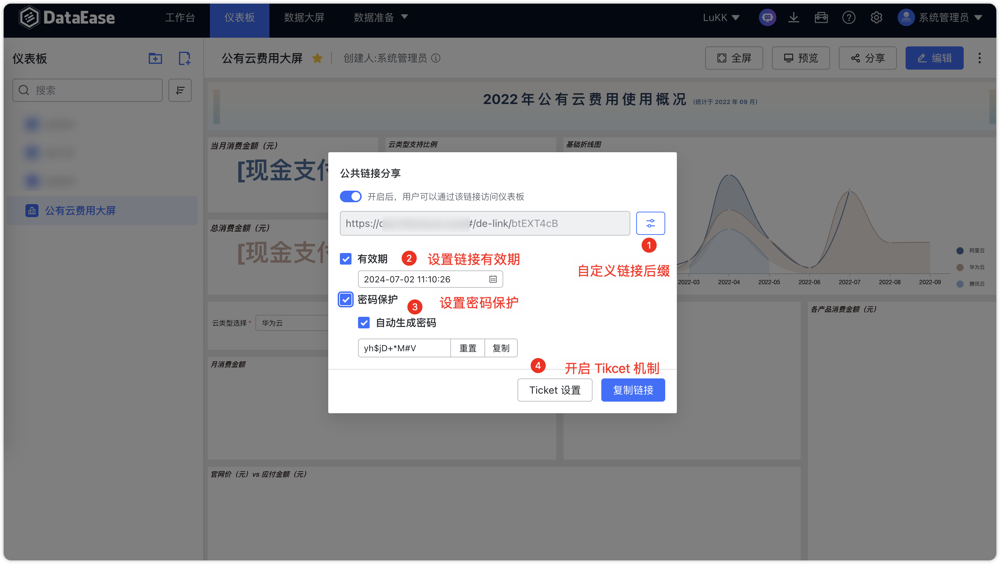
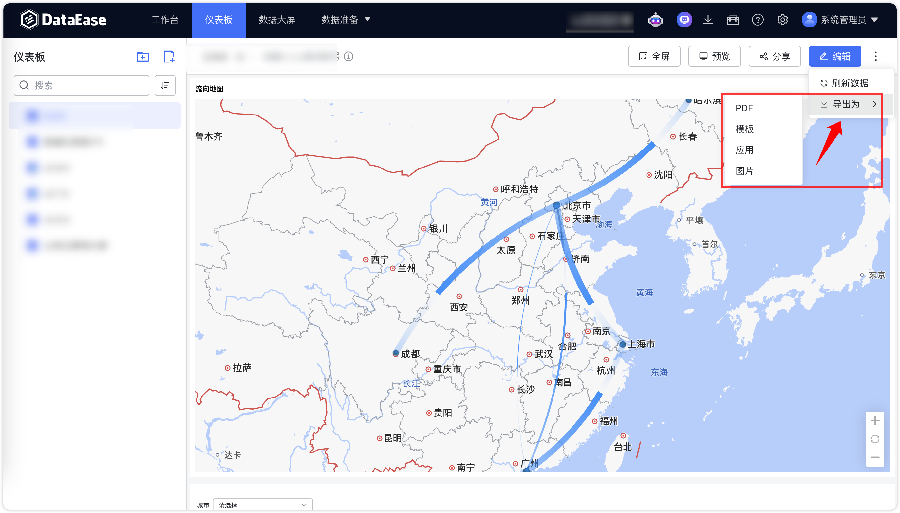
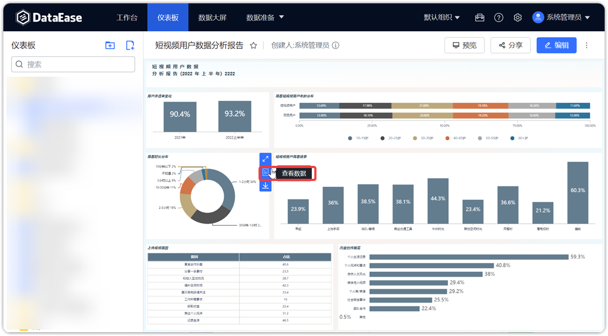
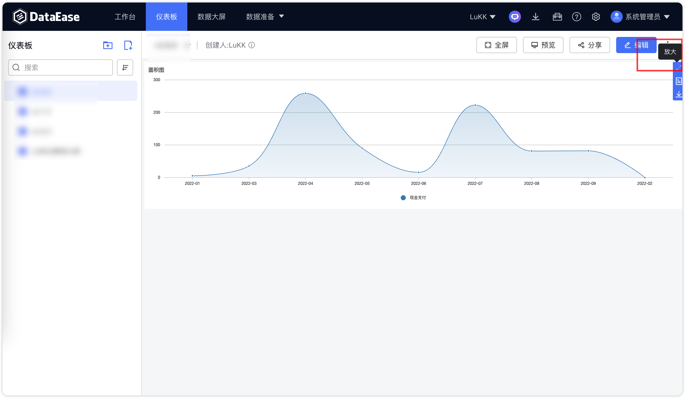

## 1 分享公共链接

!!! Abstract ""
	点击下图中所示位置，创建公共链接进行仪表板分享。

{ width="900px" }

{ width="900px" }

!!! Abstract ""
	打开下图中所示链接分享的按钮，链接自动生成，点击【复制链接】进行分享。  
	**分享链接可设置有效期及密码保护。**

{ width="900px" }

## 2 仪表板导出

!!! Abstract ""
	点击下图中所示位置，导出仪表板的模板、PDF、图片到本地，可在本地的下载目录中查看。

{ width="900px" }

## 3 仪表板预览

!!! Abstract ""
	支持两种预览方式，第一种：新打开页面预览，第二种：全屏预览仪表盘。

{ width="900px" }

## 4 查看明细与放大

### 4.1 导出视图 Excel

!!! Abstract ""
	预览模式下，视图放大页面支持导出视图图片，查看视图明细页面支持导出视图图表数据。

{ width="900px" }  

!!! Abstract ""
	视图明细效果，支持对视图进行 Excel 导出。
{ width="900px" }
{ width="900px" }

### 4.2 导出视图图片

!!! Abstract ""
	在视图放大效果下，支持导出视图图片。

{ width="900px" }
{ width="900px" }

## 5 仪表板刷新

!!! Abstract ""
	仪表板刷新提供手动与自动两种方式，其中自动刷新配置如下，支持开关控制，可开启固定刷新功能，实时刷新数据，若当前仪表板一般长时间无数据更新，不需要固定刷新功能则可关闭此功能，完成配置后需保存仪表板进入预览界面查看效果。

{ width="900px" }

!!! Abstract ""
	同时，仪表板提供手动刷新按钮，用户需要时可自行点击进行刷新。

{ width="900px" }

