## 功能概述

!!! Abstract ""
    点击【数据集】，进入数据集设计模块，为下一步数据分析或报表或视图制作进行相关的数据准备。目前支持的数据集创建方式有数据库数据集、SQL 数据集、Excel 数据集、自定义数据集四种，其中数据库数据集指直接选择数据库中某一表作为数据集，SQL 数据集可通过编写 SQL 语句后将其查询结果作为数据集，Excel 数据集指通过导入本地 Excel 数据文件生成数据集，自定义数据集可根据个人对字段的需求从现有数据集中灵活选择字段组成新的数据集。

## 数据集管理
### 1 数据集搜索

!!! Abstract ""
    可在数据集列表上方搜索框中输入查询文字，查询范围包括数据集列表中的分组名称及数据集名称。  
    搜索框右侧可切换选择只显示文件目录（分组），或显示全部。
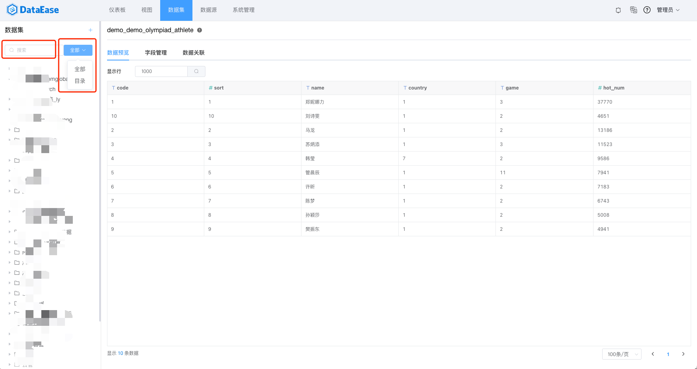

### 2 数据集分组

!!! Abstract ""
    数据集资源管理目录支持多级文件夹管理（呈树状分布），用户可按照实际使用方式设立不同维度的文件夹，从而有效对资源进行分组管理。其中【序号1】为创建根分组，【序号2】为创建子分组。
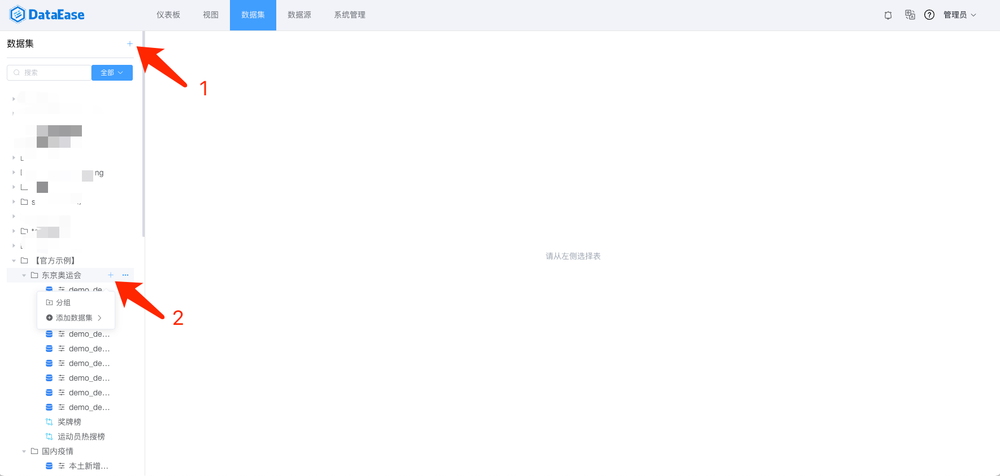

### 3 数据集移动

!!! Abstract ""
    可移动数据集到其它分组
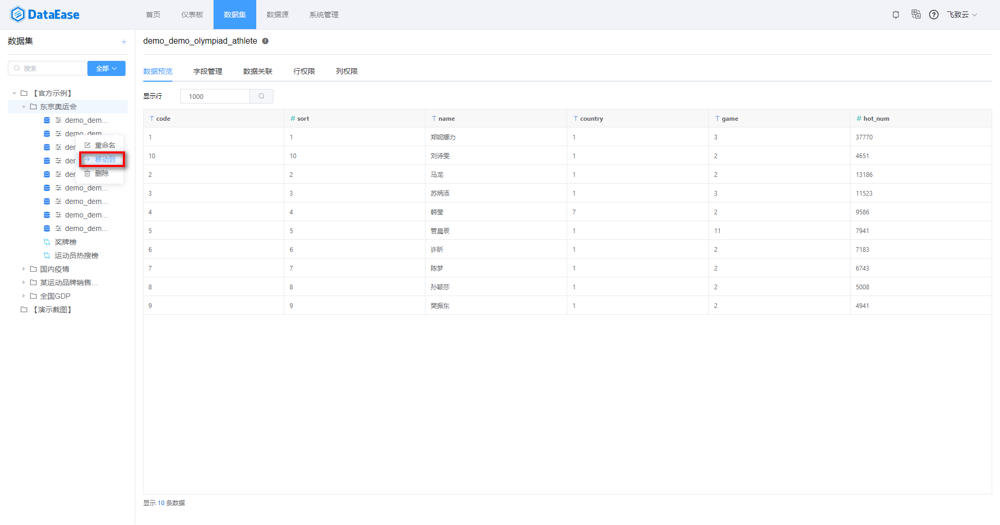

### 4 数据集删除
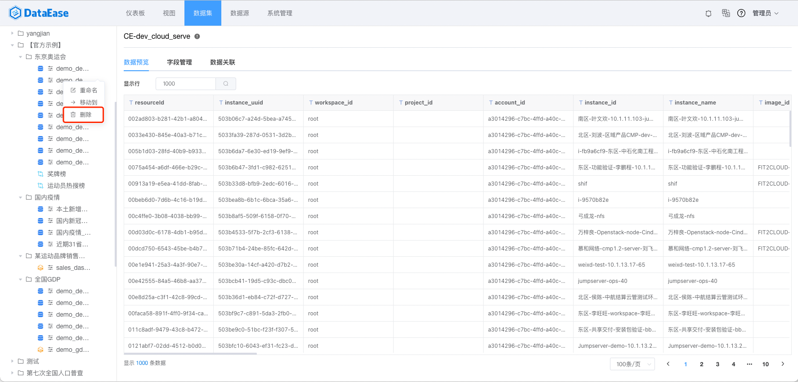

### 5 数据集重命名


## 添加数据集
### 1 添加【数据库数据集】

!!! Abstract ""
    如下图所示，点击【添加数据集】并选择【数据库数据集】，展开下拉框，选择数据源、数据源的连接方式、并勾选需要添加的数据库表。

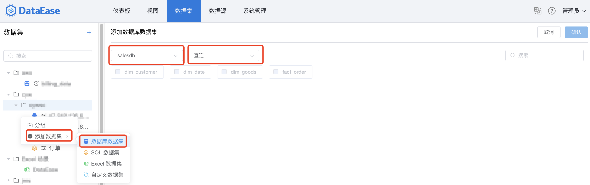

!!! Danger ""
    需注意两种连接方式的差异：  
    一、【直连】:直接访问底层数据源，数据始终是最新的;  
    二、【定时刷新】:可设置数据关联，以及通过定时任务或手动方式更新数据。

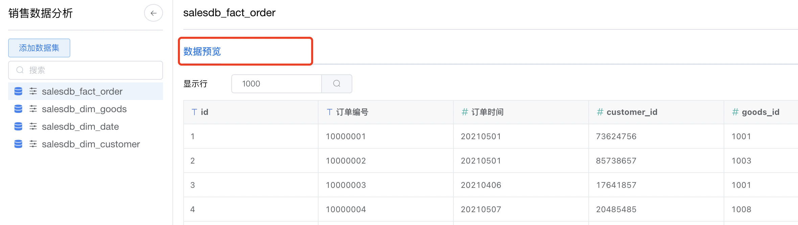


### 2 添加【SQL数据集】

!!! Abstract ""
    如下图所示，点击【添加数据集】并选择【SQL数据集】。支持丰富多样的 SQL 语法，如调用 CTE 临时表等。  
    【序号1】位置输入即将添加的数据集名称；  
    【序号2】位置为SQL语句输入区，在此区域输入正确的sql语句；  
    【序号3】点击可展示预览数据；  
    【序号4】点击后提交，SQL数据集生成成功。  
    支持两种连接方式：直连和定时缓存，具体使用与【数据库数据集】一致



### 3 添加【Excel数据集】

!!! Abstract ""
    如下图所示，点击【添加数据集】并选择【Excel数据集】，点击【上传文件】，选择Excel文件后，Excel数据展示在【数据预览】区，若预览符合预期，点击【确认】，生成Excel数据集。



### 4 添加【自定义数据集】

!!! Abstract ""
    如下图所示，点击【添加数据集】并选择【自定义数据集】，从已添加的数据集中，做数据字段的删减操作，从而衍生出的新数据集即为自定义数据集，可在下图所示位置为自定义数据集命名，以及选择数据字段，并在右侧预览，若与预期一致，点击【确认】，自定义数据集生成成功。

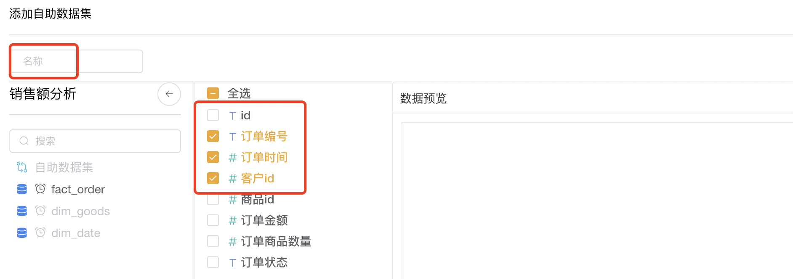

!!! Abstract ""
    **请注意：如果自定义数据涉及多个数据集，那么需要预先在数据集间创建关联关系。**  

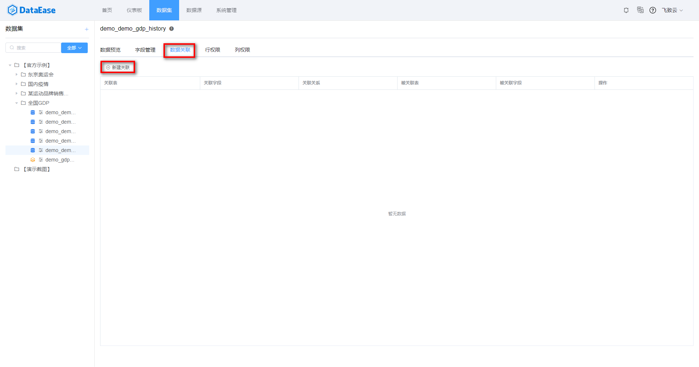

### 5 添加【关联数据集】

!!! Abstract ""
    关联数据集是改版后的自定义数据集，如下图所示，多数据集间关联关系的构建以及数据集字段的选择一并完成，更易理解，使用方便。

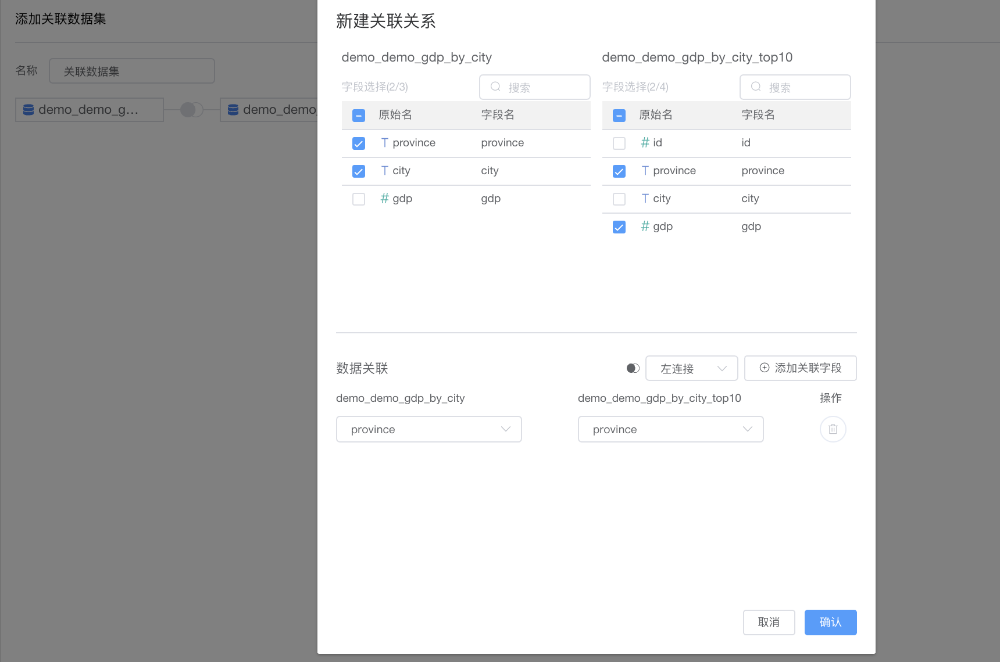

### 6 添加【API 数据集】

!!! Abstract ""
    添加 API 数据集时需选择 API 类型的数据源，API 数据集没有【直连】模式，只能选择【定时同步】，数据会存在 Doris 中。


## 数据集设计
### 1 数据集预览

!!! Abstract ""
    点击左侧数据表，右侧默认展示预览数据。
    **两种连接模式的差异：**  

    1. 如果数据集为【直连】模式，那么没有【数据关联】和【更新信息】模块，数据实时更新；  
    2. 如果数据集为【定时刷新】模式，那么可通过【数据关联】设置数据集间关联关系，也可通过【更新信息】刷新数据。
 



### 2 字段管理

!!! Abstract "字段编辑"
    字段编辑页面，如下图所示，可以修改字段类型，修改字段名称，以及删减字段（不需要的字段不勾选）、维度/指标互相切换、新增计算字段等。

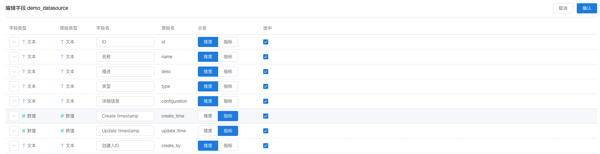

!!! Abstract "新建计算字段"
    输入字段名，字段表达式，通过引用函数，生成新字段。

!!! Danger "请注意"
    字段表达式支持所有的数据库函数，不仅是右侧列出的示例函数。比如：直连模式，数据源为 MySQL 数据库，那么字段表达式中可输入所有 MySQL 数据库的函数，包括 IF、CASE WHEN 等用法。


### 3 数据关联

!!! Abstract ""
    点击左侧数据表，右侧默认展示预览数据，可点击【数据关联】，切换至数据关联页面，如下图所示，可点击【添加关联】、【编辑】、【删除】，添加、编辑、删除关联关系。

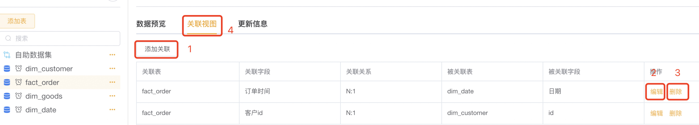 

!!! Abstract "添加关联"
    点击【添加关联】，进入关联添加页面，如下图所示，左侧选择关联字段，右侧选择被关联字段，中间可选择关联关系（左连接：LEFT JOIN、内连接：INNER JOIN、右连接：RIGHT JOIN），当关联字段，被关联字段和关联关系均被选择后，点击【确认】，关联关系创建成功。

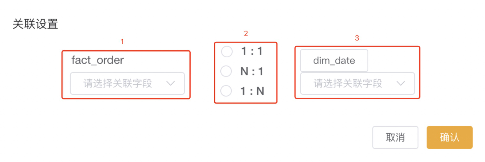

!!! Abstract "编辑关联"
    点击关联关系右侧的【编辑】，进入关联编辑页面，如下图所示，左侧选择关联字段，右侧选择被关联字段，中间可选择关联关系（左连接：LEFT JOIN、内连接：INNER JOIN、右连接：RIGHT JOIN），当关联字段，被关联字段和关联关系均被选择后，点击【确认】，关联关系修改成功。

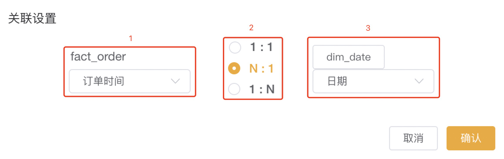

!!! Abstract "删除关联"
    使用方式，请查阅通用功能 [「删除」](../general/#_5)

### 4 更新信息

!!! Abstract ""
    点击左侧数据表（定时缓存模式下），右侧默认展示预览数据，可点击【更新信息】，切换至更新信息页面，可点击【更新设置】设置定时任务；点击【刷新】，刷新下方任务列表。

!!! Warning "请注意"
    如果数据集是首次添加，而且是【定时同步】模式，那么需要设置定时任务刷新数据至缓存区，否则无法用此数据集创建数据关联和视图。



!!! Abstract "更新设置"
    点击【更新设置】，进入更新设置页面，如下图，可以通过点击【添加任务】增加新任务，也可以编辑和删除任务，【增量更新方式】，选择同步数据的增量方式，若勾选增量添加，那么数据增量添加；若勾选增量删除，那么对数据实行增量删除。同时也可在在【参数】区域，输入sql语句的时间参数。



!!! Abstract "添加任务"
    设置任务名称，更新方式（有全量更新、增量更新两种方式），选择任务的开始时间，结束时间，以及执行频率（支持三种设置方式，立即执行、简单重复、表达式设定），任务信息添加完毕后，点击确认任务添加成功。



!!! Abstract "增量更新"
    如下图所示，增量更新方式选择【增量添加】，在输入框中输入sql语句，并拖拉参数【上次更新时间】，即更新数据的方式为：把订单时间大于上次更新时间的订单数据抽取至缓存区。



!!! Abstract "增量删除"
    如下图所示，增量更新方式选择【增量删除】，在输入框中输入sql语句，并拖拉参数【上次更新时间】，即更新数据的方式为：把订单时间大于上次更新时间的订单数据从缓存区删除。



