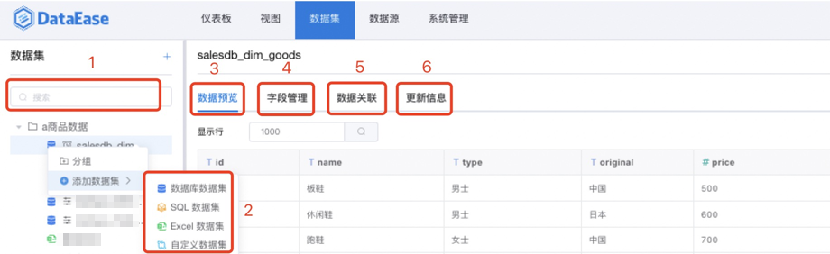

## 功能概述
> 点击【数据集】，进入数据集设计模块，可以从【数据源】中选择数据表，添加表的关联关系，以及设置定时任务更新数据等管理数据集。 目前支持的数据集类型：数据库数据集、SQL数据集、Excel数据集、自定义数据集。

## 数据集管理
> 点击【a商品数据】分组，可查看该分组下的数据集，主要功能如下： 【序号1】搜索功能区，可输入关键字搜索，快速锁定目标表； 【序号2】添加数据集，点击可添加新数据集； 【序号3】数据预览区，点击可预览数据集； 【序号4】字段管理，维度/指标切换、字段删减、字段重命名等； 【序号5】关联数据集，用于创建自定义数据集； 【序号6】创建数据集任务，用于更新数据集（定时缓存）数据。

## 1 添加数据集
### 1.1 添加【数据库数据集】
> 如下图所示，点击【添加数据集】并选择【数据库数据集】，展开下拉框，选择数据源、数据源的连接方式、并勾选需要添加的数据库表。

> 需注意两种连接方式的差异： 一、【直连】，那么直接访问底层数据源，数据始终是最新的。

> 二、【定时刷新】，可设置数据关联，以及通过定时任务或手动方式更新数据。

### 1.2 添加【SQL数据集】
> 如下图所示，点击【添加数据集】并选择【SQL数据集】。 【序号1】位置输入即将添加的数据集名称； 【序号2】位置为SQL语句输入区，在此区域输入正确的sql语句； 【序号3】点击可展示预览数据； 【序号4】点击后提交，SQL数据集生成成功。 支持两种连接方式：直连和定时缓存，具体使用与【数据集数据集】一致

### 1.3 添加【Excel数据集】
> 如下图所示，点击【添加数据集】并选择【Excel数据集】，点击【上传文件】，选择Excel文件后，Excel数据展示在【数据预览】区，若预览符合预期，点击【确认】，生成Excel数据集。

### 1.4 添加【自定义数据集】
> 如下图所示，点击【添加数据集】并选择【自定义数据集】，从已添加的数据集中，做数据字段的删减操作，从而衍生出的新数据集即为自定义数据集，可在下图所示位置为自定义数据集命名，以及选择数据字段，并在右侧预览，若与预期一致，点击【确认】，自定义数据集生成成功。

## 2 数据集设计
### 2.1 数据集预览
> 点击左侧数据表，右侧默认展示预览数据。

> 请注意两种连接模式的差异 一、如果数据集为【直连】模式，那么没有【数据关联】和【更新信息】模块，数据实时更新；
 

> 二、如果数据集为【定时刷新】模式，那么可通过【数据关联】设置数据集间关联关系，也可通过【更新信息】刷新数据。

### 2.2 数据集字段编辑
#### 2.2.1 字段编辑
> 字段编辑页面，如下图所示，可以修改字段类型，修改字段名称，以及删减字段（不需要的字段不勾选）、维度/指标互相切换、新增计算字段等。

#### 2.2.2 新建计算字段
> 输入字段名，字段表达式，通过函数运算，生成新字段。

### 2.3 数据关联
> 点击左侧数据表（定时缓存模式下），右侧默认展示预览数据，可点击【关联视图】，切换至关联视图页面，如下图所示，可点击【添加关联】、【编辑】、【删除】，添加、编辑、删除关联关系。

#### 2.3.1 添加关联
> 点击【添加关联】，进入关联添加页面，如下图所示，左侧选择关联字段，右侧选择被关联字段，中间可选择关联关系（左连接：LEFT JOIN、内连接：INNER JOIN、右连接：RIGHT JOIN），当关联字段，被关联字段和关联关系均被选择后，点击【确认】，关联关系创建成功。

#### 2.3.2 编辑关联
> 点击关联关系右侧的【编辑】，进入关联编辑页面，如下图所示，左侧选择关联字段，右侧选择被关联字段，中间可选择关联关系（左连接：LEFT JOIN、内连接：INNER JOIN、右连接：RIGHT JOIN），当关联字段，被关联字段和关联关系均被选择后，点击【确认】，关联关系修改成功。

#### 2.3.2 删除关联
> > 使用方式，请查阅通用功能 [「删除」](../general/#_5)

### 2.4 更新信息
> 点击左侧数据表（定时缓存模式下），右侧默认展示预览数据，可点击【更新信息】，切换至更新信息页面，可点击【更新设置】设置定时任务；点击【刷新】，刷新下方任务列表。 请注意，如果数据集是首次添加，而且是【定时同步】模式，那么需要设置定时任务刷新数据至缓存区，否则无法用此数据集创建数据关联和视图。

#### 2.4.1 更新设置
> 点击【更新设置】，进入更新设置页面，如下图，可以通过点击【添加任务】增加新任务，也可以编辑和删除任务，【增量更新方式】，选择同步数据的增量方式，若勾选增量添加，那么数据增量添加；若勾选增量删除，那么对数据实行增量删除。同时也可在在【参数】区域，输入sql语句的时间参数。

#### 2.4.2 添加任务
> 设置任务名称，更新方式（有全量更新、增量更新两种方式），选择任务的开始时间，结束时间，以及执行频率（支持三种设置方式，立即执行、简单重复、表达式设定），任务信息添加完毕后，点击确认任务添加成功。

#### 2.4.3 增量更新
> 如下图所示，增量更新方式选择【增量添加】，在输入框中输入sql语句，并拖拉参数【上次更新时间】，即更新数据的方式为：把订单时间大于上次更新时间的订单数据抽取至缓存区。

#### 2.4.4 增量删除
> 如下图所示，增量更新方式选择【增量删除】，在输入框中输入sql语句，并拖拉参数【上次更新时间】，即更新数据的方式为：把订单时间大于上次更新时间的订单数据从缓存区删除。

