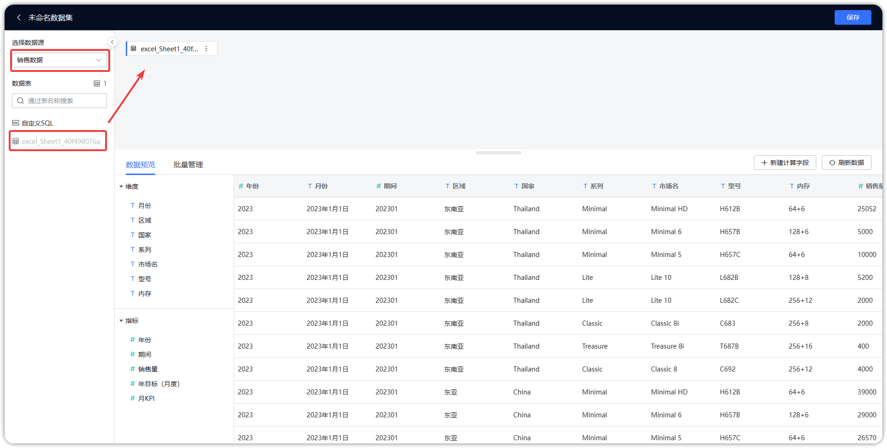

## 功能概述
> 点击"数据集"，进入数据集设计功能模块，通过从"数据源"中选择数据表，添加表的关联关系，构建需要的业务场景，并对场景进行分组，以便于管理。

## 场景构建
> 点击"销售额分析"场景，进入场景构建模块，通过点击"添加表"（序号1），添加数据表；"序号2"为搜索功能区，可输入关键字搜索，快速锁定目标表；"序号3"为数据表预览，表关系创建，以及数据表更新时间、频率设置和数据刷新等操作功能区；"序号4"功能区，可对数据表重命名和删除；"序号5"功能区，可对数据表字段删减、字段重命名等；点击"序号6"，退出场景构建模块。

## 1 为数据集添加表
### 1.1 添加数据库表
> 如下图所示，点击【添加表】并选择【数据库表】，展开下拉框，选择数据源、数据源的连接方式、并勾选需要添加的数据库表。这里需要注意：如果选择直连，那么直接访问底层数据源，数据始终是最新的；如果选择定时刷新，需要手动刷新或者设置定时任务自动刷新。

### 1.2 添加SQL数据集
> 如下图所示，点击【添加表】并选择【SQL数据集】，在"序号3"位置输入即将添加的数据集名称；"序号4"位置为SQL语句输入区，在此区域输入正确的sql语句，点击【预览】（序号5），展示数据预览结果；当预览结果为预期时，点击【确认】（序号6）提交，SQL数据集保存成功。

### 1.3 添加Excel数据集
> 如下图所示，点击【添加表】并选择【Excel数据集】，点击【上传文件】，选择Excel文件后，Excel数据展示在【数据预览】区，若预览符合预期，点击【确认】，生成Excel数据集。

### 1.4 添加自助数据集
> 如下图所示，点击【添加表】并选择【自助数据集】，从已添加的数据集中，做数据字段的删减操作，从而衍生出的新数据集即为自助数据集，可在下图所示位置为自助数据集命名，以及选择数据字段，并在右侧预览该自助数据集，若与预期一致，点击【确认】，自助数据集保存成功。

## 2 数据集设计
### 2.1 数据集预览
> 点击左侧数据表，右侧默认展示预览数据。

### 2.2 关联视图
> 点击左侧数据表，右侧默认展示预览数据，可点击【关联视图】，切换至关联视图页面，如下图所示，可点击【添加关联】、【编辑】、【删除】，添加、编辑、删除关联。

#### 2.2.1 添加关联
> 点击"添加关联"，进入关联添加页面，如下图所示，左侧选择关联字段，右侧选择被关联字段，中间可选择关联关系（1：1，一对一；N：1，多对一；1：N，一对多），当关联字段，被关联字段和关联关系均被选择后，点击【确认】，关联关系创建成功。

#### 2.2.2 编辑关联
> 点击关联关系右侧的【编辑】，进入关联编辑页面，如下图所示，左侧选择关联字段，右侧选择被关联字段，中间可选择关联关系（1：1，一对一；N：1，多对一；1：N，一对多），当关联字段，被关联字段和关联关系均被选择后，点击【确认】，关联关系修改成功。

### 2.3 更新信息
> 点击左侧数据表，右侧默认展示预览数据，可点击【更新信息】，切换至更新信息页面，可点击【更新信息】设置定时更新任务；点击【刷新】，刷新数据至缓存区。这里需注意，如果数据库表是首次添加，并设置为定时同步，那么需要设置定时任务刷新数据至缓存区，否则无法用此数据集创建视图。

#### 2.2.1 更新设置
> 点击【更新设置】，进入更新设置页面，如下图，可以通过点击【添加任务】增加新任务，也可以编辑和删除任务，【增量更新方式】，选择同步数据的增量方式，若勾选增量添加，那么数据增量添加；若勾选增量删除，那么对数据实行增量删除。同时也可在在【参数】区域，输入sql语句的时间参数。

#### 2.2.2 添加任务
> 设置任务名称，更新方式（有全量更新、增量更新两种方式），选择任务的开始时间，结束时间，以及执行频率，任务信息添加完毕后，点击确认任务添加成功。

#### 2.2.3 增量更新
> 如下图所示，增量更新方式选择【增量添加】，在输入框中输入sql语句，并拖拉参数【上次更新时间】，即更新数据的方式为：把订单时间大于上次更新时间的订单数据抽取至缓存区。

#### 2.2.4 增量删除
> 如下图所示，增量更新方式选择【增量删除】，在输入框中输入sql语句，并拖拉参数【上次更新时间】，即更新数据的方式为：把订单时间大于上次更新时间的订单数据从缓存区删除。

## 3 数据集字段编辑
> 如下图所示，点击选中左侧数据表后，点击右上角"编辑字段"按钮，跳转至字段编辑页面

> 字段编辑页面，如下图所示，可以修改字段类型，修改字段名称，以及删减字段（不需要的字段不勾选）

