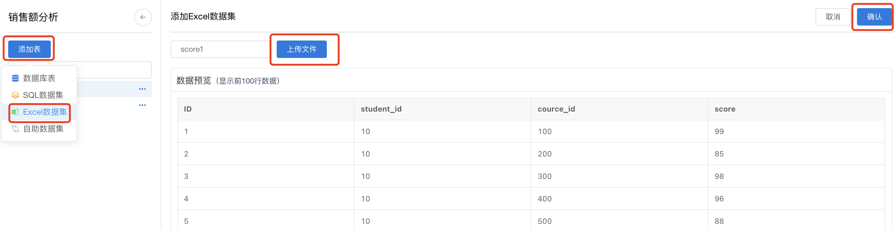
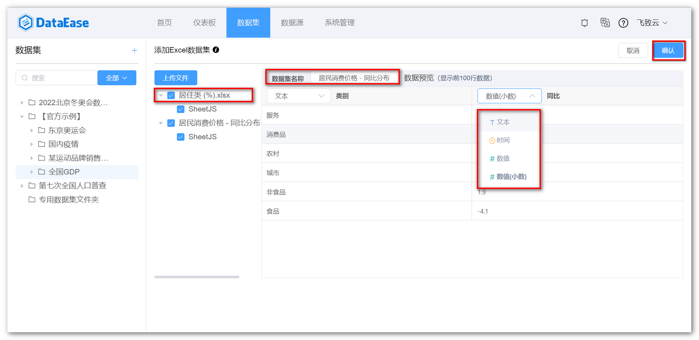
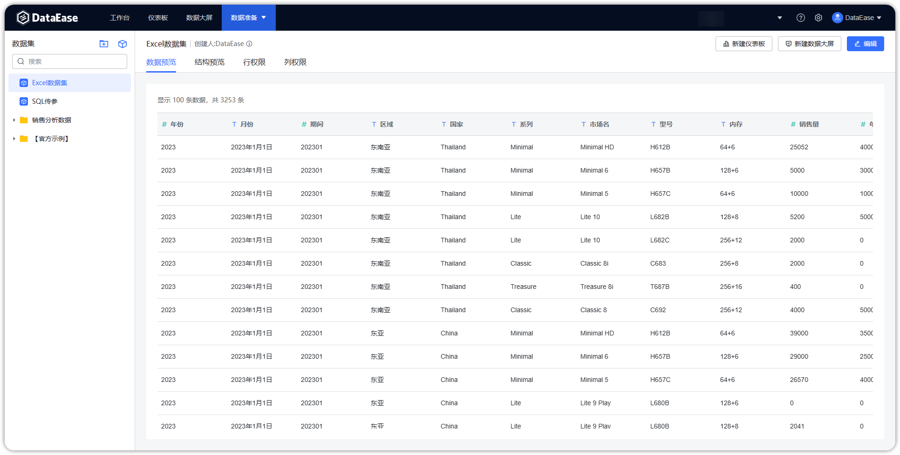

## 1  新建数据集

!!! Abstract ""
    如下图所示，点击序号位置【添加数据集】，跳转到添加数据集页面。

{ width="900px" }

## 2 添加 Excel 数据集
!!! Abstract ""
    在新建数据集页面，勾选添加数据集对应【Excel】数据源，将左侧 Excel 数据表拖拽到右侧数据集编辑区。

{ width="900px" }

## 3 保存 Excel 数据集
    
!!! Abstract ""
  
    如下图所示，Excel 数据展示在【数据预览】区，若预览符合预期，点击【保存】，生成 Excel 数据集。

{ width="900px" }

{ width="900px" }


