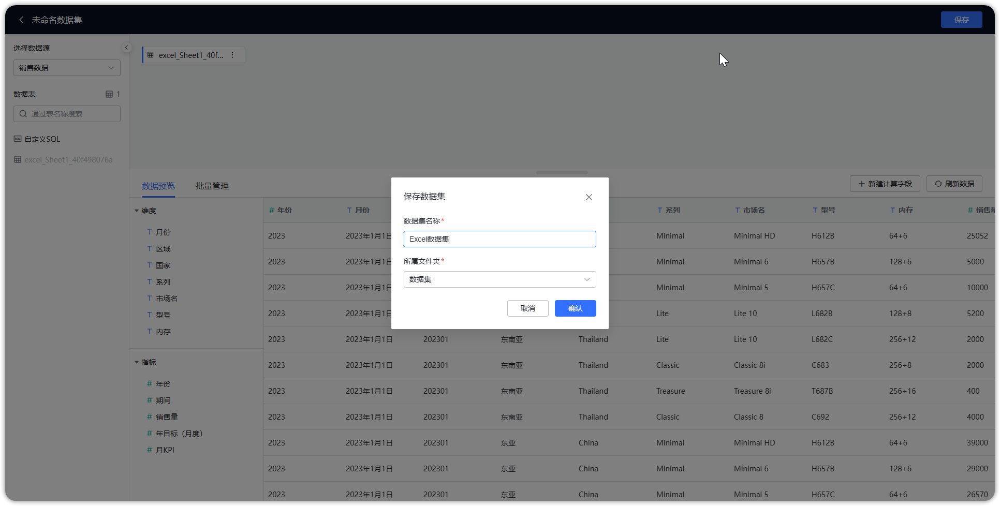

## 1 上传 Excel 文件

!!! Abstract ""
    如下图所示，点击【添加数据集】并选择【 Excel 数据集】，点击【上传文件】，将 Excel 文件上传到 DataEase，精简模式下 Excel 数据集的数据存在 MySQL 中，本地模式与集群模式 Excel 数据集的数据存在 Doris 中。  
    **注意：** 精简模式与集群模式均需提前配置好数据引擎，可参考【系统管理】篇中的引擎设置与 Kettle 设置，本地模式无需做额外配置。

!!! Abstract ""
    **注意：** Excel 必须满足以下要求的格式，否则无法成功导入：  
    1.文件中不能存在合并单元格；  
    2.文件的第一行为标题行，不能为空，不能为日期型；  
    3.Excel 文件大小请确保在 500M 以内。

{ width="900px" }

## 2 保存 Excel 数据集
    
!!! Abstract ""
    选择 Excel 文件，同一个 Excel 中可以勾选多个 sheet 页，填入数据集名称，调整对应的字段类型，如下图所示，Excel 数据展示在【数据预览】区，若预览符合预期，点击【确认】，生成 Excel 数据集。

{ width="900px" }

## 3 编辑 Excel 数据集

!!! Abstract ""
    Excel 数据集可以进行追加或替换，追加即不改变原有数据，增加新的数据，替换即重新替换掉原有的数据。

{ width="900px" }

{ width="900px" }

{ width="900px" }