## 1 新建数据集

!!! Abstract ""
    如下图所示，点击序号位置【添加数据集】，跳转到添加数据集页面。

{ width="900px" }

## 2 添加 SQL 数据集

!!! Abstract ""
    在新建数据集页面，勾选添加数据集对应的数据源，将左侧【自定义 SQL 】拖拽到右侧数据集编辑区，进入到 SQL 编辑界面。

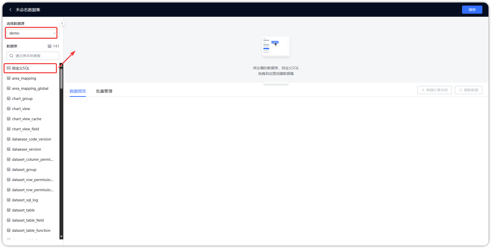{ width="900px" }

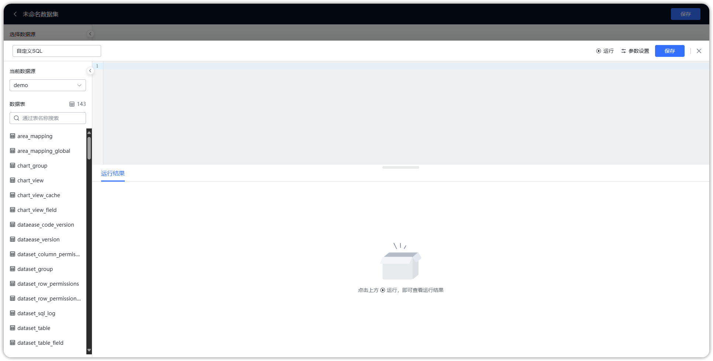{ width="900px" }

## 3 输入正确的 SQL 语句

!!! Abstract ""
    【序号1】位置选择数据库；  
    【序号2】位置为 SQL 语句输入区，在此区域输入正确的 SQL 语句；  
    【序号3】点击可展示预览数据；  
    **注意：单源数据集写 SQL 时使用对应数据库的 JDBC 语法。**

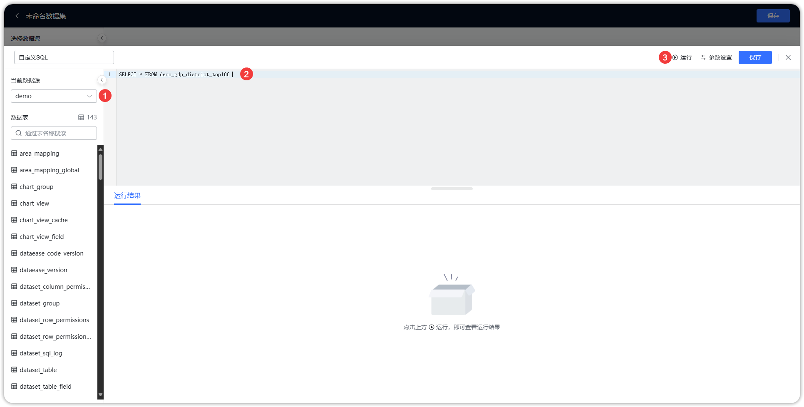{ width="900px" }

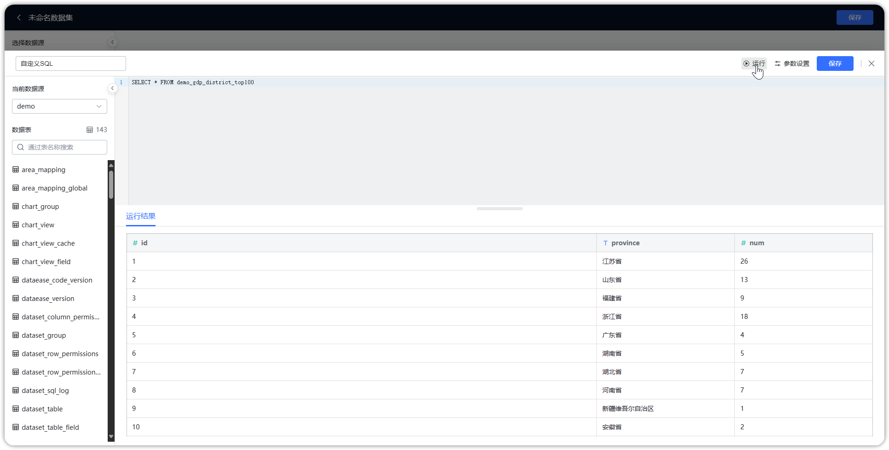{ width="900px" }

## 4 动态传参设置

!!! Abstract ""
    **SQL 数据集支持参数传递，如下图所示。**

    - 在 SQL 数据集中编写带变量的 SQL 语句，变量定义格式为 ${xxx}，其中 xxx 为变量名；  
    - 在右上角【参数设置】里对变量进行相关设置，如变量类型、生效模式、默认值（非必填），此处变量为系统根据 SQL 语句自动识别的，例如 province 会被自动带出来；
    - 在仪表板的过滤组件中（文本下拉和数字下拉组件）勾选【参数选项】，并将下拉字段与 SQL 数据集中的变量关联，如下示例以 MySQL 数据库 SQL 语法为例，不同数据库请根据实际情况调整。

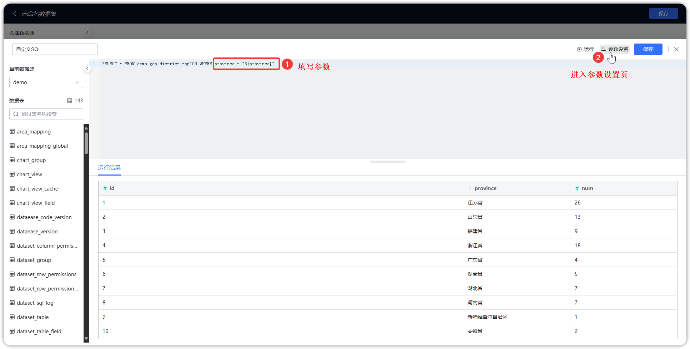{ width="900px" }

!!! Abstract ""
    编写带变量的 SQL 语句后，系统默认将参数类型设置为文本，根据需要可在右上角【参数设置】里对变量进行相关设置，示例如：  
    若该变量为时间类型，请手动调整该参数类型的时间类型及时间格式。

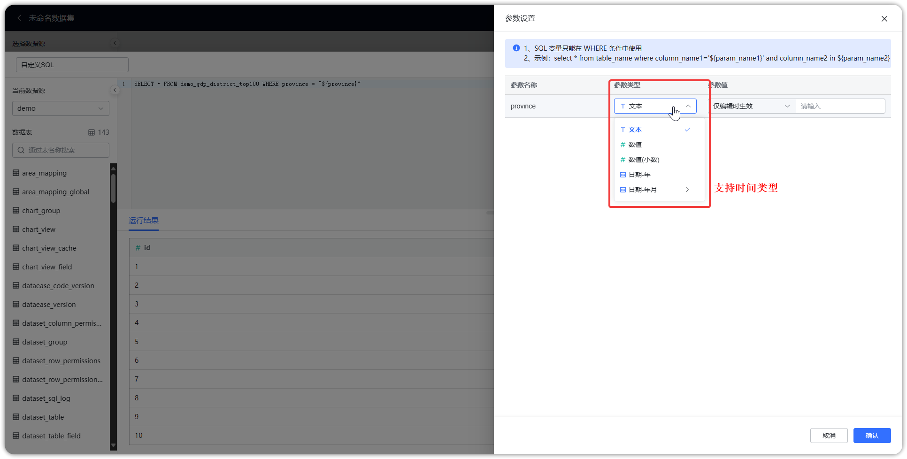{ width="900px" }

!!! Abstract ""
    参数设置里面，参数值下拉列表中可以选择“仅编辑时生效”或“数据集预览时全局生效”。   
    区别：仅编辑时生效在SQL数据集编辑界面有效，数据集预览时全局生效在数据集预览界面有效和仪表板有效 。

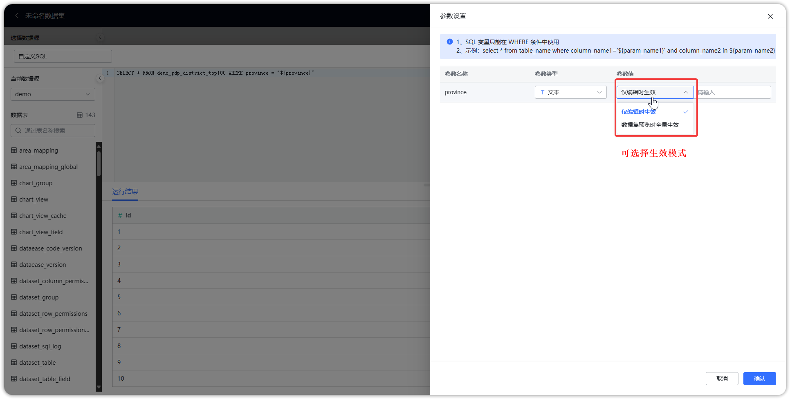{ width="900px" }

!!! Abstract ""
    在仪表板过滤组件绑定 SQL 传参：

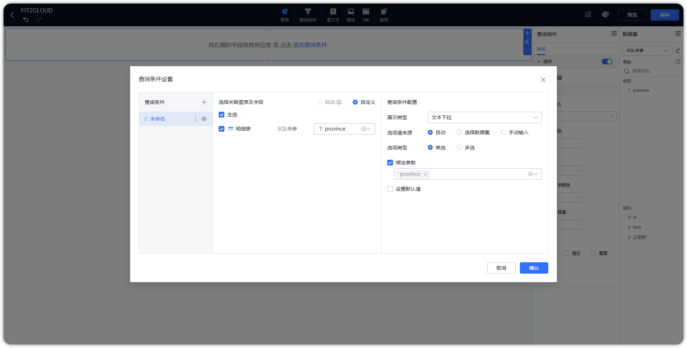{ width="900px" }

!!! Abstract ""
    **SQL 数据集带参数传递，根据过滤组件的不同，SQL 语法用法上有差异。**  
    
    情况一：过滤组件为单选时，要用 = ：
    ```
    SELECT ORDER_ID, ORDER_DATE, PROJ_ID, ORDER_EMP FROM ORDERS WHERE ORDER_EMP = '${USER_NAME}'
    ```
    情况二：过滤组件为多选时，要用 IN （用 IN 可单选也可多选，但相反地用 = 只能单选），注意变量外需要用括号包起来：
    ```
    SELECT ORDER_ID, ORDER_DATE, PROJ_ID, ORDER_EMP FROM ORDERS WHERE ORDER_EMP IN (${USER_NAME})  
    ```
    情况三：有多个过滤组件时，要用括号将它们组合在一起，否则图表无法更新：
    ```
    SELECT ORDER_ID, ORDER_DATE, PROJ_ID, ORDER_EMP FROM ORDERS WHERE (ORDER_EMP IN ${USER_NAME} AND PROJ_ID IN ${USER_PROJ_ID})
    ```
    情况四：日期范围：
    ```
    SELECT * FROM SALES WHERE 记录时间 BETWEEN '${BEGINTIME}' AND '${ENDTIME}'
    ```

!!! Abstract ""
    **SQL 动态参数与过滤组件的区别：**   

    - SQL 动态参数可以提升查询效率，自定义的 SQL 相较于过滤组件通过程序拼接出来的查询语句查询效率会更高效；  
    - SQL 动态参数可以满足一些过滤组件无法满足的场景，比如需要在 SQL 中对参数值做特殊处理后才能用于 where 过滤条件的情况。    

    SQL 数据集支持参数传递，且 SQL 数据集参数化支持子查询，系统会对 SQL 数据集在查询时的 SQL 进行 Base64 加密处理。

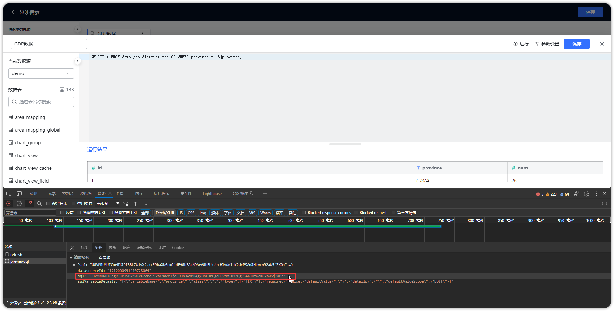{ width="900px" }

## 5 保存 SQL 数据集

!!! Abstract ""
    如下图所示，点击【保存】，SQL 数据集添加成功。

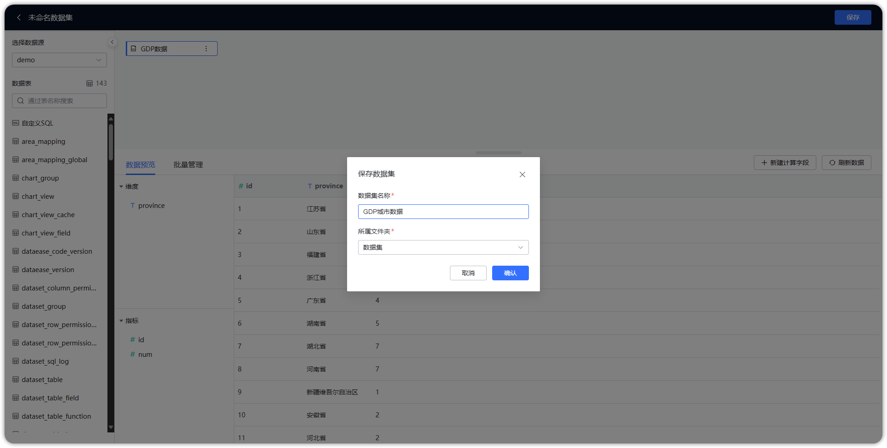{ width="900px" }

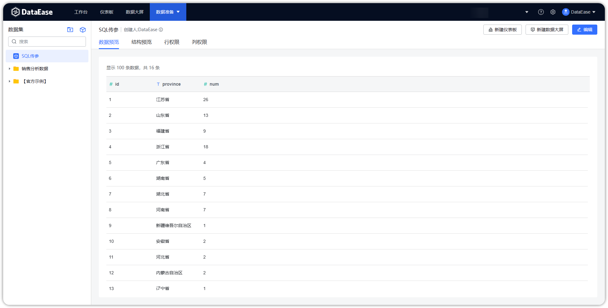{ width="900px" }
