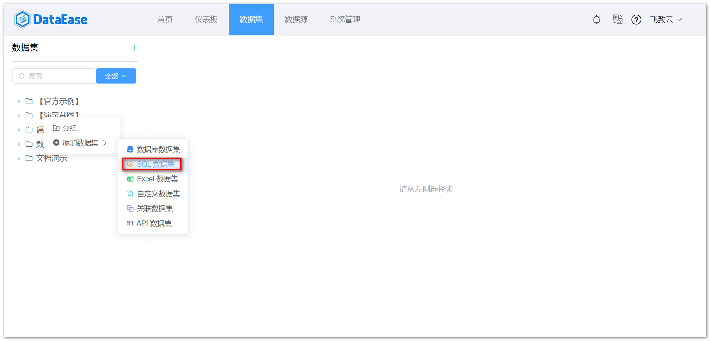
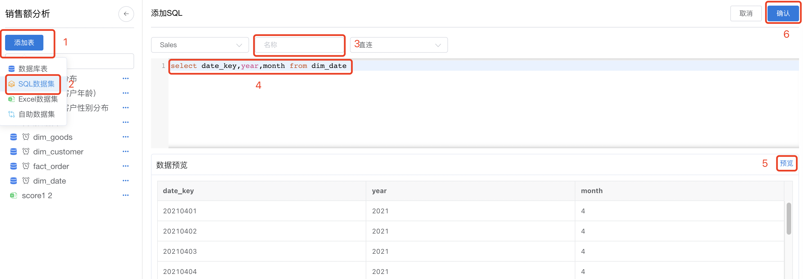
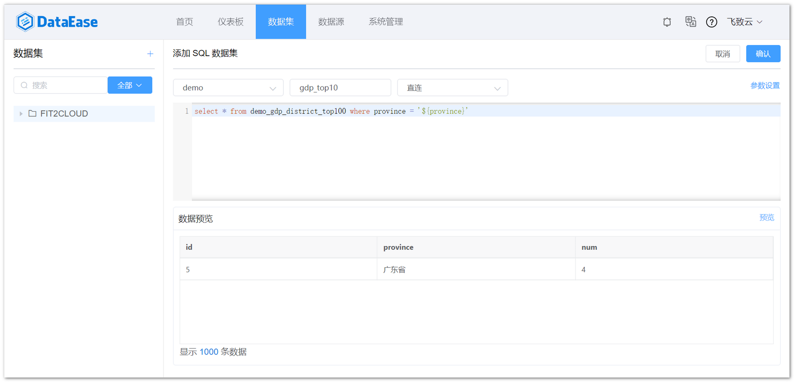
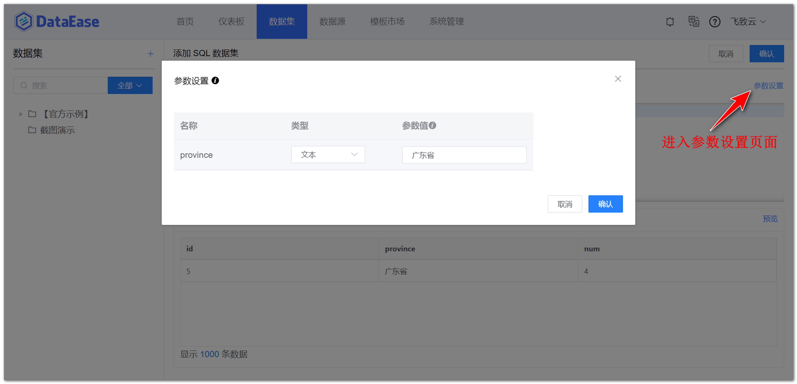
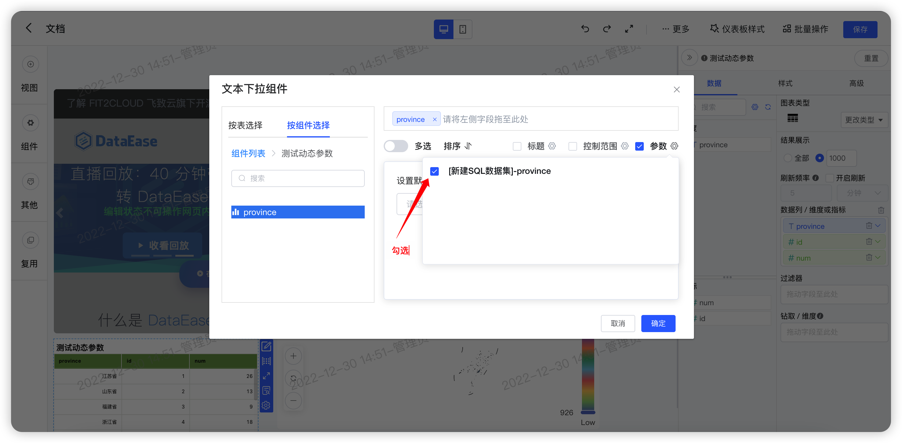
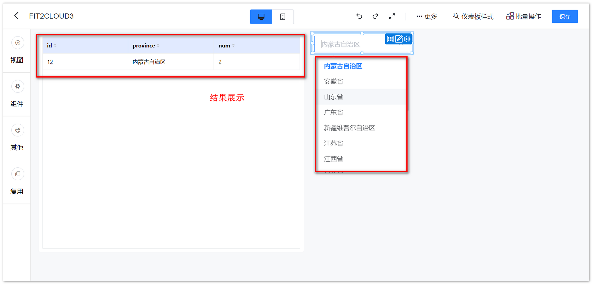
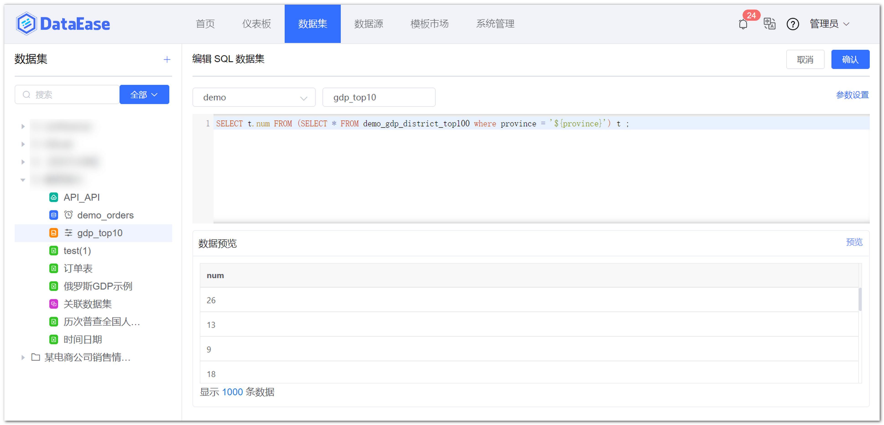
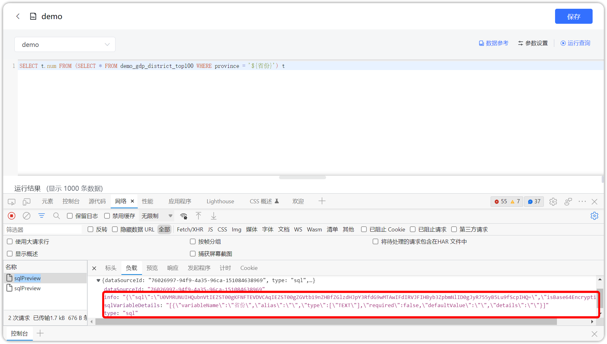
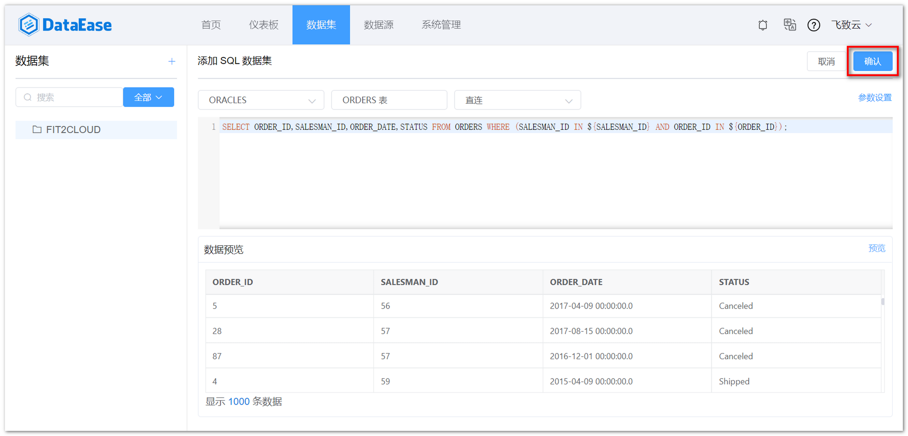

## 1 新建 SQL 数据集

!!! Abstract ""
    如下图所示，点击【添加数据集】并选择【 SQL 数据集】。

{ width="900px" }

## 2 选择连接方式

!!! Abstract ""
    支持两种连接方式：直连和定时同步。

{ width="900px" }

## 3 输入正确的 SQL 语句

!!! Abstract ""
    【序号1】位置选择数据库；  
    【序号2】位置为 SQL 语句输入区，在此区域输入正确的 SQL 语句；  
    【序号3】点击可展示预览数据；  
    **注意：此处只支持查询语句，且所有数据库均使用标准 SQL 语句，不支持数据库自身语法（比如：Elasticsearch、MongoDB 数据集也是输入标准的 SQL 查询语句）。**

{ width="900px" }

!!! Abstract ""
    **SQL 数据集支持“数据参考”功能，如下图所示；**  
    选择数据源后，点击【数据参考】，在右侧弹框中可查看当前数据源下的数据表的数量以及数据表列表，选择具体数据表，**支持一键复制表名、字段名**，方便编写 SQL 语句。

{ width="900px" }

{ width="900px" }


## 4 动态传参设置

!!! Abstract ""
    **直连模式下 SQL 数据集支持参数传递，如下图所示。**

    - 在直连模式的 SQL 数据集中编写带变量的 SQL 语句，变量定义格式为 ${xxx}，其中 xxx 为变量名；  
    - 在右上角【参数设置】里对变量进行相关设置，如变量类型、默认值（非必填），此处变量为系统根据 SQL 语句自动识别的，例如 province 会被自动带出来；  
    - 在仪表板的过滤组件中（文本下拉和数字下拉组件）勾选【参数选项】，并将下拉字段与 SQL 数据集中的变量关联，如下示例以 MySQL 数据库 SQL 语法为例，不同数据库请根据实际情况调整。

{ width="900px" }

!!! Abstract ""
    编写带变量的 SQL 语句后，系统默认将参数类型设置为文本，根据需要可在右上角【参数设置】里对变量进行相关设置，示例如：  
    若该变量为时间类型，请手动调整该参数类型的时间类型及时间格式。

{ width="900px" }

{ width="900px" }

{ width="900px" }

!!! Abstract ""
    **SQL 数据集带参数传递，根据过滤组件的不同，SQL 语法用法上有差异。**  
    情况一：过滤组件为单选时，要用 = ：
    ```
    SELECT ORDER_ID, ORDER_DATE, PROJ_ID FROM ORDERS WHERE ORDER_EMP = '${USER_NAME}'
    ```
    情况二：过滤组件为多选时，要用 IN （用 IN 可单选也可多选，但相反地用 = 只能单选）：
    ``` 
    SELECT ORDER_ID, ORDER_DATE, PROJ_ID FROM ORDERS WHERE ORDER_EMP IN ${USER_NAME}  
    ```
    情况三：有多个过滤组件时，要用括号包复成一个组，否则视图组件无法更新：
    ```
    SELECT ORDER_ID, ORDER_DATE, PROJ_ID FROM ORDERS WHERE (ORDER_EMP IN ${USER_NAME} AND PROJ_ID IN ${USER_PROJ_ID})
    ```

    直连模式下 SQL 数据集支持参数传递，且 SQL 数据集参数化支持子查询，系统会对 SQL 数据集在查询时的 SQL 进行 Base64 加密处理。

{ width="900px" }

{ width="900px" }

## 5 保存 SQL 数据集

!!! Abstract ""
    如下图所示，点击【保存】，SQL 数据集添加成功。

{ width="900px" }
