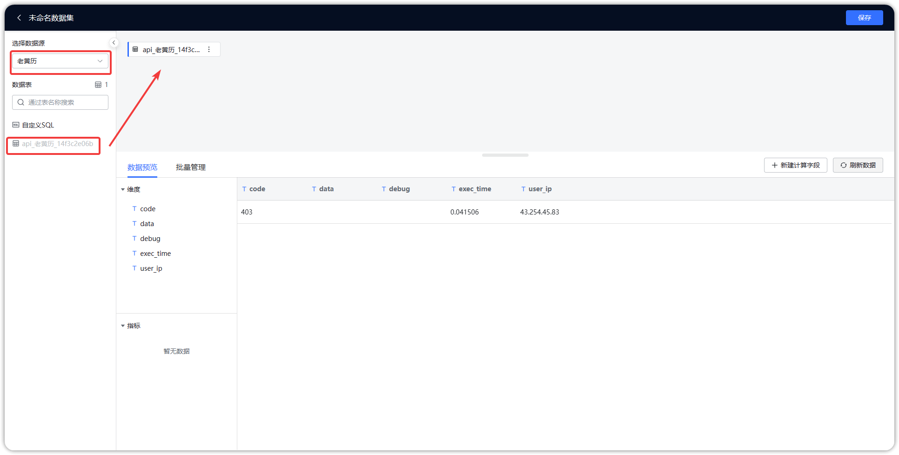

## 1 添加 API 数据集

!!! Abstract ""
    添加 API 数据集时需选择 API 类型的数据源，API 数据集没有【直连】模式，只能选择【定时同步】，精简模式下 API 数据集同步后的数据存在 MySQL 数据引擎中，本地模式与集群模式 API 数据集同步后的数据存在 Doris 中。  
    **注意：** 精简模式与集群模式均需提前配置好数据引擎，可参考【系统管理】篇中的引擎设置与 Kettle 设置，本地模式无需做额外配置。

{ width="900px" }

## 2 保存 API 数据集

!!! Abstract ""
    如下图所示，选定 API 数据表后，点击【保存】，生成 API 数据集。

{ width="900px" }


