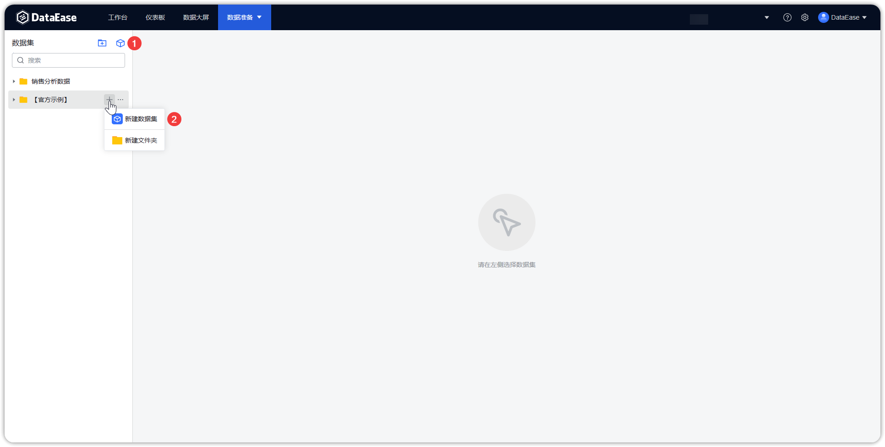

## 1 新建数据集

!!! Abstract ""
    如下图所示，点击序号位置【添加数据集】，跳转到添加数据集页面。

{ width="900px" }

## 2 添加 API 数据集

!!! Abstract ""
    如下图所示，勾选添加数据集对应【API 数据源】，将左侧要添加的 API 数据表拖拽到右侧数据集编辑区。

{ width="900px" }

## 3 保存 API 数据集

!!! Abstract ""

    点击【保存】，生成 API 数据集。
{ width="900px" }



