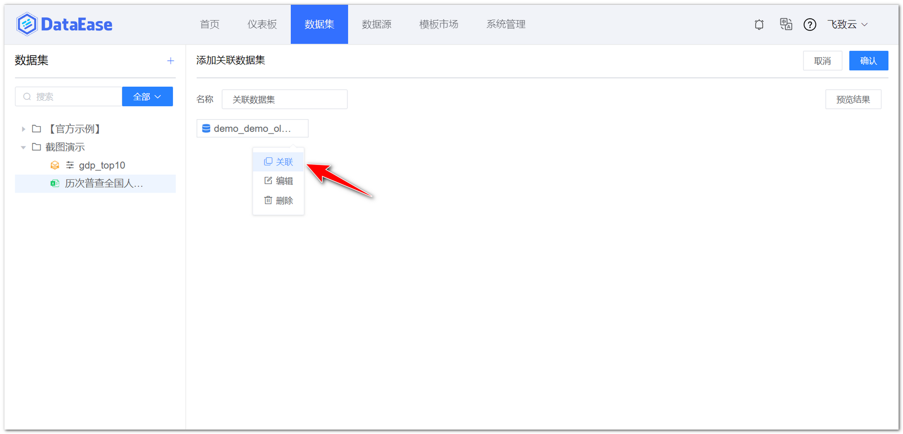
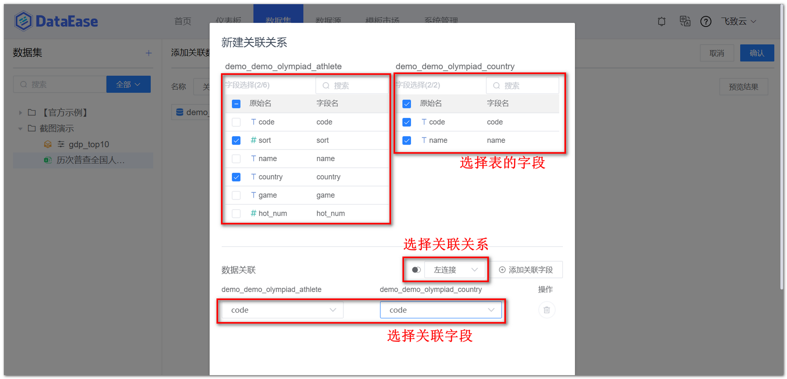
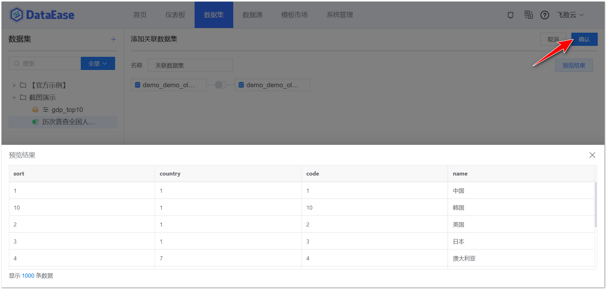

## 1 新建关联数据集

!!! Abstract ""
    点击【添加数据集】并选择【关联数据集】，填入数据集名称，点击【选择数据集】，弹出选择数据集页面，选定一个数据集，点击【确定】。


{ width="900px" }

{ width="900px" }

{ width="900px" }

## 2 建立关联关系

!!! Abstract ""
    如下图，点击【关联】，跳转到新的选择数据集页面，选定需要关联的数据集，弹出新建关联关系页面，勾选关联表的字段，选择数据关联方式和关联字段，点击【确认】。

{ width="900px" }  
{ width="900px" }

## 3 保存关联数据集

!!! Abstract ""
    如下图所示，点击【预览结果】，若数据集符合预期，点击【确认】，成功添加关联数据集。

{ width="900px" }

!!! Abstract ""
    注意：同步模式下的数据集、Excel 数据集和 API 数据集可以相互关联；非同步模式下仅限来自同一数据源的数据库数据集可以相互关联。