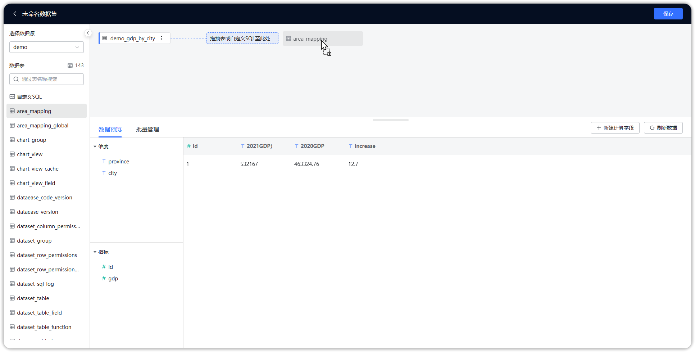
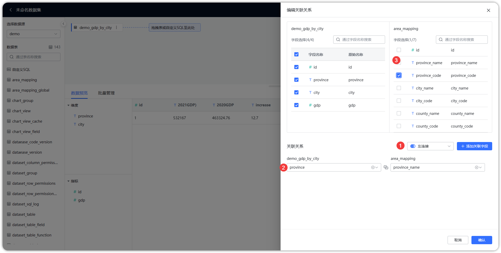
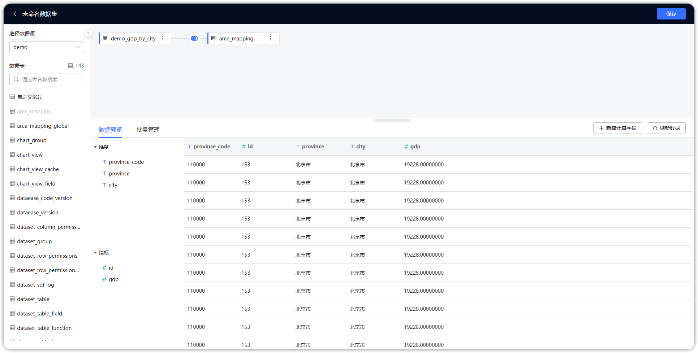
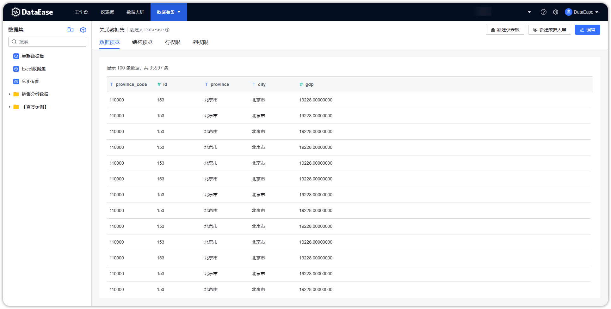

## 1 新建数据集

!!! Abstract ""
    如下图所示，点击序号位置【添加数据集】，跳转到添加数据集页面。

{ width="900px" }

## 2 添加关联数据集

!!! Abstract ""
    在新建数据集页面，勾选添加数据集对应数据源，将左侧要关联的数据表拖拽到右侧数据集编辑区。

{ width="900px" }

!!! Abstract ""
    将关联的数据表拖拽到编辑区后，可编辑关联关系：

    -  序号 1 ：设置连接方式；
    -  序号 2 ：添加关联字段；
    -  序号 3 ：选择输出字段。

{ width="900px" }

## 3 保存关联数据集

!!! Abstract ""
    如下图所示，点击【刷新数据】，若数据集符合预期，点击【保存】，成功添加关联数据集。

{ width="900px" }

{ width="900px" }
