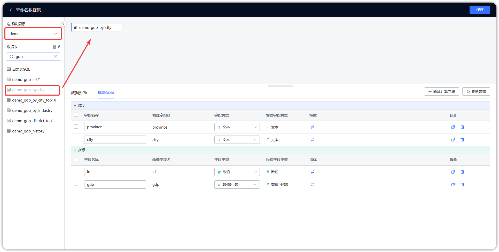
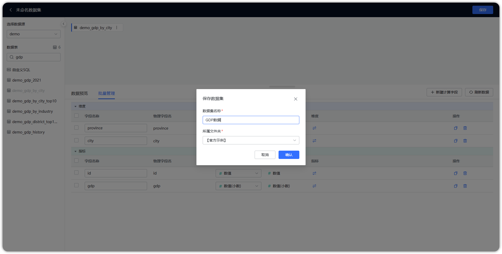
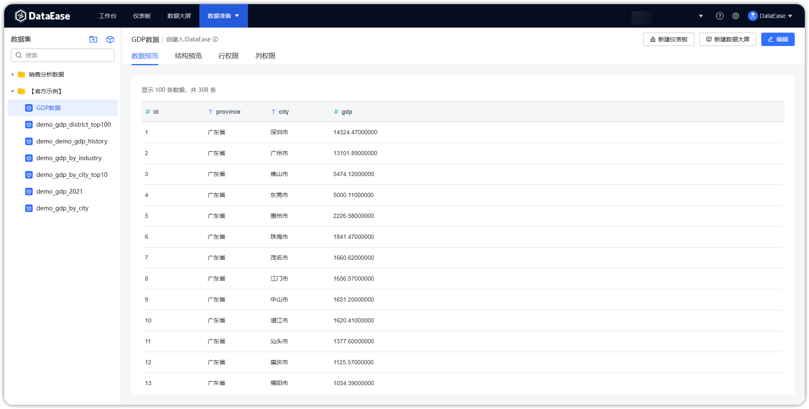

## 1 新建数据集

!!! Abstract ""
    如下图所示，点击序号位置【添加数据集】，跳转到添加数据集页面。

{ width="900px" }

## 2 添加数据库数据集

!!! Abstract ""
    在新建数据集页面，勾选添加数据集对应的数据源，将左侧数据库数据表（可利用搜索功能进行快速筛选）后拖拽到右侧数据集编辑区。

{ width="900px" }

## 3 保存数据库数据集

!!! Abstract ""
    如下图所示，点击【保存】，设置对应名称以及保存文件夹位置，点击【确认】即成功添加数据库数据集。

{ width="900px" }

{ width="900px" }

