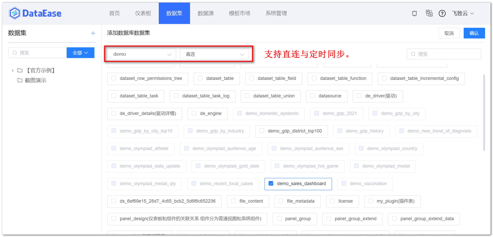
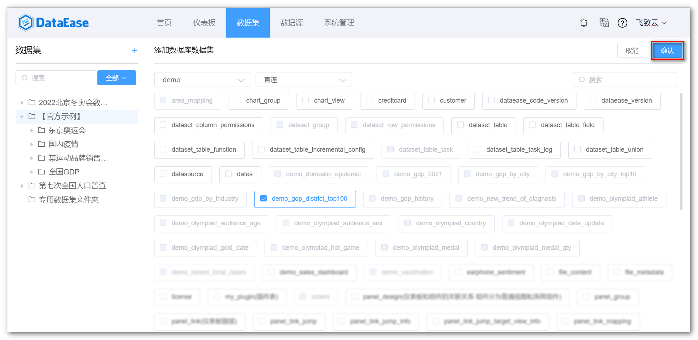

## 1 新建数据库数据集

!!! Abstract ""
    如下图所示，点击【添加数据集】并选择【数据库数据集】，跳转到添加数据库数据集页面。

{ width="900px" }

## 2 选择连接方式

!!! Abstract ""
    - 连接方式支持直连模式和定时同步模式，部分数据库不支持定时同步，请参考数据集概述的连接方式说明；
    - 在数据库数据集页面，选择数据源和连接方式，勾选需要添加的数据库表。  
    **提示：** 同一张表只支持创建一次数据库数据集。

{ width="900px" }

## 3 保存数据库数据集

!!! Abstract ""
    如下图所示，点击【确定】，即成功添加数据库数据集。

{ width="900px" }
