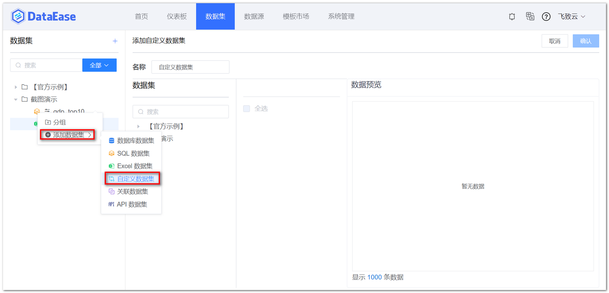
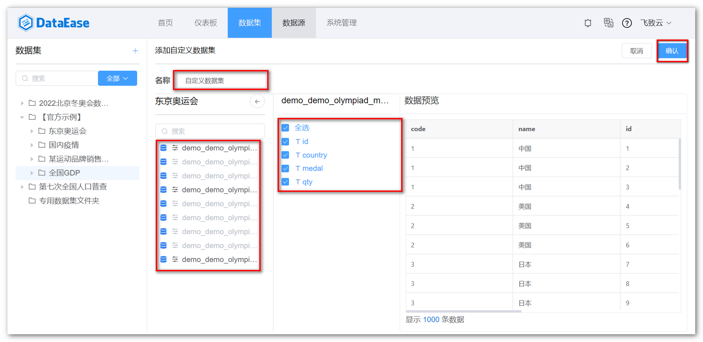

## 1 新建自定义数据集

!!! Abstract ""
    如下图所示，点击【添加数据集】并选择【自定义数据集】。

{ width="900px" }

## 2 保存自定义数据集

!!! Abstract ""
    从已添加的数据集中，做数据字段的删减操作，从而衍生出的新数据集即为自定义数据集；  
    可在下图所示位置为自定义数据集命名，以及选择数据表和字段，并在右侧预览，点击【确认】，自定义数据集生成成功。  
    **请注意：如果自定义数据涉及多个数据集，那么需要预先在数据集间创建关联关系，可参考数据集功能设计的数据关联说明。**  

{ width="900px" }
