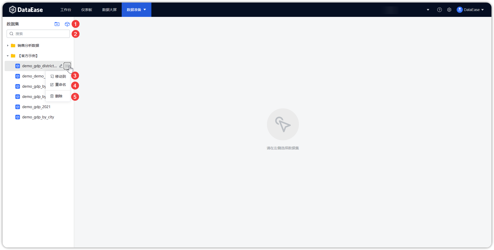

## 1 功能概述

!!! Abstract ""
    【数据集】为下一步数据分析或报表制作进行相关的数据准备；   

    点击【数据准备】，进入【数据源】管理功能模块，该页面包括数据连接的新增（序号 1）、搜索（序号 2）、编辑（序号 3）、复制（序号 4）、删除（序号 5）等功能。

{ width="900px" }

## 2 支持的数据集类型

!!! Abstract ""
    目前 DataEase 仅支持直连模式，支持创建的数据集类型有数据库数据集、SQL 数据集、Excel 数据集、关联数据集、API 数据集五种:

    - 数据库数据集指直接选择数据库中某一表作为数据集；
    - SQL 数据集可通过编写 SQL 语句后将其查询结果作为数据集；
    - Excel 数据集指通过导入本地 Excel 数据文件生成数据集；
    - 关联数据集可灵活关联多个数据集并按需求选择数据集中的字段；
    - API 数据集是 API 数据源里的接口数据形成的数据集。
