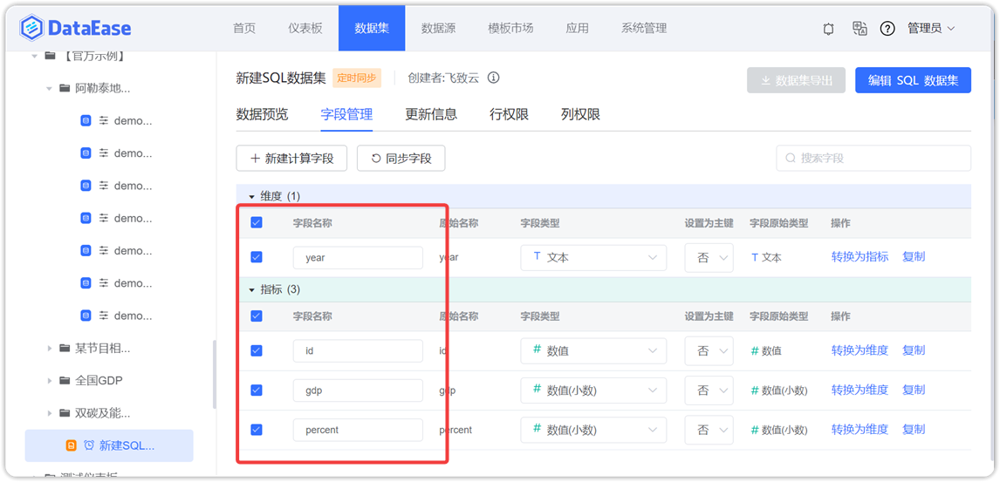
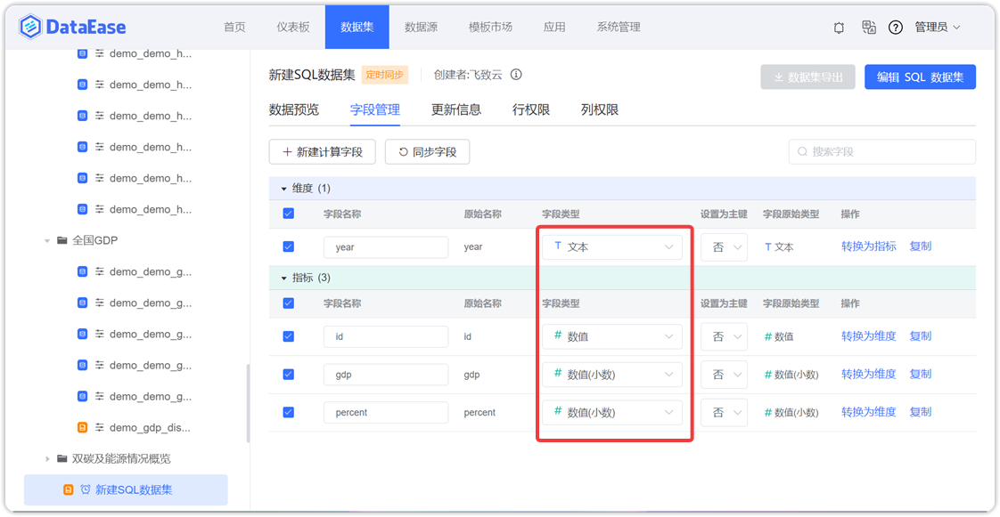
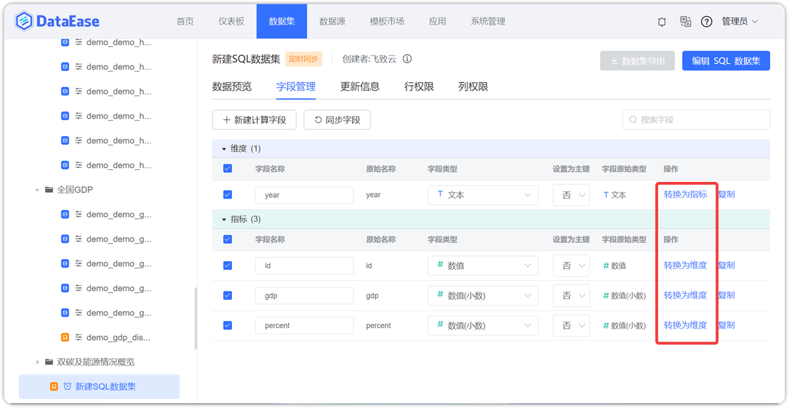
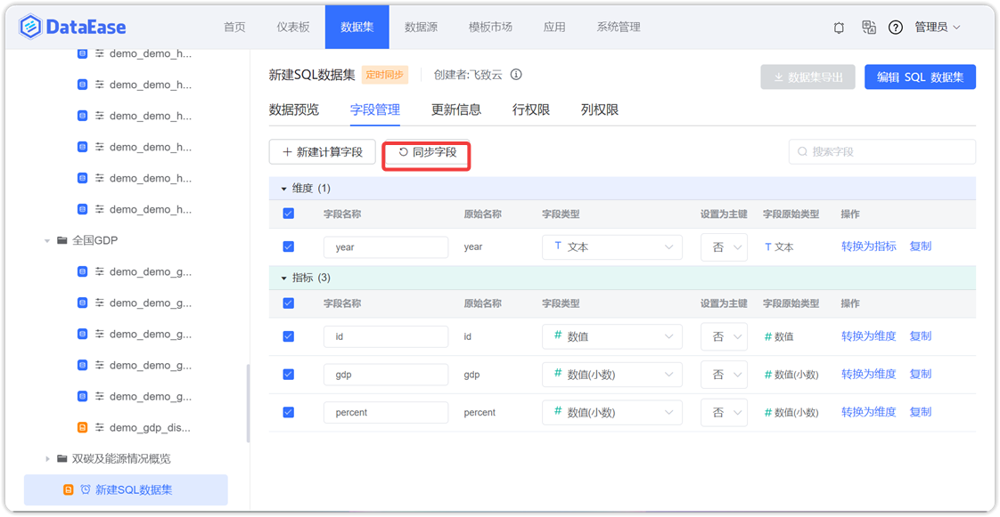
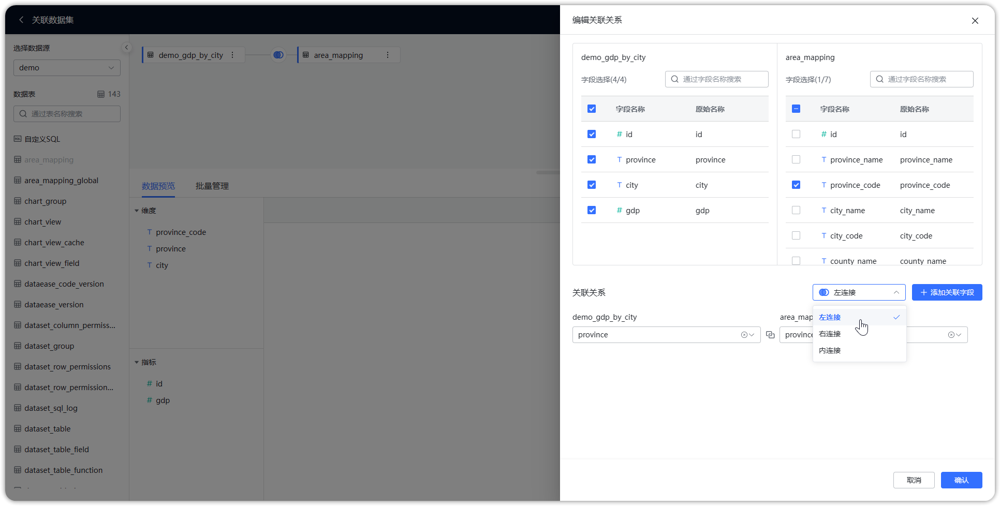

## 1 数据集预览

!!! Abstract ""
    点击左侧数据表，右侧默认展示预览数据。  
    **两种连接模式的差异：**  

    1. 如果数据集为【直连】模式，那么没有【更新信息】模块，数据实时获取；  
    2. 如果数据集为【定时同步】模式，那么可通过【数据关联】设置数据集间关联关系，也可通过【更新信息】设置定时任务，更新数据。

    **DataEase v1.12.0 版本，优化了数据集数据预览页面的请求数据策略，数据集从数据关联、更新信息、行权限、列权限 Tab 页切换至数据预览 Tab 页时，不再向后端发起数据请求；**  

    从字段管理 Tab 页，切换至数据预览 Tab 页时，若字段管理中没有任何更变，这些更变包括 2 【字段管理】中的操作，则不向后端发起数据请求，否则重新请求数据；  
    是否变更的判定标准：在字段管理 Tab 页中，向后端发起任何修改请求，即判定为发生变更，包括：新建、编辑 、删除计算字段，同步字段，对字段进行任意修改（比如是否选中、字段名、类型、维度指标转换）。
 
{ width="900px" }  
{ width="900px" }

## 2 字段管理

### 2.1 字段重命名

!!! Abstract ""
    如下图所示，切换到字段管理页，修改字段名。

{ width="900px" }

### 2.2 更换字段类型

!!! Abstract ""
    如下图所示，点击【字段类型】按钮，更换字段类型。

{ width="900px" }

### 2.3 更换指标维度

!!! Abstract ""
    如下图所示，点击【维度指标转换】按钮，将字段转换为维度或指标。

{ width="900px" }

### 2.4 新建计算字段

!!! Abstract ""
    点击【新建计算字段】按钮，弹出新建计算字段页面，在此页面输入字段名，字段表达式，通过引用函数，生成新的数据集字段。

{ width="900px" }
 
!!! Abstract ""
    - 【序号 1】在此输入新建字段的名称；
    - 【序号 2】字段表达式由引用的字段和函数组成，也可手动添加四则运算符号；
    - 【序号 3】选择新建字段的数据类型，包括维度或指标；
    - 【序号 4】根据引用的字段及函数计算结果，调整新建字段的字段类型；
    - 【序号 5】引用字段栏，点击数据集原有的字段，字段表达式栏引用到对应的字段；
    - 【序号 6】函数栏，使用的函数支持对应数据集的数据库函数。

{ width="900px" }

!!! Abstract ""
    **请注意：** 字段表达式支持所有的数据库函数以及简单的加减乘除，不仅是右侧列出的示例函数。比如：直连模式，数据源为 MySQL 数据库，那么字段表达式中可输入所有 MySQL 数据库的函数，包括 IF、CASE WHEN 等用法。已增加的计算字段不支持二次计算。  
    **提示：** 相关函数的使用可参考 [DataEase 数据集的计算字段使用说明](https://kb.fit2cloud.com/archives/17)。

### 2.5 同步新的字段
    
!!! Abstract ""
    点击【同步字段】，弹出确认同步页面，点击【确定】对字段进行同步。

{ width="900px" }

## 3 数据关联

!!! Abstract ""
    点击【数据关联】，切换到数据关联页面，点击【新建关联】，切换至关联设置页面，如下图所示，还可以编辑、删除关联关系。

{ width="900px" }

### 3.1 左连接

!!! Abstract ""
    如下图，在关联数据集设置页面，选择左连接，即 LEFT JOIN，连接取左表所有数据记录，当关联字段中匹配到右表的字段，则检索出右表的数据记录，否则以 null 显示。

{ width="900px" }


### 3.2 右连接

!!! Abstract ""
    如下图，在关联数据集设置页面，选择右连接，即 RIGHT JOIN，连接取右表所有数据记录，当关联字段中匹配到左表的字段，则检索出左表的数据记录，否则以 null 显示。

{ width="900px" }

### 3.3 内连接

!!! Abstract ""
    如下图，在关联数据集设置页面，选择内连接，即 INNER JOIN，当左表和右表的数据记录存在匹配时，数据记录才被检索出来。

{ width="900px" }

## 4 更新信息

!!! Abstract ""
    点击左侧数据表（定时同步模式下），右侧默认展示预览数据，可点击【更新信息】，切换至更新信息页面，可点击【更新设置】设置定时任务；点击【刷新】，刷新下方任务列表；点击状态栏，还可查看任务执行的详细情况。

!!! Abstract ""
    **请注意：** 如果数据集是首次添加，而且是【定时同步】模式，那么需要设置定时任务更新数据到缓存区，否则无法用此数据集创建数据关联和视图。

{ width="900px" }

!!! Abstract ""
    点击【更新设置】，进入更新设置页面，如下图，可以通过点击【添加任务】增加新任务，也可以编辑和删除任务。

{ width="900px" }

### 4.1 添加任务

!!! Abstract ""
    点击添加任务，在添加任务页面，设置任务名称，更新方式（有全量更新、增量更新两种方式），选择任务的开始时间，结束时间，以及执行频率（支持三种设置方式，立即执行、简单重复、表达式设定），任务信息添加完毕后，点击【确认】，任务添加成功。  
    **提示：** 表达式可参考 [Cron 在线表达式生成器](http://cron.ciding.cc/)。

{ width="900px" }

### 4.2 全量更新

!!! Abstract ""
    如下图所示，在更新设置页面，点击【添加任务】，弹出添加任务页面，先修改任务名称，选定【全量更新】更新方式，调整执行频率，点击【确定】，全量更新任务添加成功。

{ width="900px" }

### 4.3 增量添加

!!! Abstract ""
    【增量更新方式】，选择同步数据的增量方式，若勾选增量添加，那么数据增量添加；若勾选增量删除，那么对数据实行增量删除。同时也可在【参数】区域，输入 SQL 语句的时间参数。  
    **注意：系统自带的 ${__current_update_time__}、${__last_update_time__} 为 13 位的时间戳，传参时，需要把原始时间字段转化为时间戳再做比较。**

!!! Abstract "" 
    如下图所示，增量更新方式选择【增量添加】，在输入框中输入 SQL 语句，并拖拉参数【上次更新时间】，即更新数据的方式为：把订单时间大于上次更新时间的数据抽取至缓存区；
    点击【添加任务】，修改任务名称，选定【增量更新】，点击【确定】，增量添加任务建立成功。

{ width="900px" }

### 4.4 增量删除

!!! Abstract ""
    如下图所示，增量更新方式选择【增量删除】，在输入框中输入 SQL 语句，并拖拉参数【上次更新时间】，即更新数据的方式为：把订单时间大于上次更新时间的数据从缓存区删除；  
    点击【添加任务】，修改任务名称，选定【增量更新】，点击【确定】，增量删除任务添加成功。  
    **注意：系统自带的 ${__current_update_time__}、${__last_update_time__} 为 13 位的时间戳，传参时，需要把原始时间字段转化为时间戳再做比较。**

{ width="900px" }

