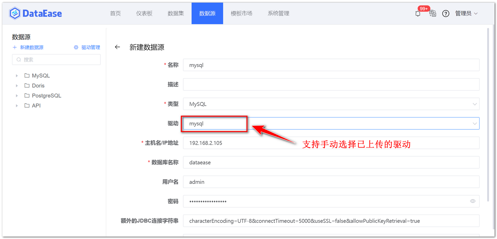
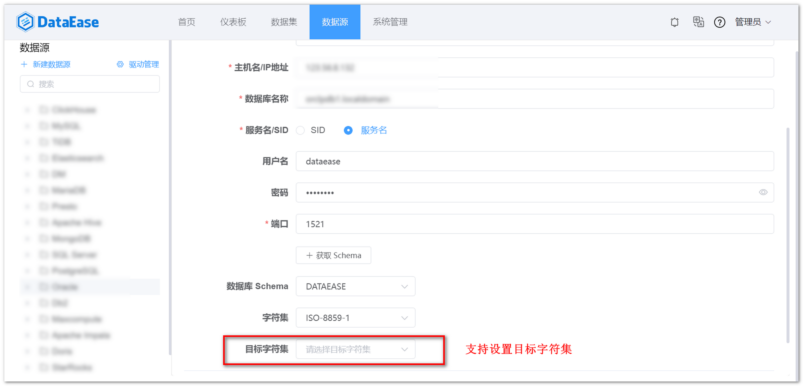
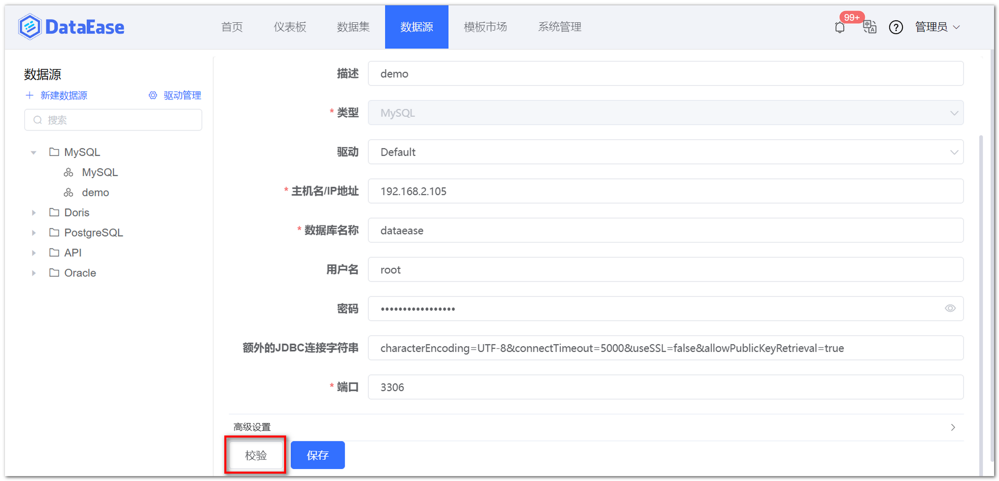
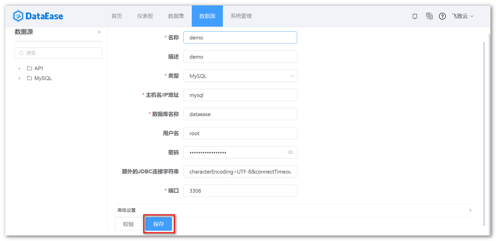

## 1 新建数据连接

!!! Abstract ""
    **以 MySQL 数据库为示例：**

    点击【新建数据连接】按钮，跳转至新建数据源页面。在新建数据源页面输入名称、选择类型为 MySQL，填入 IP 地址，填写数据库名称，用户名和密码等。
 
{ width="900" }

!!! Abstract ""
    配置数据源时，支持手动选择与数据库匹配的驱动，解决不同版本数据源驱动程序不兼容问题，如不更改，驱动选择栏默认是 Default，即系统自带的驱动。

{ width="900" }

!!! Abstract ""
    配置数据源时，支持查询超时参数设置，DataEase v1.12.0 之前的版本数据源默认超时时间为 30 秒，新增数据源时可调整超时时间，若不修改，超时时间默认为 30 秒，如下图所示。

{ width="900" }

!!! Abstract ""
    配置数据源时，支持设置源编码与目标编码，目前仅支持 Oracle 数据源，如下图所示。

{ width="900" }

## 2 数据源校验

!!! Abstract ""
    如下图所示，点击【校验】，校验数据链接性，若信息输入正确，且网络正常，提示校验成功。

{ width="900" }

## 3 数据源保存

!!! Abstract ""
    如下图所示，点击【保存】，完成数据库数据源的新建。  
    **提示：** 添加数据源时若链接信息已存在系统会提示用户 "已经存在相同配置的数据源信息，确认保存？"，用户仍然可以选择继续按照该信息添加。

{ width="900" }
