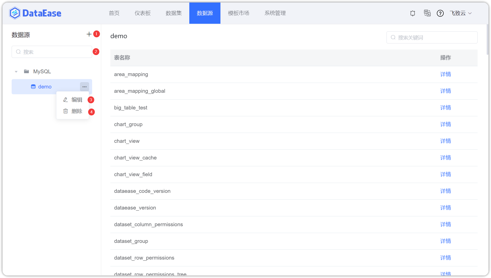
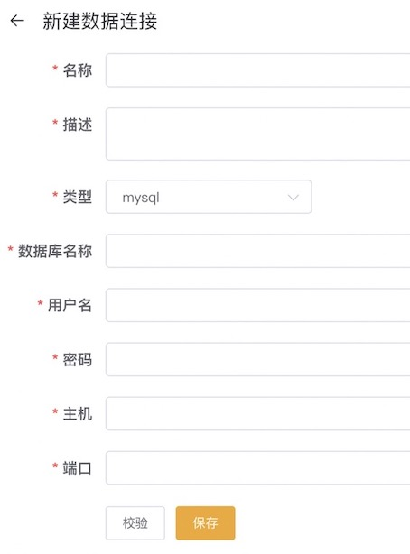
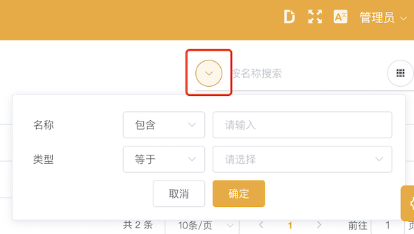
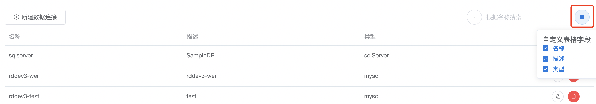
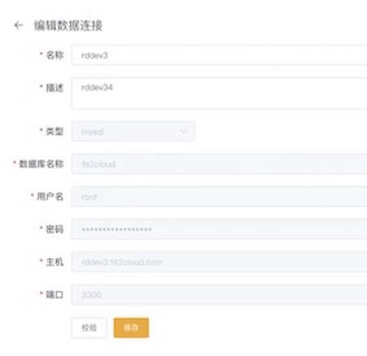
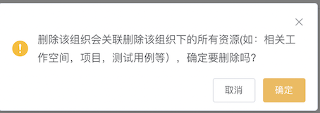
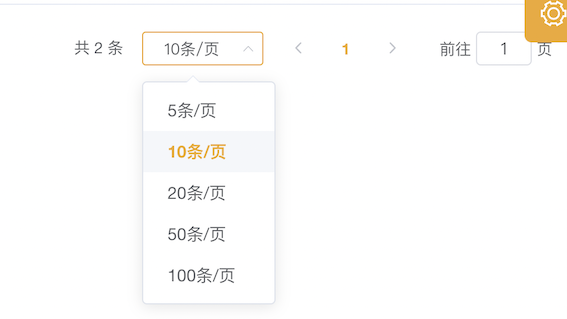

## 功能概述
> 点击"数据源"，进入数据源管理功能模块，该页面包括数据连接的新增（序号1）、搜索（2）、列表显示（序号3）、编辑（序号4）、删除（序号5）、翻页（序号6）等功能

 

## 新建数据连接
> 点击"新建数据连接"按钮，跳转至新建数据连接页面。在新建页面输入连接信息，输入完成后点击校验，若校验成功，点击保存，则新连接成功添加；若校验失败，需重新输入连接信息，直至校验通过，方可保存成功，也可以点击左上方箭头返回之前页面。
 

## 数据连接搜索
> 支持两种搜索方式： 第一种、输入连接名称进行模糊搜索； 点击下图箭头，使用高级搜索功能。

## 数据连接列表显示
> 数据连接列表，默认显示名称、描述和类型属性，可点击下图图标，选择需要显示的属性，如需要显示，点击勾选☑️，如果不需要显示，点击勾选掉即可。

## 编辑数据连接
> 点击连接的"编辑"按钮，可进行数据连接的编辑，包括修改连接名称、描述，修改完成后点击"校验"，校验通过可点击"保存"，提示保存成功并返回"数据源"页面

## 删除数据连接
> 点击连接的"删除"按钮，弹出如下界面，若点击"确定"，则删除该数据连接，并返回"数据源"页面；若点击"取消"，则没有任何改变，并返回"数据源"页面。

## 翻页
> 该区域记录连接总条数，当前页码；可点击下拉框，选择每页展示的连接条数；也可输入页码，展示该页码的连接信息。

