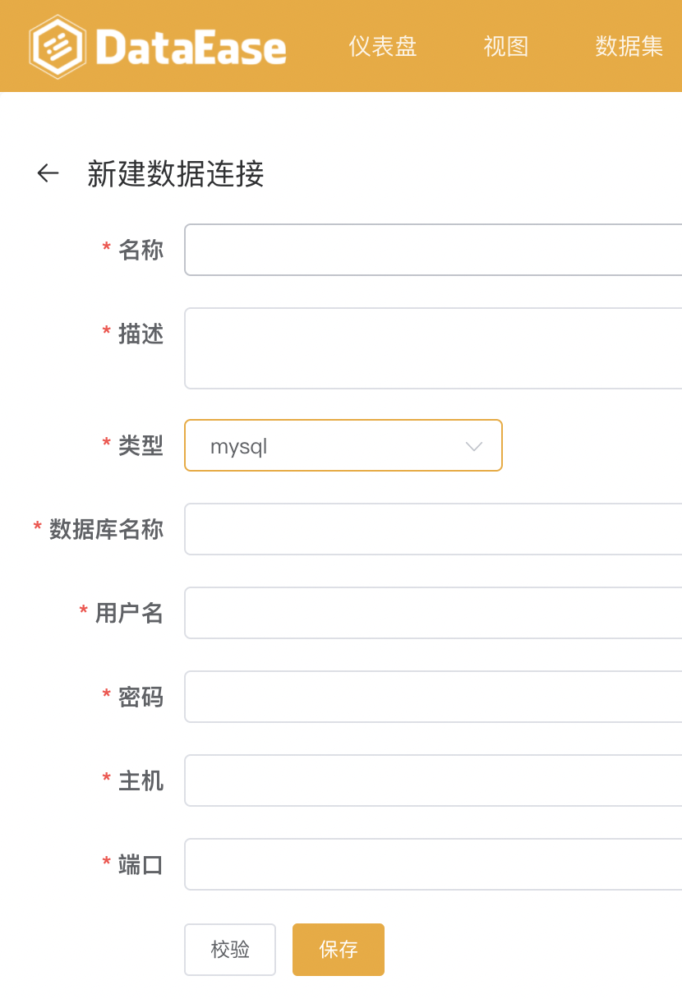
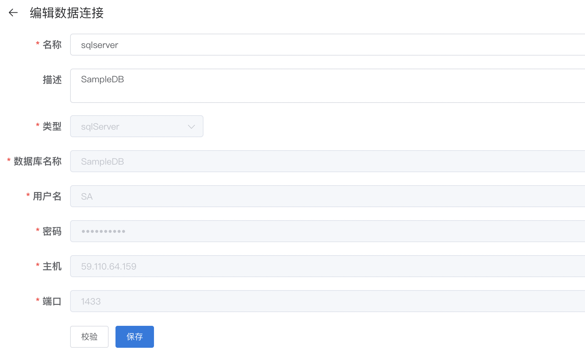

## 功能概述
> "数据源"用来管理各类数据源连接信息，是后续数据分析操作中数据的来源。目前支持的数据源类型有：Excel文件、MySQL数据库、Oracle数据库、Sql Server数据库、PostgreSQL数据库。

> 点击"数据源"，进入数据源管理功能模块，该页面包括数据连接的新增（序号1）、搜索（序号2）、删除（序号3）、编辑（序号4）等功能

 

## 1 新建数据连接
> 点击"新建数据连接"按钮，跳转至新建数据连接页面。在新建页面输入连接信息，输入完成后点击校验，若校验成功，点击保存，则新连接成功添加；若校验失败，需重新输入连接信息，直至校验通过，方可保存成功，也可以点击左上方箭头返回之前页面。
 

## 2 数据连接搜索
> 使用方式，请查阅通用功能 [「搜索」](../general/#_6)

## 3 编辑数据连接
> 点击连接的"编辑"按钮，可进行数据连接的编辑，包括修改连接名称、描述，修改完成后点击"校验"，校验通过可点击"保存"，提示保存成功并返回"数据源"页面

## 4 删除数据连接
> > 使用方式，请查阅通用功能 [「删除」](../general/#_5)
