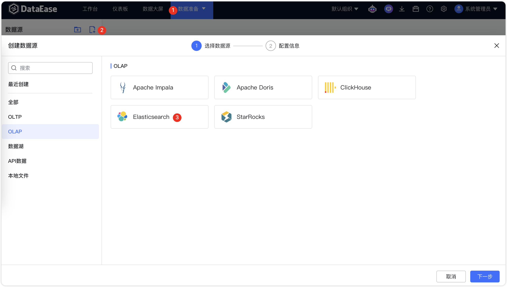
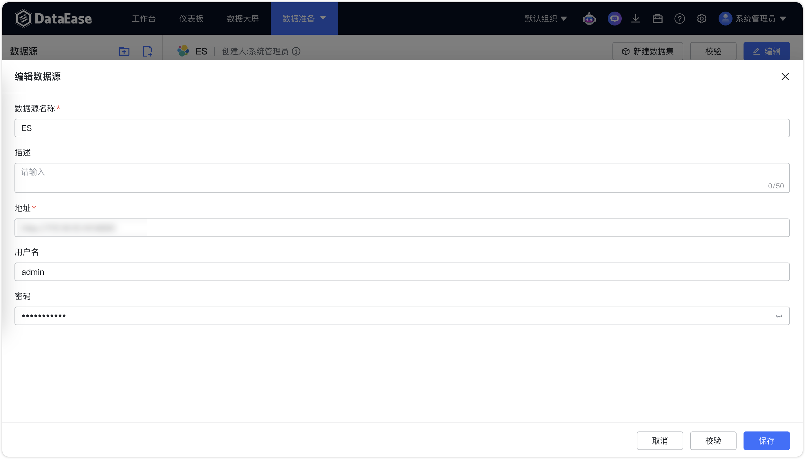
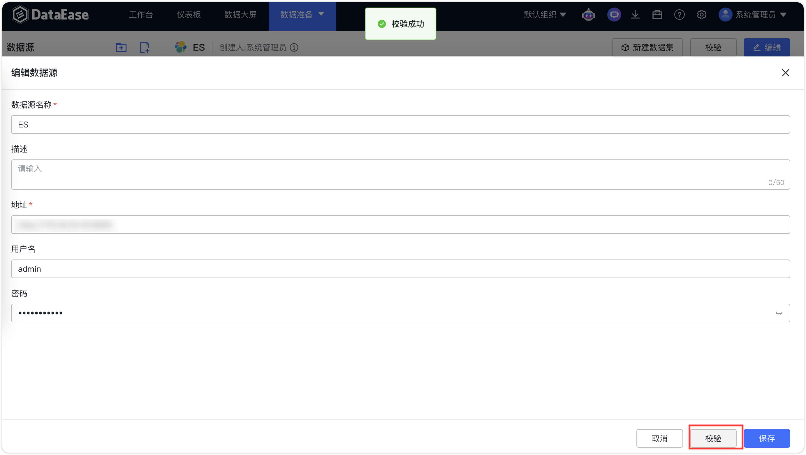

## 1 前提条件

!!! Abstract ""
    链接 Elasticsearch 数据库之前，请收集以下信息：

    - 数据库服务器的 IP 地址和端口号
    - 数据库名称
    - 数据库用户名和密码

## 2 配置数据源链接步骤

!!! Abstract ""
    步骤一：登入 DataEase 系统。

!!! Abstract ""
    步骤二：按照以下步骤，选择 Elasticsearch 图标。

{ width="900" }

!!! Abstract ""
    步骤三：填入收集的 IP 、端口、数据库等相关的信息。

{ width="900" }

!!! Abstract ""
    详细说明信息如下：

| 基础属性 | 说明                      |
|:-----|:------------------------|
| 显示名称 | 数据源界面左侧列表中的显示名称         |   
| 描述   | 填写与此数据源相关的一些附属说明信息      |
| 地址   | 填写 http(s)://域名(IP):端口号 |
| 用户名  | 数据库对应的用户名               |
| 密码   | 数据库对应的密码                |

!!! Abstract ""
    步骤四：数据源检验，校验成功后如下图所示，点击保存即可。

{ width="900" }
