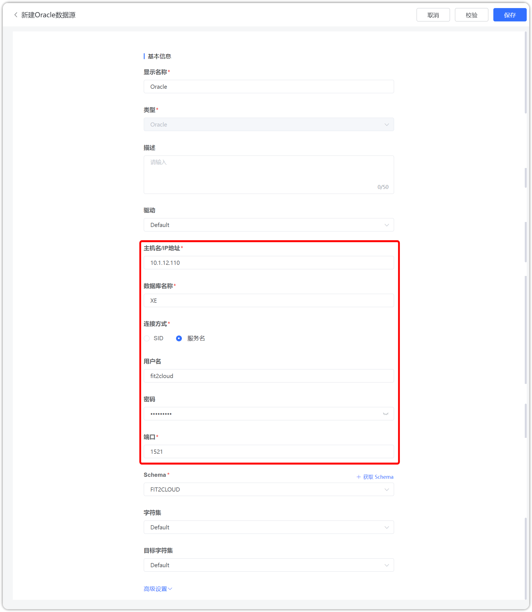

## 1 前提条件

!!! Abstract ""
    链接 Oracle 数据库之前，请收集以下信息：

    - 数据库服务器的 IP 地址和端口号
    - 数据库名称
    - 数据库用户名和密码

## 2 配置数据源链接步骤

!!! Abstract ""
    步骤一：登入 DataEase 系统。

!!! Abstract ""
    步骤二：按照以下步骤，选择 Oracle 图标。

{ width="900" }

!!! Abstract ""
    步骤三：填入收集的 IP 、端口、数据库等相关的信息。

{ width="900" }

!!! Abstract ""
    步骤四：获取 Schema。

{ width="900" }

!!! Abstract ""
    详细说明信息如下：

| 基础属性           | 说明                          |
|:---------------|:----------------------------|
| 显示名称           | 数据源界面左侧列表中的显示名称             |   
| 描述             | 填写与此数据源相关的一些附属说明信息          |
| 驱动             | 默认驱动包使用 ojdbc8-12.2.0.1.jar |
| 主机名/IP 地址      | 填写数据库所在服务器的 IP 地址           |
| 数据库名称          | 连接的数据库的名称                   |
| 链接方式           | 可选择 SID 或 服务名               |
| 用户名            | 数据库对应的用户名                   |
| 密码             | 数据库对应的密码                    |
| 额外的 JDBC 链接字符集 | 填写连接数据库的 JDBC 字符集           |
| 端口             | 填写正确的端口，默认为 1521            |
| Schema         | 选择对象的集合                    |
| 字符集            | 请根据数据库实际情况填写                |
| 目标字符集          | 请根据数据库实际情况填写                |

!!! Abstract ""
    步骤五：数据源检验，校验成功后如下图所示，点击保存即可。

{ width="900" }