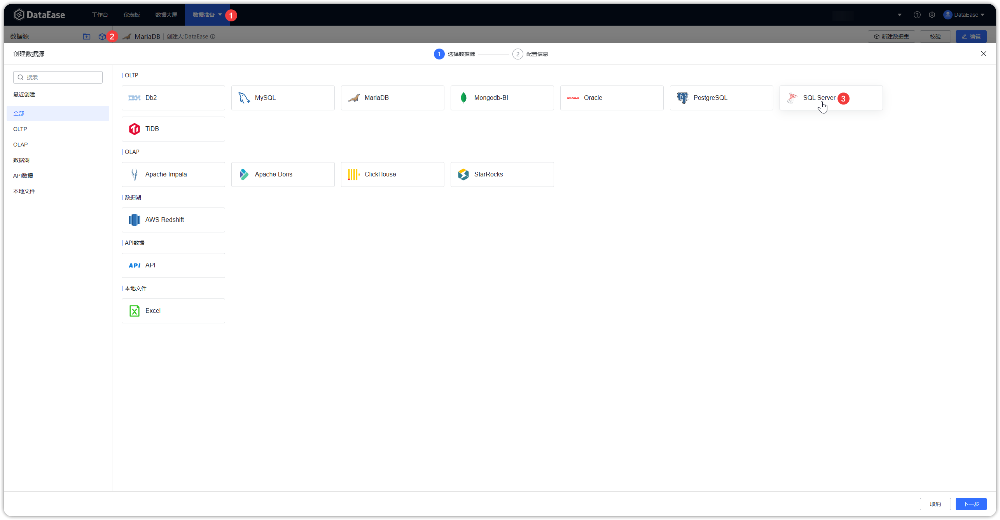
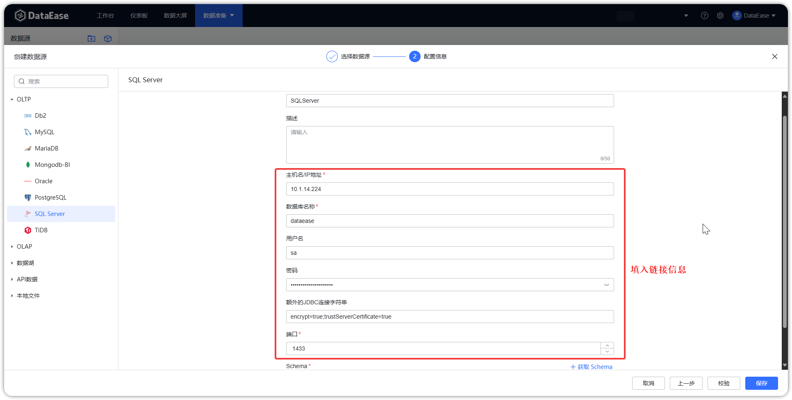
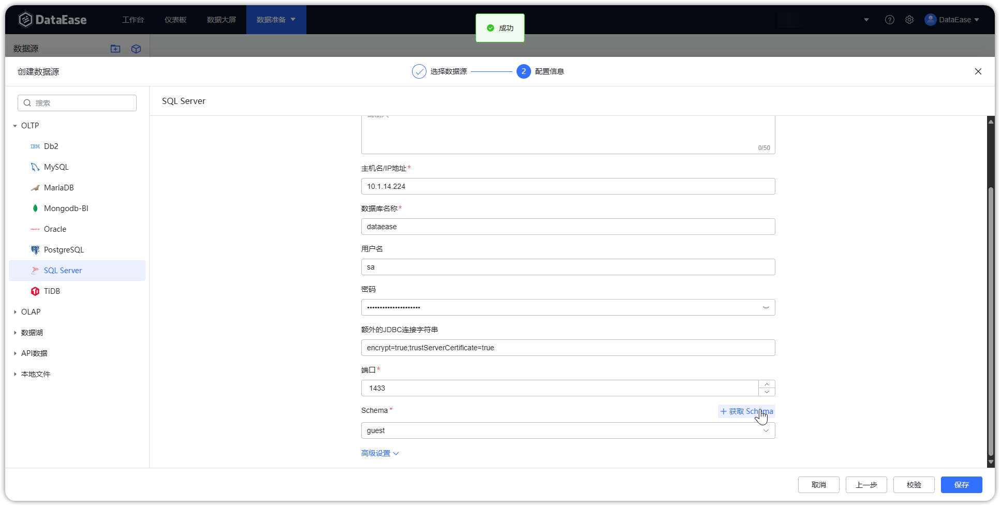

## 1 前提条件

!!! Abstract ""
    链接 SQL_Server 数据库之前，请收集以下信息：

    - 数据库服务器的 IP 地址和端口号
    - 数据库名称
    - 数据库用户名和密码

## 2 配置数据源链接步骤

!!! Abstract ""
    步骤一：登入 DataEase 系统。

!!! Abstract ""
    步骤二：按照以下步骤，选择 SQL Server 图标。

{ width="900" }

!!! Abstract ""
    步骤三：填入收集的 IP 、端口、数据库等相关的信息。

{ width="900" }

!!! Abstract ""
    步骤四：获取 Schema。

{ width="900" }

!!! Abstract ""
    详细说明信息如下：

| 基础属性             | 说明                 |
 |:-----------------|:-------------------|
| 显示名称             | 数据源界面左侧列表中的显示名称    |   
| 描述               | 填写与此数据源相关的一些附属说明信息 |
| 驱动               | 默认驱动包              |
| 主机名/IP 地址        | 填写数据库所在服务器的 IP 地址  |
| 数据库名称            | 连接的数据库的名称          |
| 用户名              | 数据库对应的用户名          |
| 密码               | 数据库对应的密码           |
| 额外的 JDBC 链接字符集   | 填写连接数据库的 JDBC 字符集  |
| 端口               | 填写正确的端口，默认为 1433   |
| Schema         | 选择对象的集合           |

!!! Abstract ""
    步骤五：数据源检验，校验成功后如下图所示，点击保存即可。  
    **注意：若数据库连接失败，可添加额外的 JDBC 连接符”encrypt=true;trustServerCertificate=true“，确保具有足够的权限。**

{ width="900" }
