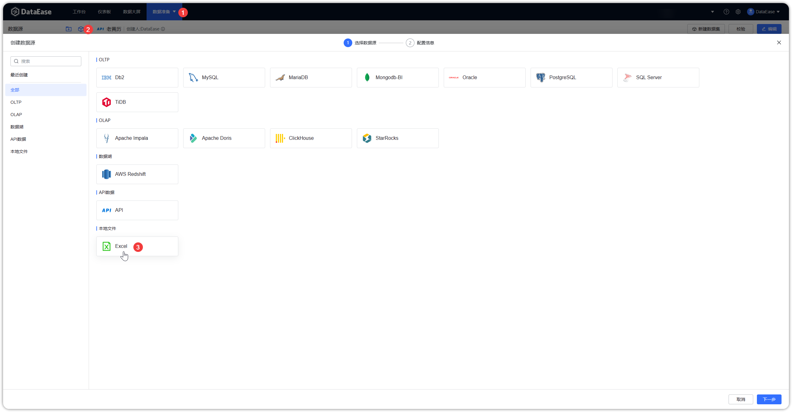
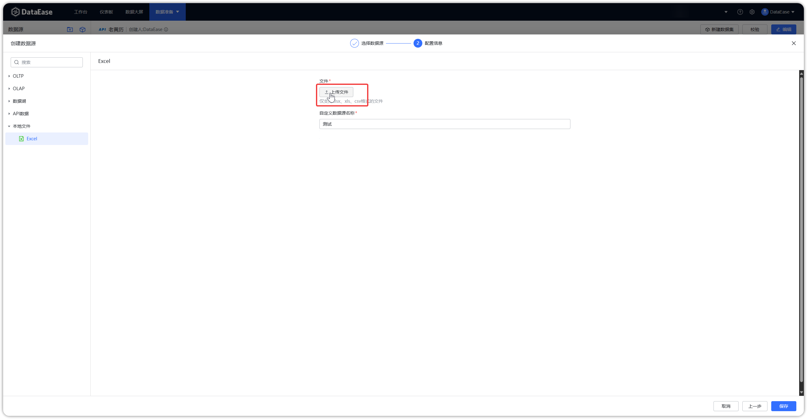
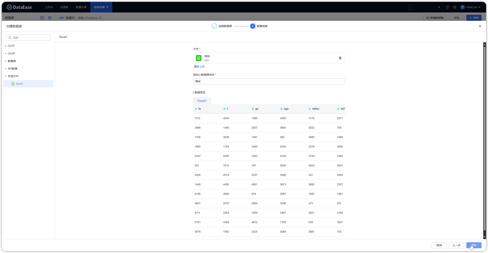
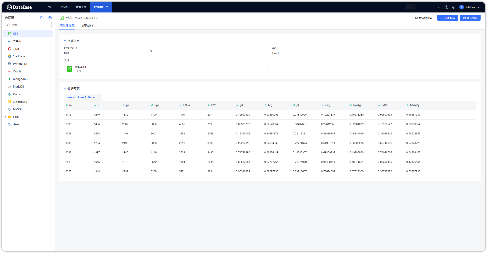

## 1 前提条件

!!! Abstract ""
    链接 Excel 数据表之前，请收集以下信息：

    - 数据质量检查： 确保 Excel 数据表中的数据质量良好，无合并单元格、缺失值、错误格式或其他异常；
    - 格式标准化： 统一日期、时间和数字的格式，以确保数据在不同系统之间的兼容性，文件的第一行为标题行，不能为空；
    - 合理的文件大小：Excel 文件大小请确保在 500M 以内。

## 2 配置数据源链接步骤

!!! Abstract ""
    步骤一：登入 DataEase 系统。

!!! Abstract ""
    步骤二：按照以下步骤，选择 Excel 图标。

{ width="900" }

!!! Abstract ""
    步骤三：点击【上传文件】并自定义数据源名称，上传成功后可对数据进行预览。

{ width="900" }

{ width="900" }

!!! Abstract ""
    步骤四：点击保存即可，如下图所示。

{ width="900" }

