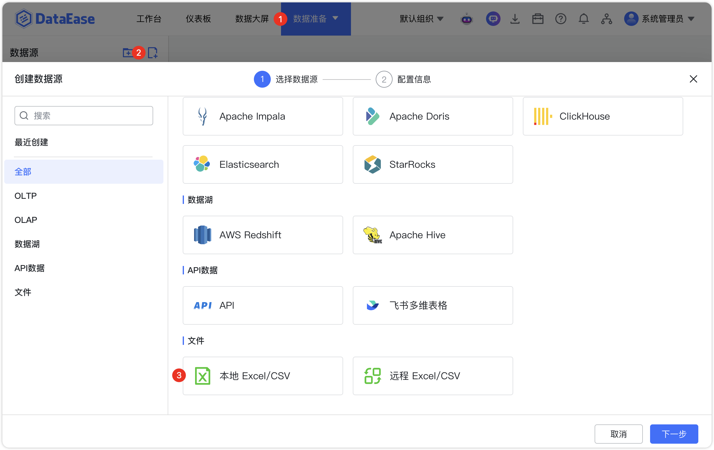
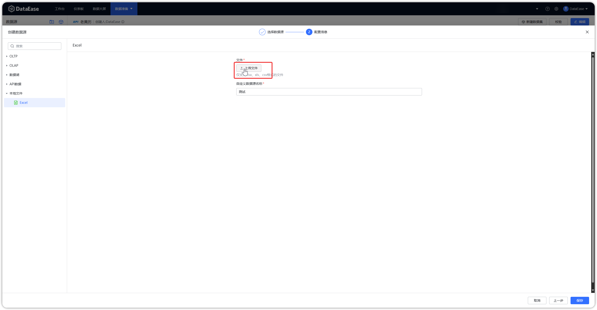
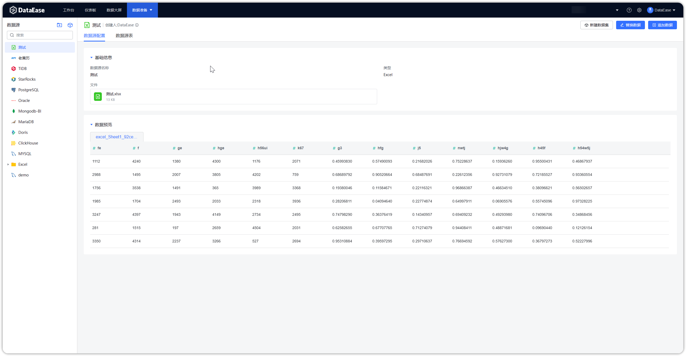

## 1 前提条件

!!! Abstract ""
    上传 Excel/CSV 数据表之前，请收集以下信息：

    - 数据质量检查： 确保 Excel/CSV 数据表中的数据质量良好，无合并单元格、缺失值、错误格式或其他异常；
    - 格式标准化： 统一日期、时间和数字的格式，以确保数据在不同系统之间的兼容性，文件的第一行为标题行不能为空，百分比转为数值格式；
    - 合理的文件大小：Excel/CSV 文件大小请确保在 500M 以内。

## 2 配置数据源链接步骤

!!! Abstract ""
    步骤一：登入 DataEase 系统。

!!! Abstract ""
    步骤二：按照以下步骤，选择 本地 Excel/CSV 图标。
    
    **注意：本地 Excel/CSV 指的是用户通过浏览器，将本地的  Excel/CSV  文件上传到 DataEase 中。而远程 Excel/CSV 数据源是  DataEase  从远程服务器读取的 Excel 或 CSV 文件。**

{ width="900" }

!!! Abstract ""
    步骤三：点击【上传文件】并自定义数据源名称，上传成功后可对数据进行预览。

{ width="900" }

!!! Abstract ""
    **上传 Excel 数据源时支持字段选择：**

    - 在上传 Excel/CSV 数据源时，支持选择指定字段进行导入，无需导入全部数据。选择字段时可自定义设置字段长度。
    - 对已有 Excel/CSV 数据源进行数据替换时，同样支持字段选择和字段长度调整。
    - 上传后可在字段选择中设置字段类型以及字段长度。

{ width="900px" }

!!! Abstract ""
    步骤四：点击保存即可，如下图所示。

{ width="900" }

!!! Abstract ""
    **替换 Excel/CSV 数据源时，按以下规则处理：**

    - 若新文件中包含相同的 sheet 页，则直接替换。
    - 若新文件的 sheet 页不一致（发生变化）：
        - 对于新文件中缺失的原有 sheet 页，保持不变。
        - 对于新文件中新增的 sheet 页，自动创建新数据集。

    **追加 Excel/CSV 数据源时，按以下规则处理：**

    - 只有新上传的 Excel/CSV 文件的 Sheet 页与原数据源的 Sheet 页匹配时，才会执行数据追加。匹配后，将新数据追加到原 Sheet 页，且不进行主键替换。
    - 如果新上传的 Excel/CSV 文件中包含原数据源中不存在的 Sheet 页，则不处理这些不匹配的 Sheet 页。