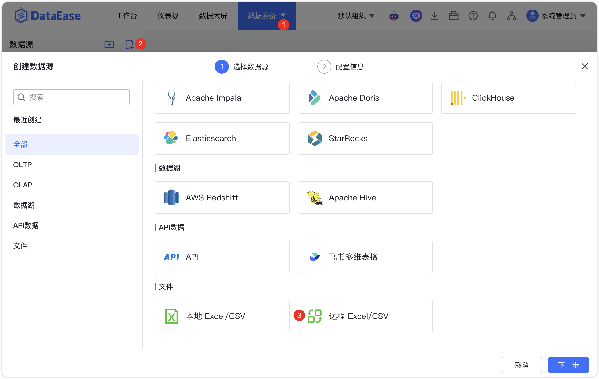

## 1 前提条件

!!! Abstract ""
    DataEase 支持通过 HTTP(S)/FTP 协议远程读取 Excel/CSV 文件，并将数据存入本地数据库。同时，可结合 API 数据源的定时同步功能，定期从指定路径获取最新的 Excel/CSV 文件并更新数据。

## 2 配置数据源链接步骤

!!! Abstract ""
    步骤一：登入 DataEase 系统。

!!! Abstract ""
    步骤二：按照以下步骤，选择 远程 Excel/CSV 图标。
    
    **注意：远程 Excel/CSV 数据源是  DataEase  从远程服务器读取的 Excel 或 CSV 文件。而本地 Excel/CSV 指的是用户通过浏览器，将本地的  Excel/CSV  文件上传到 DataEase 中。**

{ width="900" }

!!! Abstract ""
    步骤三：配置数据源基本信息。

    - 数据源名称：输入数据源的名称。
    - 远程 Excel/CSV 地址：填写远程数据文件的 HTTP(S) 或 FTP 访问链接。
    - 填写认证信息（如适用）：如果远程服务器需要身份验证，输入用户名和对应密码。
    可点击 【加载数据】进行数据预览，以确保远程文件能够正确解析。点击 【校验】 以验证数据源的连通性。

{ width="900px" }

!!! Abstract ""
    步骤四：设置更新方式和更新频率，可定期拉取远程 Excel/CSV 文件实现数据自动更新。

{ width="900px" }

{ width="900px" }

