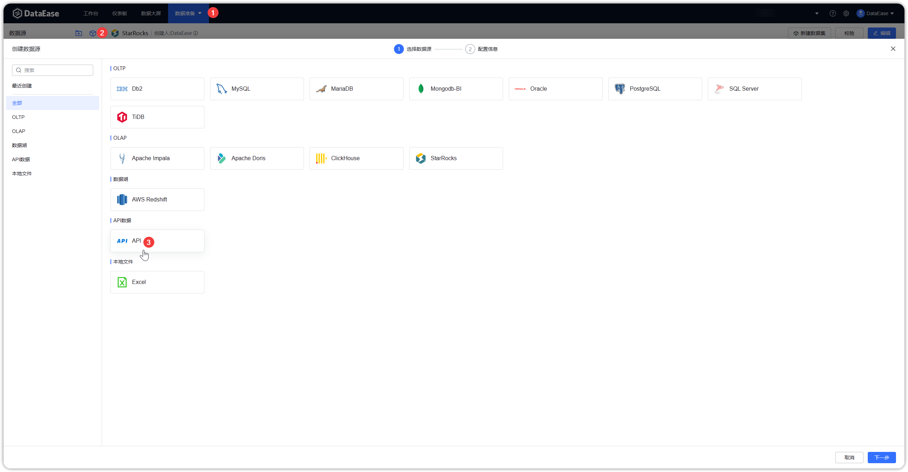
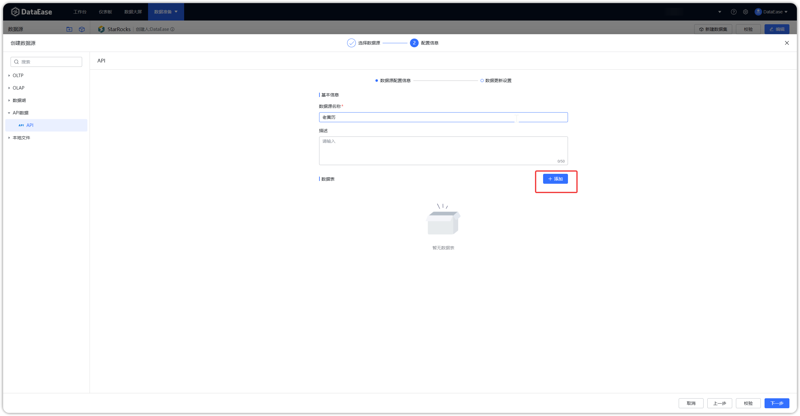
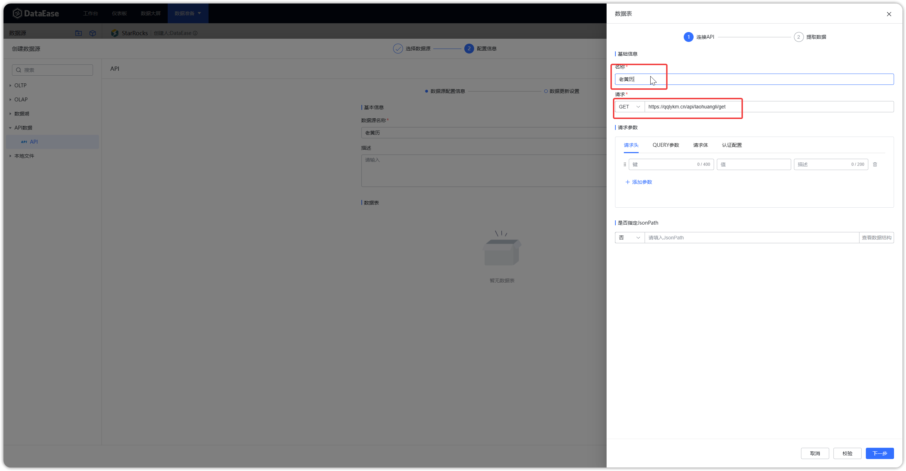
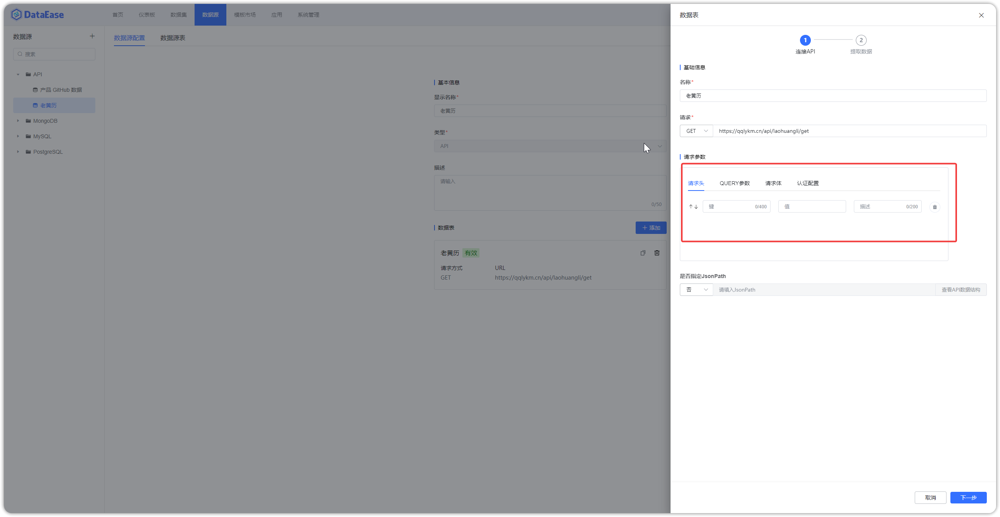
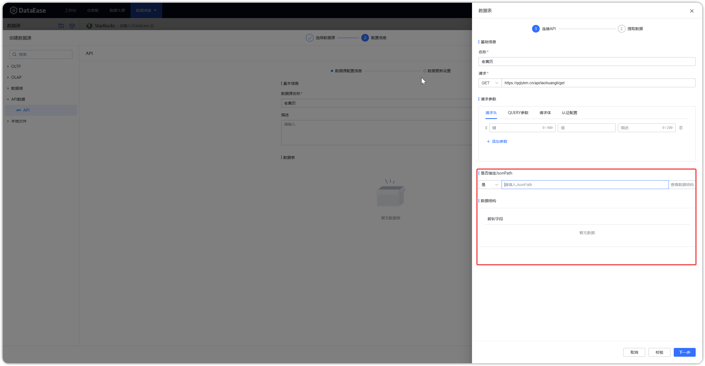
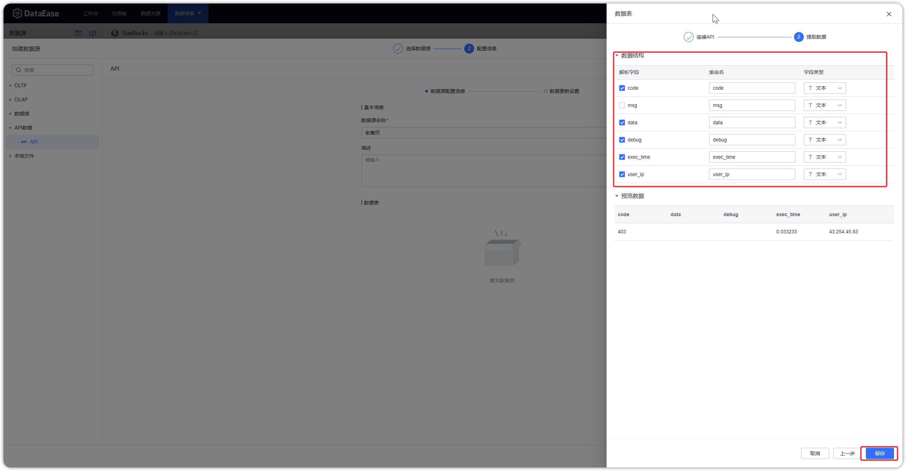
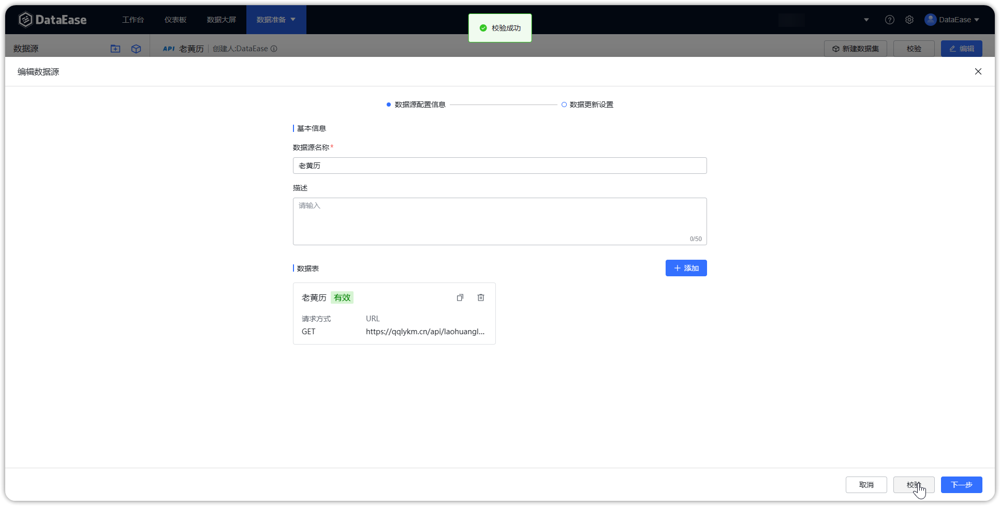
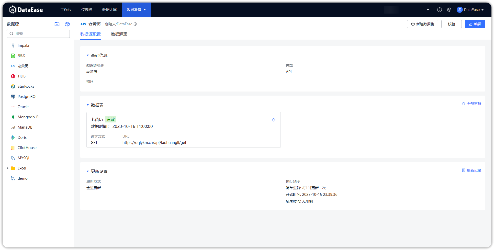

## 1 新建数据连接

!!! Abstract ""
    点击【新建数据源】，跳转至新建数据连接页面，填入新建数据源的名称，在【类型】下拉框选定【API】数据源。
 
{ width="900" }

## 2 添加 API 数据表

!!! Abstract ""
    点击【数据表】，跳转至添加 API 数据表页面，添加成功可再次返回新建数据源页面，一个 API 数据源可添加多张 API 数据表。

{ width="900" }

## 3 输入基础信息

!!! Abstract ""
    填写 API 数据表的基础信息，包括名称、完整的请求地址和请求方式，请求方式支持 GET 和 POST；  
    如下示例图以 GET 请求为例，请求类型选择 GET，填入完整的请求地址。

{ width="900" }

## 4 填写请求参数

!!! Abstract ""
    填写请求参数，包括请求头、请求体与认证配置，认证配置支持 No Auth 和 Basic Auth；  
    若【是否指定JsonPath】勾选否，则用户无需自行写 JsonPath，系统会自行解析，且可以组合不同层级的字段；  
    如下示例图，认证方式选 No Auth，【是否指定JsonPath】勾选否，点击下一步，勾选所需的字段，支持字段重命名，字段类型选择，点击【保存】即可。

{ width="900" }

{ width="900" }

!!! Abstract ""
    若【是否指定JsonPath】勾选是，则用户需自行写 JsonPath，系统会根据 JsonPath 的值进行解析，不可以组合不同层级的字段；  
    **注意：** 点击【查看 API 原始数据】按钮，可以查看到接口对应的数据结构，为写 JsonPath 提供参考；  
    如下示例图，认证方式选 No Auth，【是否指定JsonPath】勾选是，录入正确的 JsonPath 的值，点击下一步，支持字段重命名，字段类型选择，点击【保存】即可。

{ width="900" }

{ width="900" }

!!! Abstract ""
    API 数据源支持参数提取。API 数据源接口参数设置支持从 API 请求的响应数据中提取结果作为 API 数据表的请求参数，可以用于 API  token 获取等场景。
    提取参数：
{ width="900px" }

!!! Abstract ""
    配置参数：
{ width="900px" }

!!! Abstract ""
    API 数据源在请求参数的请求头、QUERY 参数、请求体（form-data、x-www-form-urlencoded）均增加时间函数支持。目前内置的时间函数有当天（yyyy-MM-DD）、当天（yyyy/MM/DD）。

{ width="900px" } 

!!! Abstract ""
    API 数据源支持主键设置及基于主键的增量同步更新。  

    **注意：**

    - API 数据源支持设置字段类型、长度以及是否为主键。
    - 增量更新时，系统会根据主键自动更新已存在的数据。
    - 仅在新建 API 数据源表时，才能为选定的字段设置主键，已有数据源表不支持修改主键设置。

{ width="900px" }

## 5 数据源校验

!!! Abstract ""
    新建数据源页面点击【校验】，校验数据链接性，若信息输入正确，且网络正常，提示校验成功。

{ width="900" }

## 6 数据源保存

!!! Abstract ""
    如下图所示，点击【保存】，配置 API 数据源完成。

{ width="900" }