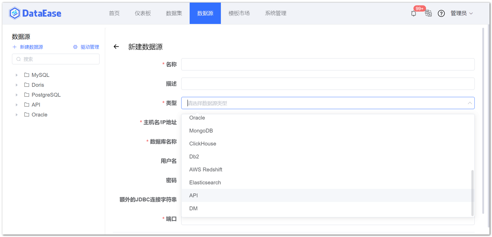
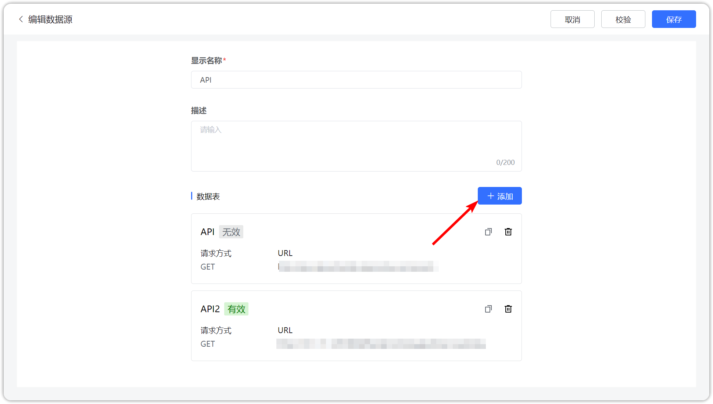
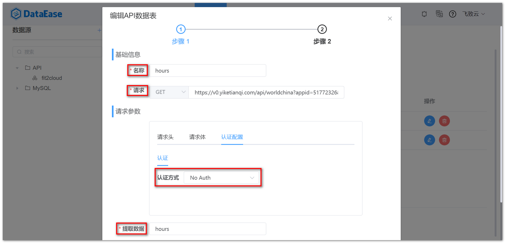
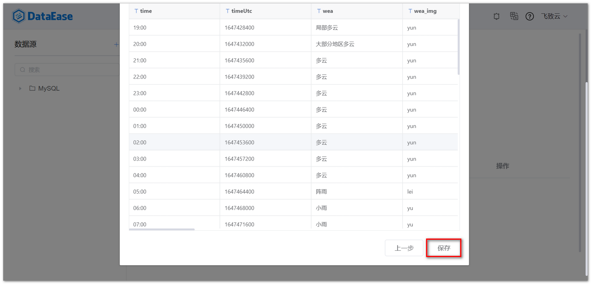
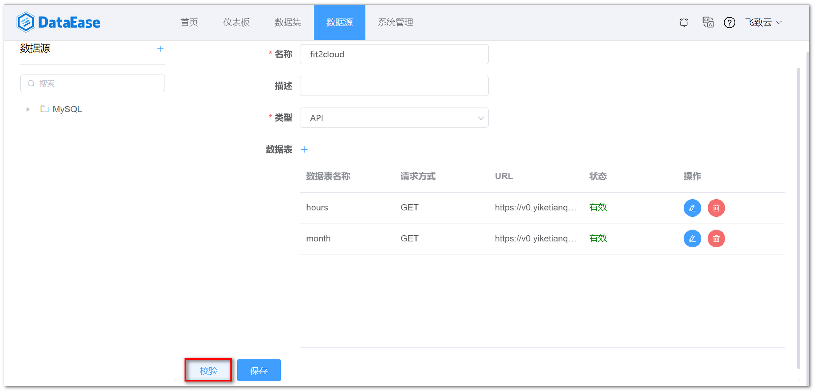
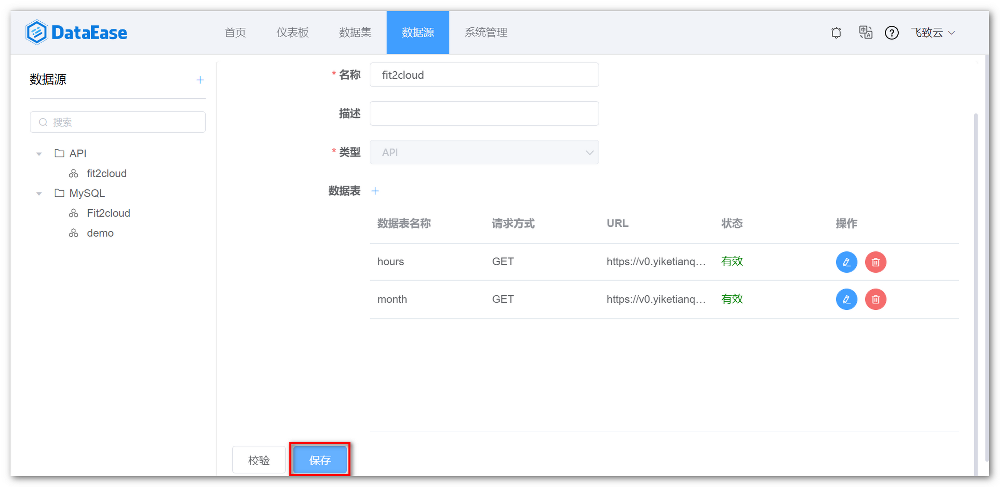

## 1 新建数据连接

!!! Abstract ""
    点击【新建数据连接】按钮，跳转至新建数据连接页面，填入新建数据源的名称，在【类型】下拉框选定【API】数据源。
 
{ width="900" }

## 2 添加 API 数据表

!!! Abstract ""
    点击【数据表】，跳转至添加 API 数据表页面，添加成功再次返回新建数据源页面，一个 API 数据源可添加多张 API 数据表。

{ width="900" }

## 3 输入基础信息

!!! Abstract ""
    填写 API 数据表的基础信息，包括数据表名称、完整的请求地址和请求方式，请求方式支持 GET 和 POST，认证配置支持 No Auth 和 Basic Auth;

    填写请求参数，包括请求头、请求体，选定认证方式后，用 **JsonPath** 填入数据路径，如果是获取根路径则填写 $ ，点击下一步，进入步骤二。

    **提示：** 以下以 GET 请求为例，请求类型选择 GET，填入完整的请求地址，认证方式选 No Auth。  
    **注意： DataEase v1.10.0 版本支持非数组类型的数据，如果是 v1.10.0 之前的版本 JsonPath 返回的结果必须是数组类型的值才支持保存，如需取非数组类型的数据，建议做版本升级。**

{ width="900" }

## 4 填写请求参数

!!! Abstract ""
    如下图，预览显示相应的字段与数据后，点击【保存】即可，否则返回上一步，再次检查填写的参数，直至数据预览成功。

{ width="900" }

## 5 数据源校验

!!! Abstract ""
    新建数据连接页面点击【校验】，校验数据链接性，若信息输入正确，且网络正常，提示校验成功。

{ width="900" }

## 6 数据源保存

!!! Abstract ""
    如下图所示，点击【保存】，配置 API 数据源完成。

{ width="900" }