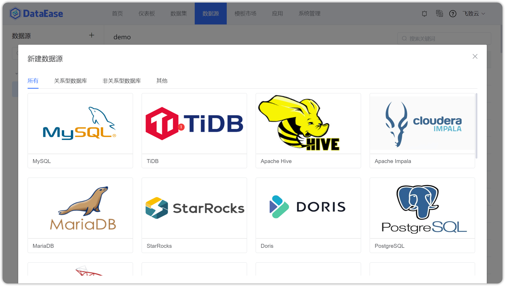
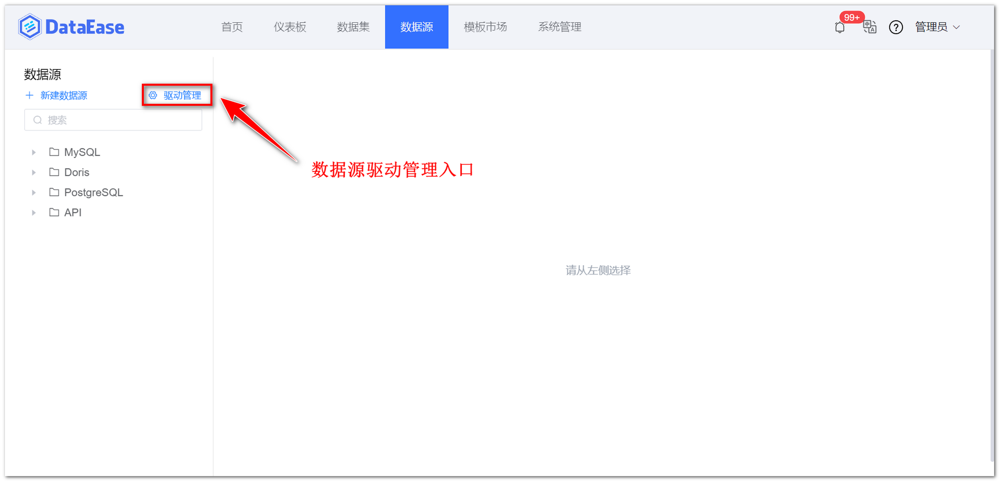
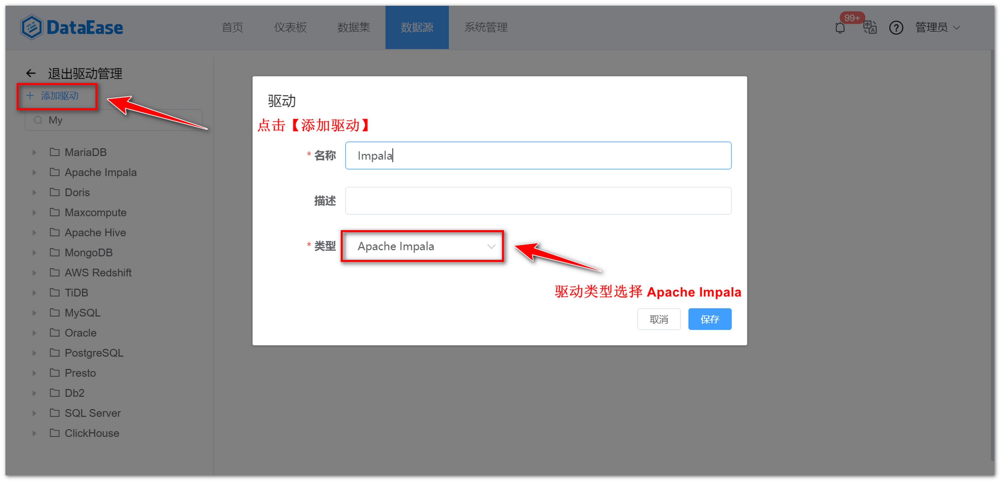
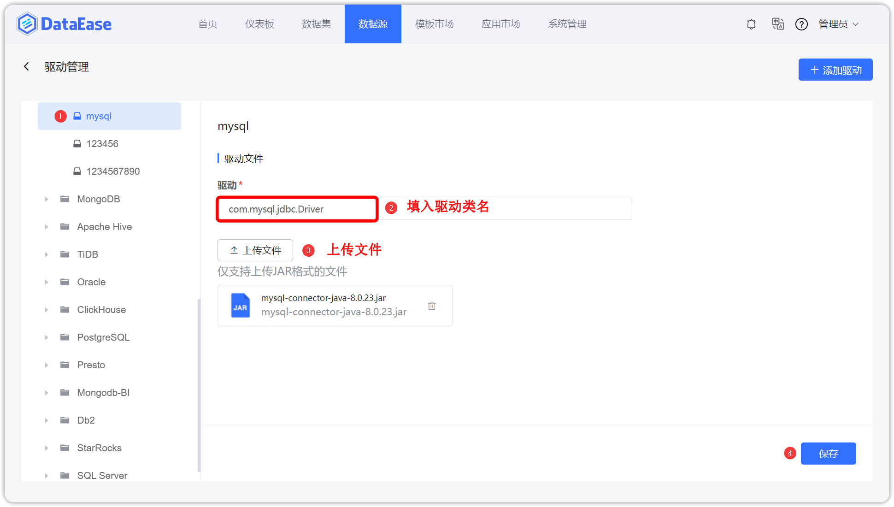
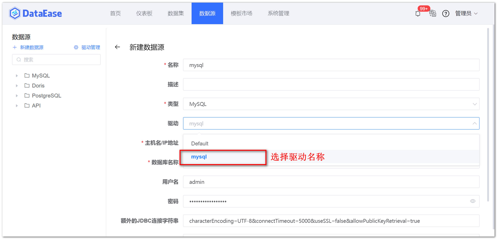

## 1 功能概述

!!! Abstract ""
    【数据源】用来管理各类数据源连接信息，是后续数据分析操作中数据的来源。点击【数据源】，进入数据源管理功能模块，该页面包括数据连接的新增（序号 1）、搜索（序号 2）、删除（序号 3）、编辑（序号 4）等功能。

{ width="900" }

## 2 支持的数据源类型

!!! Abstract ""
    - **数据仓库/数据湖：** AWS RedShift、MaxCompute
    - **OLTP 型数据库：** MySQL、MongoDB、SQL Server、Oracle、PostgreSQL、MariaDB、Db2、TiDB、达梦（DM）
    - **OLAP 型数据库：** Apache Hive、Elasticsearch、ClickHouse、Apache Doris、Apache Impala、StarRocks、Presto
    - **数据文件：** Excel
    - **API 数据源**

{ width="900" }

!!! Abstract ""
    以下版本为 DataEase 对接调试版，可供参考，其它版本您也可正常对接，若不满足可尝试通过在驱动管理处添加相应版本驱动解决。

    - SQL Server - 2019
    - Elasticsearch - 7.10.1、8.1.1
    - Oracle - 12.2.0.1
    - MongoDB - 4.4.13、5.0.6
    - Db2 - 10.5、11.5.7.0
    - TiDB - 5.3.1
    - PostgreSQL - 12.10、14.2
    - ClickHouse - 22.1.4.30
    - Hive - 2.3.2
    - 达梦 - DM8
    - mysql - 5.7.36
    - Impala - 4.0.0
    - Doris - 0.15、1.0.0、1.1.0
    - presto - 0.272

## 3 数据源驱动管理

!!! Abstract ""
    支持手动上传数据源驱动程序，在创建数据源时手动选择驱动，匹配不同版本数据库，下图以添加 Impala 驱动为示例。

{ width="900" }

{ width="900" }

{ width="900" }

{ width="900" }