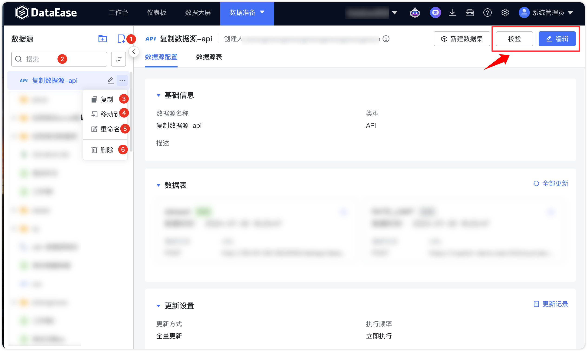
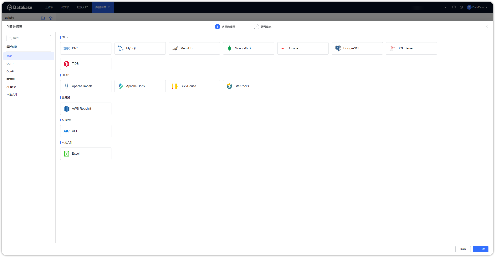

## 1 功能概述

!!! Abstract ""
    【数据源】用来管理各类数据连接信息，是后续数据分析操作中数据的来源；  
    点击【数据准备】，进入【数据源】管理功能模块。点击右上角可进行编辑选择的数据源。  
    该页面包括数据连接的新增（序号 1）、搜索（序号 2）、复制（序号 3）、移动（序号 4）、重命名（序号 5）、删除（序号 6）等功能。

{ width="900px" }

## 2 支持的数据源类型

!!! Abstract ""
    - **数据仓库/数据湖：** AWS RedShift、 Apache Hive（插件）
    - **OLTP 型数据库：** MySQL、MongoDB-BI、SQL Server、Oracle、PostgreSQL、MariaDB、Db2、TiDB、达梦（插件）
    - **OLAP 型数据库：** ClickHouse、Apache Doris、Apache Impala、StarRocks
    - **数据文件：** Excel、CSV
    - **API 数据源**

{ width="900px" }

!!! Abstract ""
    以下版本为 DataEase 研发对接调试版，可供参考，其它版本通常也可正常对接，若有问题可反馈至 GitHub Issue。

    - SQL Server - 2019
    - Oracle - 12.2.0.1
    - MongoDB - 4.4.13、5.0.6
    - TiDB - 5.3.1
    - PostgreSQL - 12.10、14.2
    - ClickHouse - 22.1.4.30
    - MySQL - 5.7.36
    - Impala - 4.0.0
    - Doris - 0.15、1.0.0、1.1.0
    - StarRocks  - 3.0.0
    - MariaDB - 10.7.8

## 3 数据源设置
!!! Abstract ""
    支持 ssh 隧道方式，通过跳板机连接其他网络环境中的数据源。支持密码和密钥两种方式。
{ width="900px" }
!!! Abstract ""
    支持设置连接数、查询超时。
{ width="900px" }
