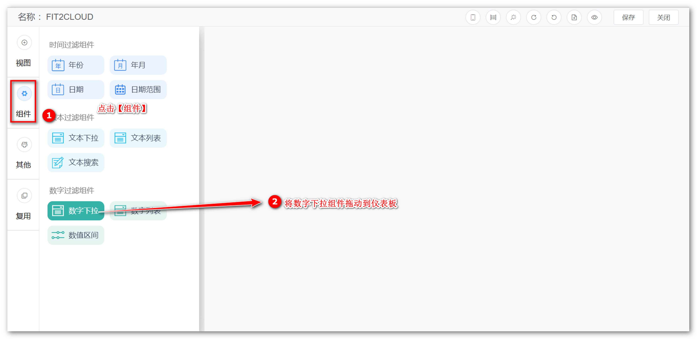
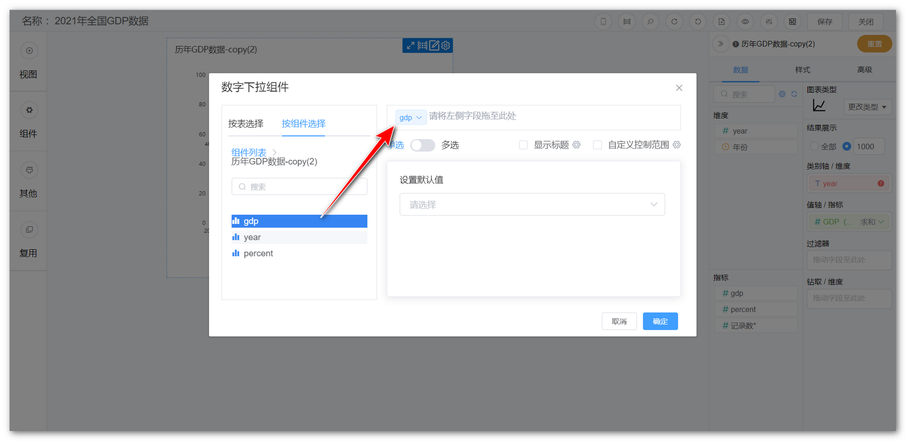
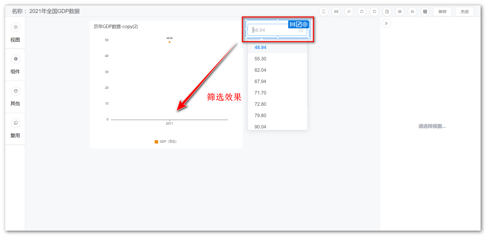
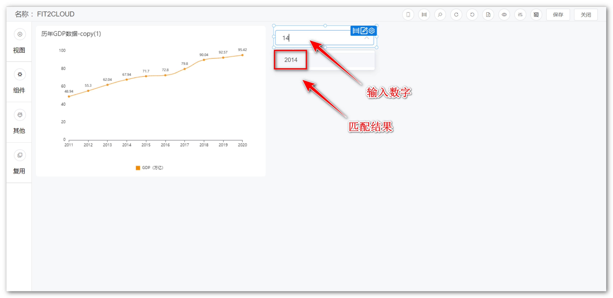
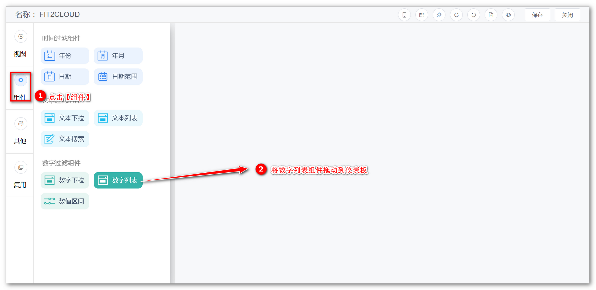
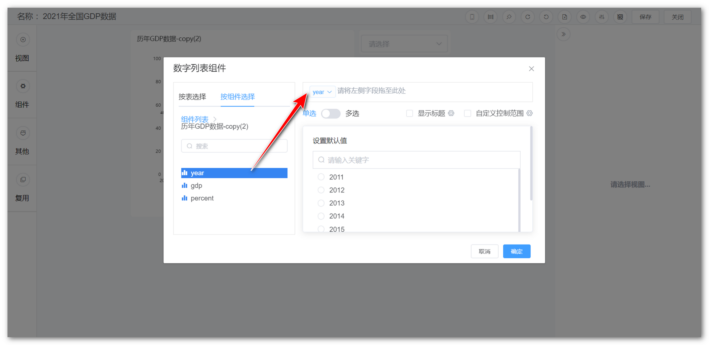
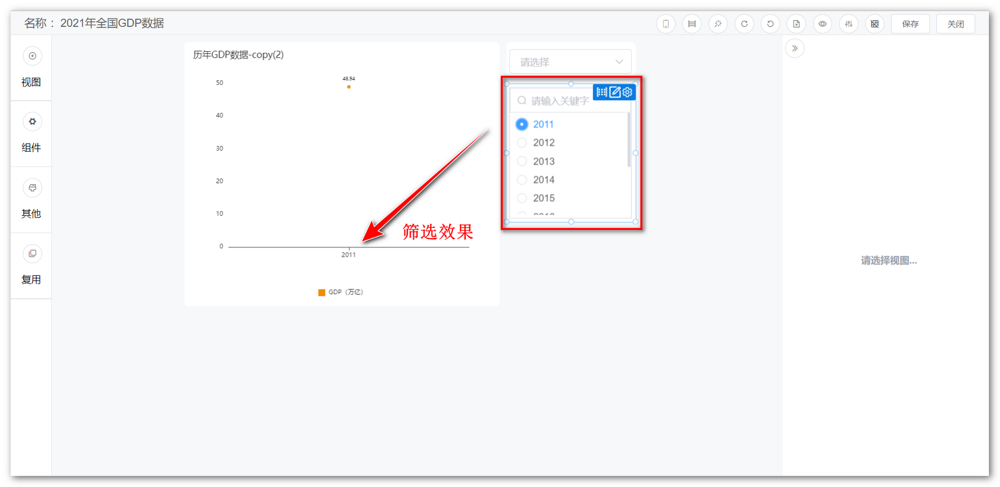
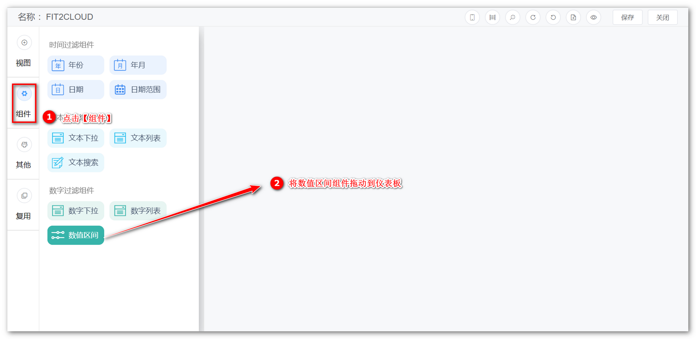
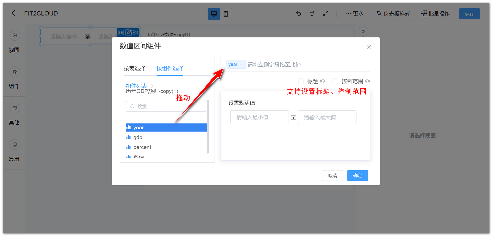
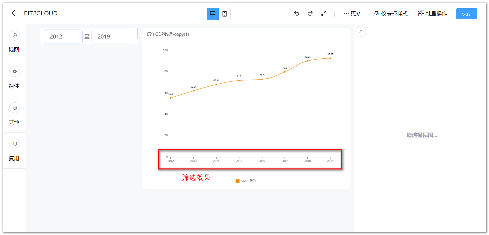

## 1 数字下拉组件

!!! Abstract ""
	可通过与视图组件的数值型字段绑定，点击数字下拉组件，即弹出下拉选项框，选定下拉框内的数值，过滤视图组件的数据。

{ width="900px" }  
{ width="900px" }  
{ width="900px" }

!!! Abstract ""
	单选的文本下拉组件以及数字下拉组件可在【组件样式】中设置选项平铺展示，展示项最多可设置为 10。

{ width="500px" }
{ width="900px" }

!!! Abstract ""
	数字下拉组件支持手动输入模糊匹配的功能。

{ width="900px" }

## 2 数字列表组件

!!! Abstract ""
	可通过与视图组件的数值型字段绑定，数字列表组件以列表的形式展示字段内数值，用户可通过勾选列表内的数值，过滤视图组件的数据。

{ width="900px" }  
{ width="900px" }  
{ width="900px" }

## 3 数值区间组件

!!! Abstract ""
	可通过与视图组件的数值型字段绑定，自定义数值区间过滤视图数据。
{width="900px" }  
{ width="900px" }  
{ width="900px" }