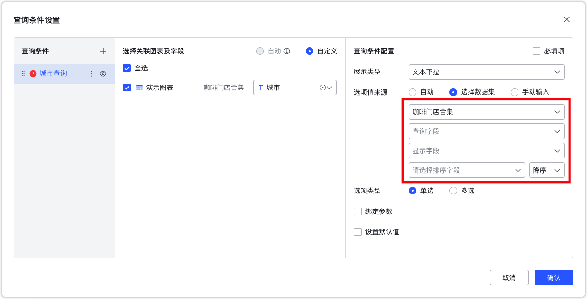
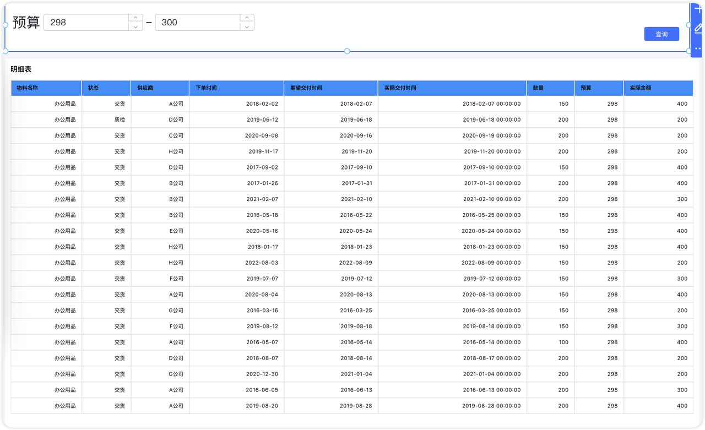

## 1 数字下拉组件

!!! Abstract ""
	可通过与图表的数值型字段绑定，点击数字下拉组件，即弹出下拉选项框，选定下拉框内的数值，点击【查询】按钮，过滤图表的数据。

{ width="900px" }  
{ width="900px" }  

!!! Abstract ""
	文本下拉和数字下拉查询组件支持设置显示字段和排序字段

    - 前提条件：选项值来源选择【选择数据集】。
    - 查询字段：用作后台查询条件。
    - 显示字段：用作前端显示内容。
    - 排序字段：影响前段展示的排序顺序。
{ width="900px" }

## 2 数值区间组件
!!! Abstract ""
	在设置查询条件时，支持选择指标字段选择【数值区间】作为过滤组件，便于根据特定数值范围筛选数据。

    应用场景：适用于需要在特定数值范围内进行数据筛选的场景，例如筛选预算、实际金额等数值类型字段。

{ width="900px" }

{ width="900px" }