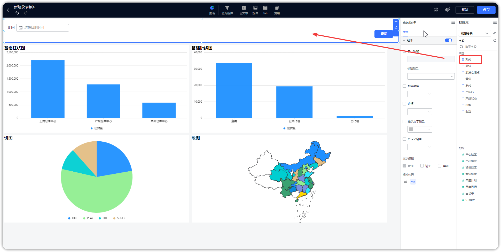

## 1 添加过滤组件
!!! Abstract ""
	添加查询组件至仪表板
	
	- 【序号 1】：点击添加查询组件至仪表板；
	- 【序号 2】：添加过滤组件查询条件；
	- 【序号 3】：设置查询组件的样式，包括标题、边框、展示按钮、标签位置等；
	- 【序号 4】：选择数据集，并将数据集的字段拖拽至查询组件中。

{ width="900px" }

!!! Abstract ""
	如下图所示，选择数据集，并将数据集中的区域字段拖拽至查询组件中。

{ width="900px" }

!!! Abstract ""
	如下图所示，点击查询组件的编辑按钮，设置查询条件。

{ width="900px" }
!!! Abstract ""
	查询组件支持下拉选项设置为必填。

{ width="900px" }
{ width="900px" }

!!! Abstract ""

	查询条件设置，会自动关联同数据集的图表。如果【自动】模式不能满足需求，可以切换至【自定义】模式，自定义所需要关联的图表及字段，修改选项值来源、选项类型、绑定参数、设置默认值等。【自动】模式可切换至【自定义】模式后，但是【自定义】模式不可切换为【自动】模式。

	提示：  如果所选字段类型不一致，将无法进行查询配置。

	-  过滤组件的类型，可以进行【文本下拉】、【数字下拉】、【时间】、【时间范围】切换。
	-  选项值来源可以选择【自动】，或者【选择数据集】，也可以支持通过【手动输入】设置选项。
	-  选项类型支持【单选】和【多选】。
	-  查询条件支持绑定参数，与 SQL 传参搭配使用。
	-  可以为过滤条件设置默认值。
	
{ width="900px" }

{ width="900px" }

{ width="900px" }

## 2 使用过滤组件
!!! Abstract ""
	进行选项选择，并点击【查询】后，被关联的图表中只显示选中的区域的数据。如果是多选，在勾选完点击【确认】后，再点击【查询】。
{ width="900px" }

{ width="900px" }

{ width="900px" }

## 3 组件样式设置

!!! Abstract ""

	- 所有过滤组件输入框均支持边框、标题、背景色设置。
	- 可以设置【查询】、【清空】、【重置】的展示按钮（【查询】不可取消）。
	- 支持标签位置设置为上或者左。

{ width="900px" }

