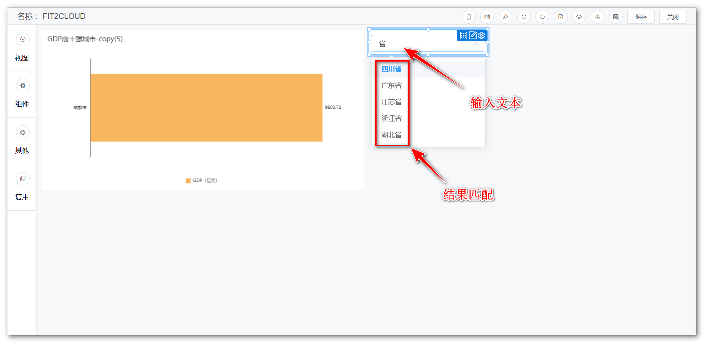
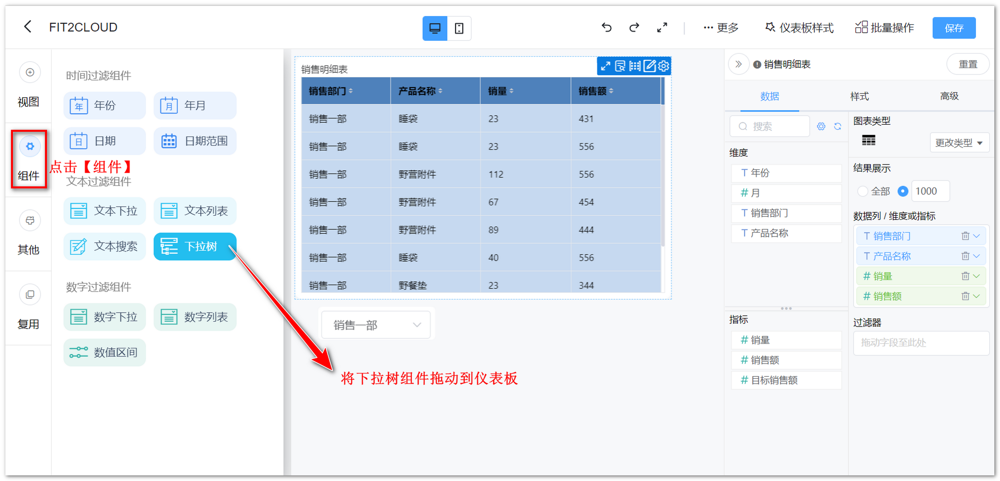
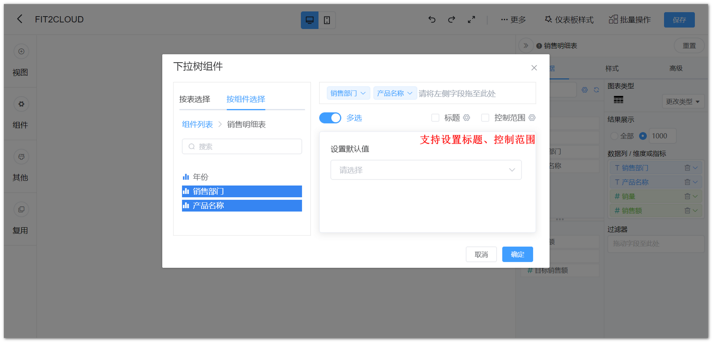
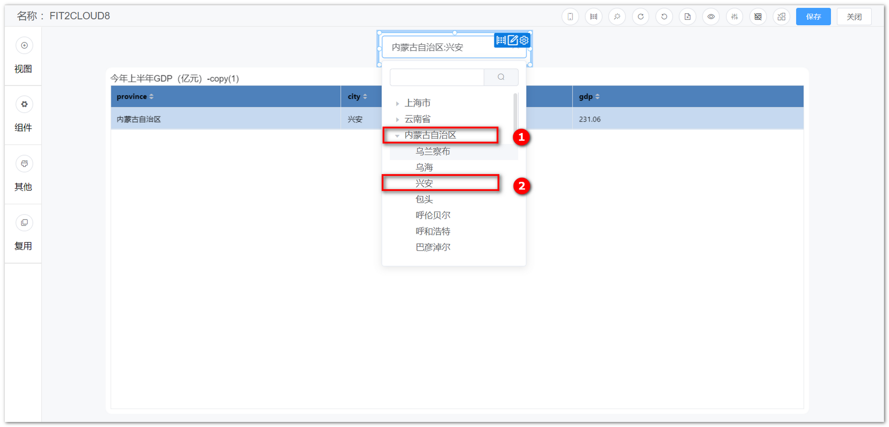

## 1 文本下拉组件

!!! Abstract ""
	可通过与视图组件的文本型字段绑定，点击文本下拉组件，即弹出下拉选项框，选定下拉框内的文本，过滤视图组件的数据。

{ width="900px" }  
{ width="900px" }  
{ width="900px" }

!!! Abstract ""
	单选的文本下拉组件以及数字下拉组件可在【组件样式】中设置选项平铺展示，展示项最多可设置为 10。

{ width="500px" }
{ width="900px" }

!!! Abstract ""
	文本下拉组件支持自定义排序，类似视图里的自定义排序，可手动拖动排序。

{ width="900px" }

!!! Abstract ""
	文本下拉组件支持过滤空数据。

{ width="900px" }
{ width="900px" }

!!! Abstract ""
	如下图所示，文本下拉组件支持手动输入模糊匹配的功能。

{ width="900px" }

!!! Abstract ""
如下图所示，文本下拉组件支持手动输入模糊匹配的功能。

{ width="900px" }

## 2 文本列表组件

!!! Abstract ""
	可通过与视图组件的文本型字段绑定，文本列表组件以列表的形式展示字段内的文本，用户可通过勾选列表内的文本，过滤视图组件的数据。

{ width="900px" }  
{ width="900px" }  
{ width="900px" }
## 3 文本搜索组件

!!! Abstract ""
	可通过与视图组件的文本型字段绑定，搜索并展示符合条件的视图组件的数据。

{ width="900px" }  
{ width="900px" }  
{ width="900px" }

## 4 下拉树组件

!!! Abstract ""
	支持把具有级联关系的字段依次拖入至框中，实现级联功能。  
	**注意：** 字段需要来自同一个数据集。

{ width="900px" }

{ width="900px" }

{ width="900px" }