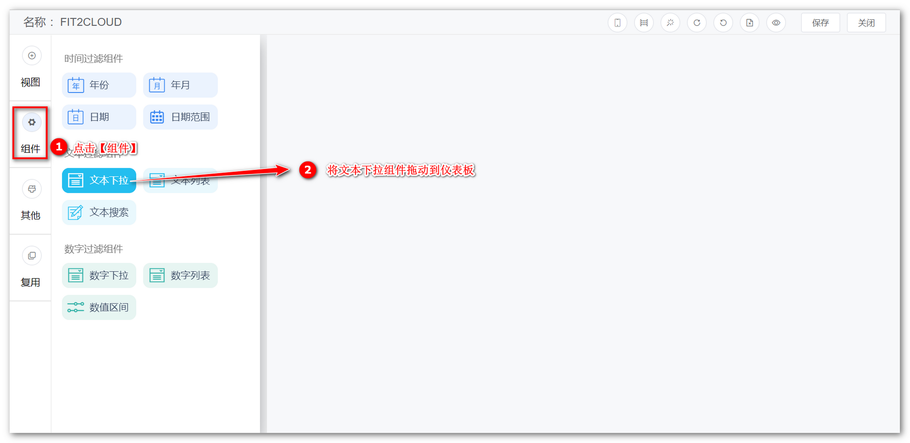
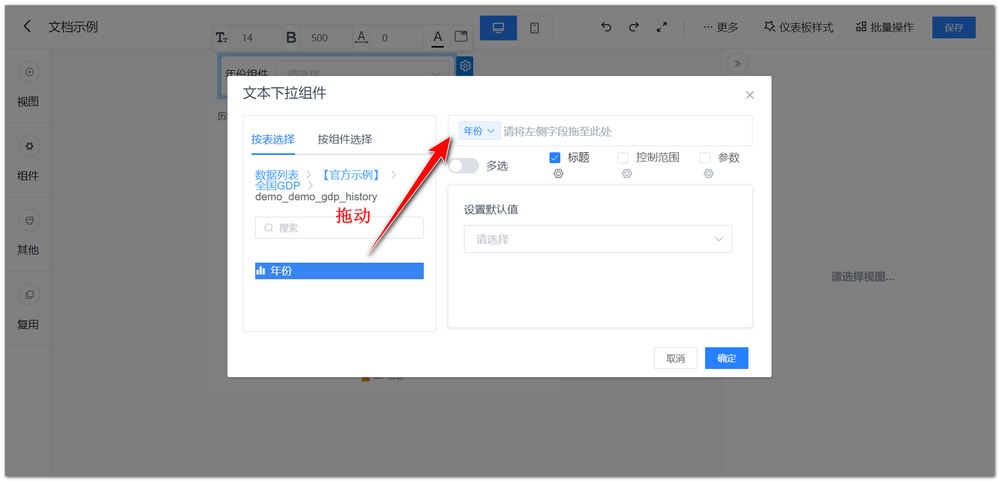
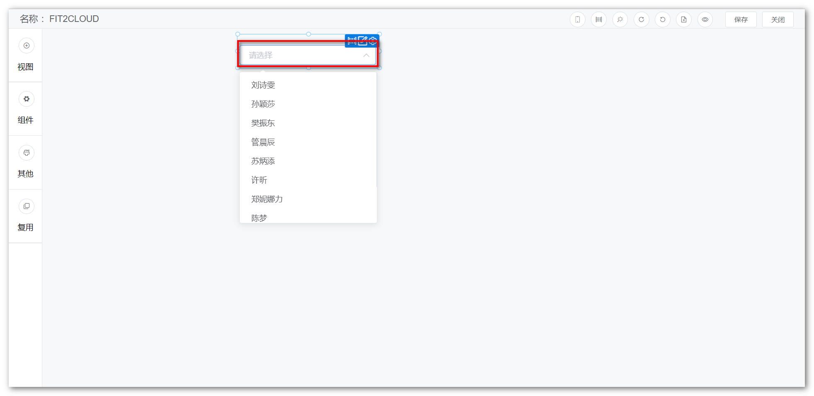
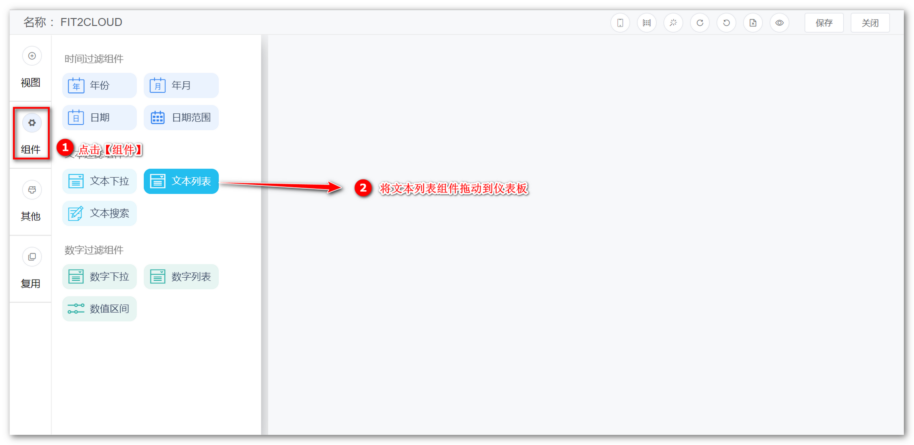
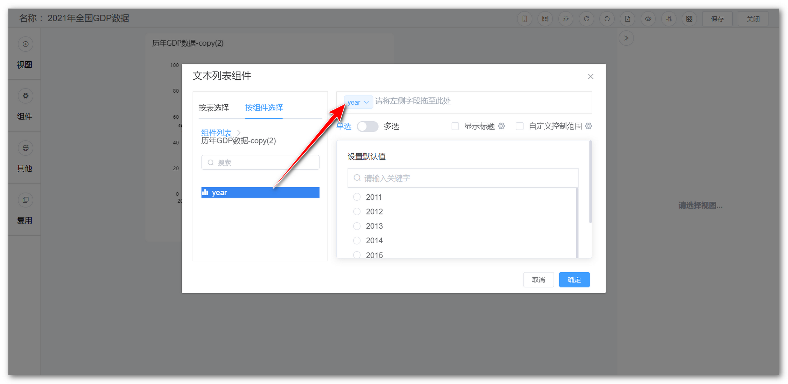
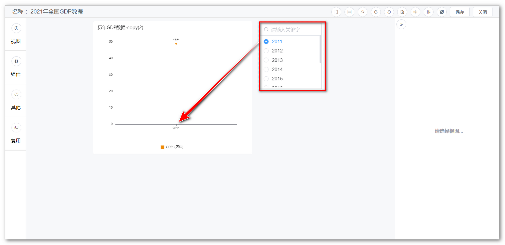
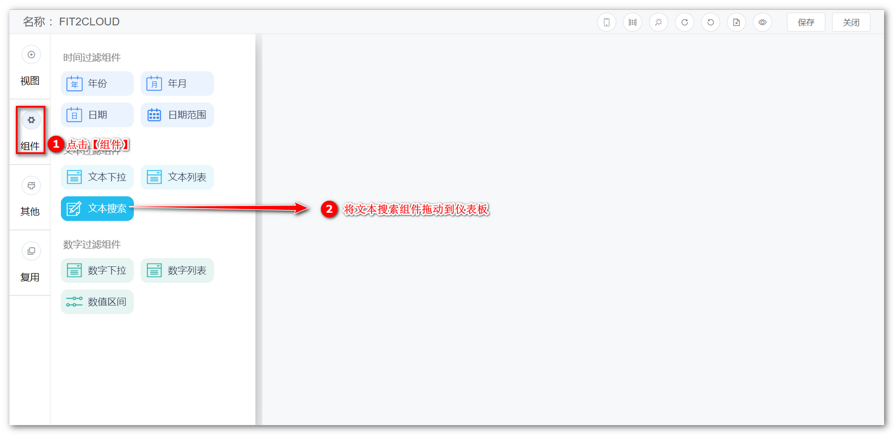
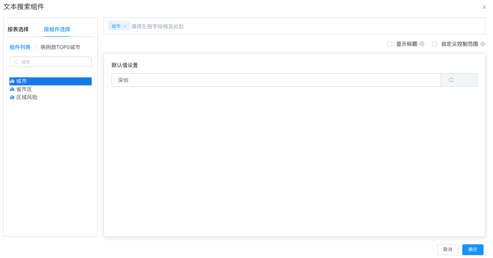
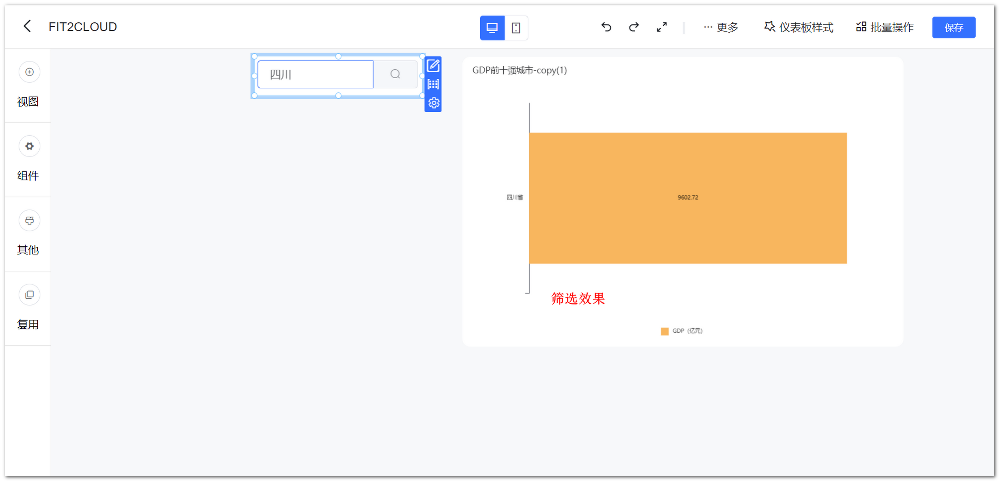

## 1 文本下拉组件

!!! Abstract ""
	可通过与视图组件的文本型字段绑定，点击文本下拉组件，即弹出下拉选项框，选定下拉框内的文本，过滤视图组件的数据。

{ width="900px" }  
{ width="900px" }  
{ width="900px" }

## 2 文本列表组件

!!! Abstract ""
	可通过与视图组件的文本型字段绑定，文本列表组件以列表的形式展示字段内的文本，用户可通过勾选列表内的文本，过滤视图组件的数据。

{ width="900px" }  
{ width="900px" }  
{ width="900px" }
## 3 文本搜索组件

!!! Abstract ""
	可通过与视图组件的文本型字段绑定，搜索并展示符合条件的视图组件的数据。

{ width="900px" }  
{ width="900px" }  
{ width="900px" }