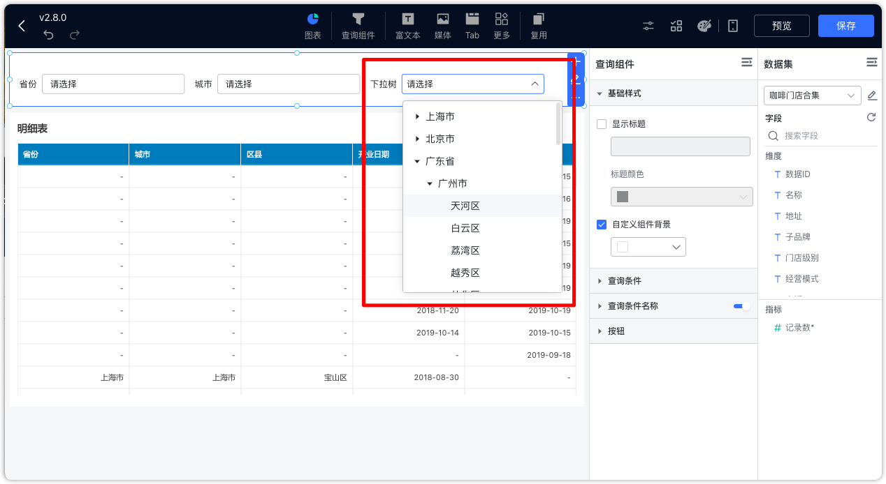

## 1 文本下拉组件

!!! Abstract ""
	可通过与图表的文本型字段绑定，点击文本下拉组件，即弹出下拉选项框，选定下拉框内的文本，点击【查询】按钮，过滤图表的数据。

{ width="900px" }  
{ width="900px" }

!!! Abstract ""
	文本下拉和数字下拉查询组件支持设置显示字段和排序字段

    - 前提条件：选项值来源选择【选择数据集】。
    - 查询字段：用作后台查询条件。
    - 显示字段：用作前端显示内容。
    - 排序字段：影响前段展示的排序顺序。
{ width="900px" }

!!! Abstract ""
	查询组件中的文本下拉选项支持全部和默认两种选择。

    - 默认：如果未设置显示和排序字段，或者这两个字段与查询字段相同，则获取 1000 个选项进行过滤；当显示和排序字段与查询字段不同时，无论是默认下拉选项还是动态查询选项，都获取 1000 条数据进行过滤。
    - 全部：对所有数据进行查询并返回，在数据量大的情况下，可能会存在性能问题，如等待时间长，加载慢，甚至浏览器内存不足，故使用时需注意。

{ width="900px" }

## 2 文本搜索组件

!!! Abstract ""

    - 条件类型：单条件、与条件、或条件
    - 搜索模式：精确匹配、模糊匹配
{ width="900px" }
{ width="900px" }

!!! Abstract ""
	查询组件支持配置外部显示或隐藏精确匹配和模糊匹配

{ width="900px" }

## 3 下拉树组件

!!! Abstract ""
	下拉树组件允许用户在多级分类中逐级选择，如图所示，组件结构设计为“省份-城市-区县”三级分类。
{ width="900px" }
{ width="900px" }

