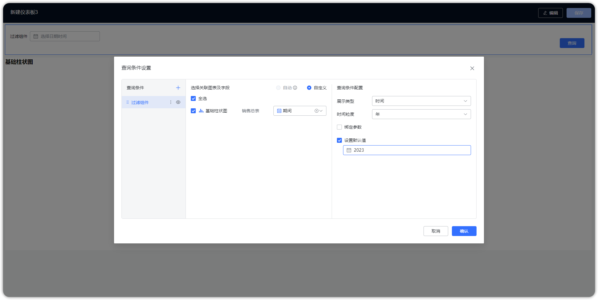
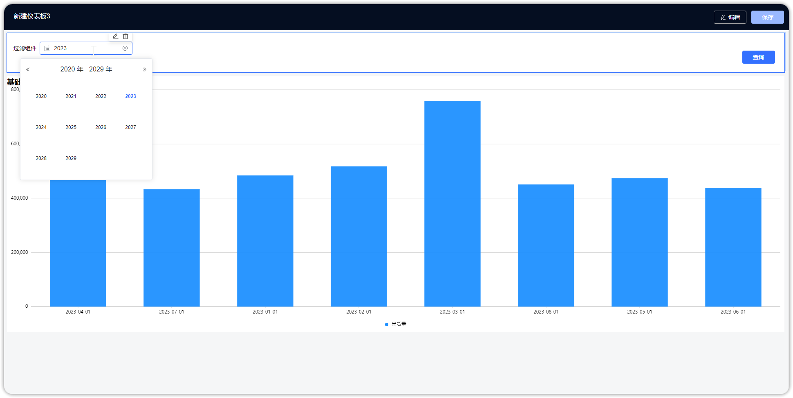
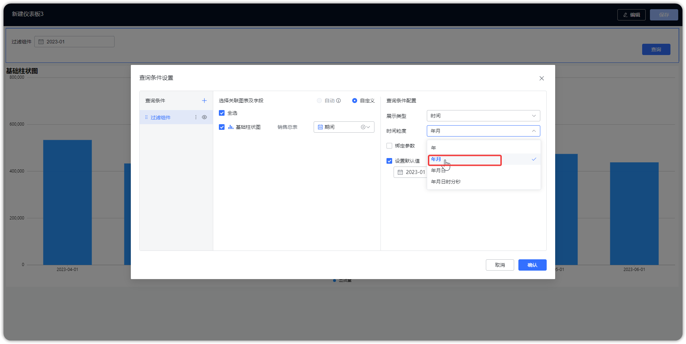
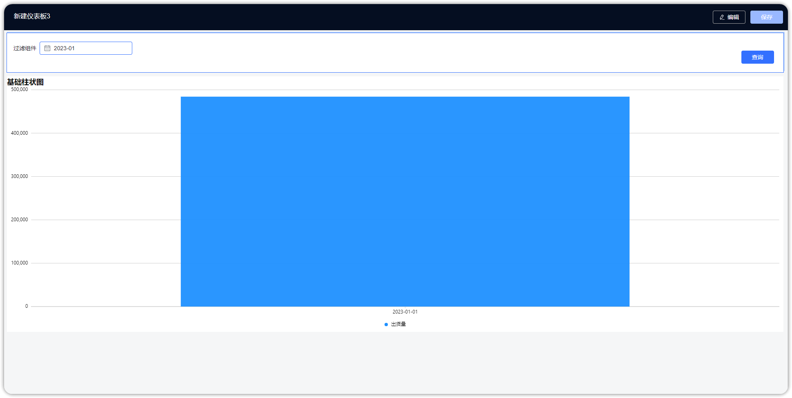
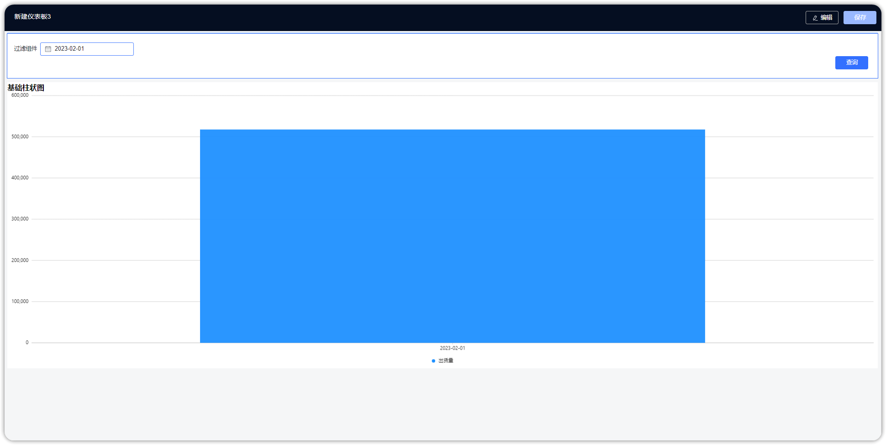
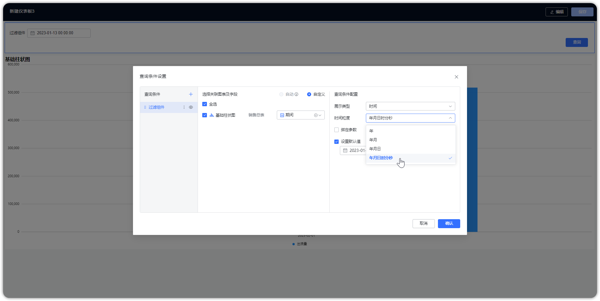
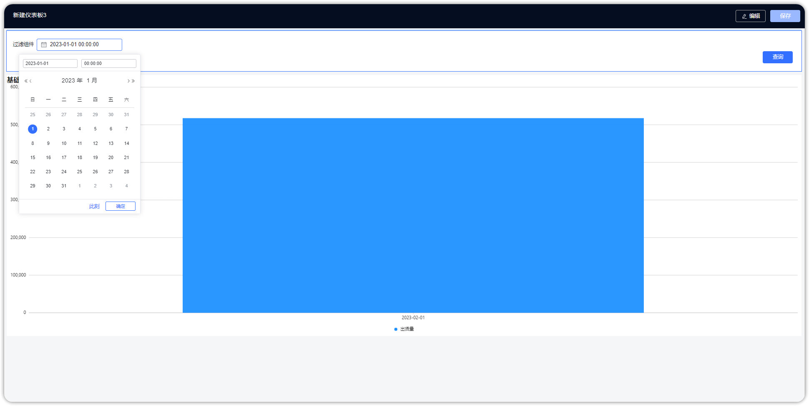
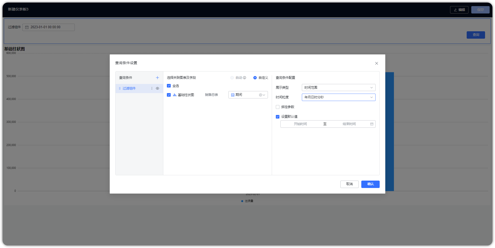
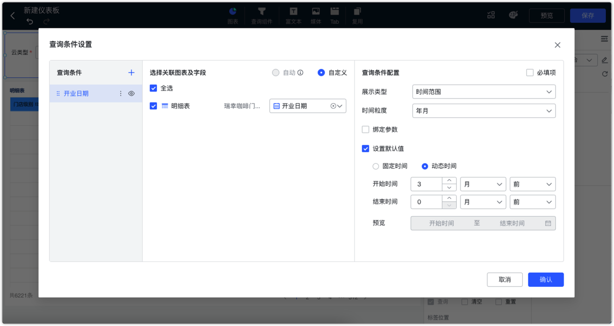

## 1 年份组件

!!! Abstract ""
	可通过与图表的日期字段绑定，按年过滤图表的数据。  
	年份组件支持默认设置，可根据设置相对年份。

{ width="900px" }  
{ width="900px" }  

## 2 年月组件

!!! Abstract ""
	可通过与图表的日期字段绑定，按年份和月份过滤图表的数据。  
	年月组件支持默认设置，可根据设置相对月份。

{ width="900px" }  
{ width="900px" }  

## 3 日期组件

!!! Abstract ""
	可通过与图表的日期字段绑定，按日期过滤图表的数据。支持设置默认日期，展示展示具体日期的数据。

{ width="900px" }  
{ width="900px" }

!!! Abstract ""
	日期过滤组件支持时分秒级别的设置。

{ width="900px" }
{ width="900px" }

## 4 日期范围组件

!!! Abstract ""
	可通过与图表的日期字段绑定，自定义日期范围过滤图表的数据。可选择年、年月、年月日时分秒时间粒度，支持设置固定时间和动态时间范围。
 
{ width="900px" }  
{ width="900px" }
{ width="900px" }

