!!! Abstract ""
	所有过滤组件均支持跨数据集或视图进行多字段过滤，并可自定义控制范围，如下示例。  
	**提示：** 所有过滤组件选择数据集时支持逐级返回。  
	**注意：** 同数据集在一个过滤组件中仅支持绑定一个字段。

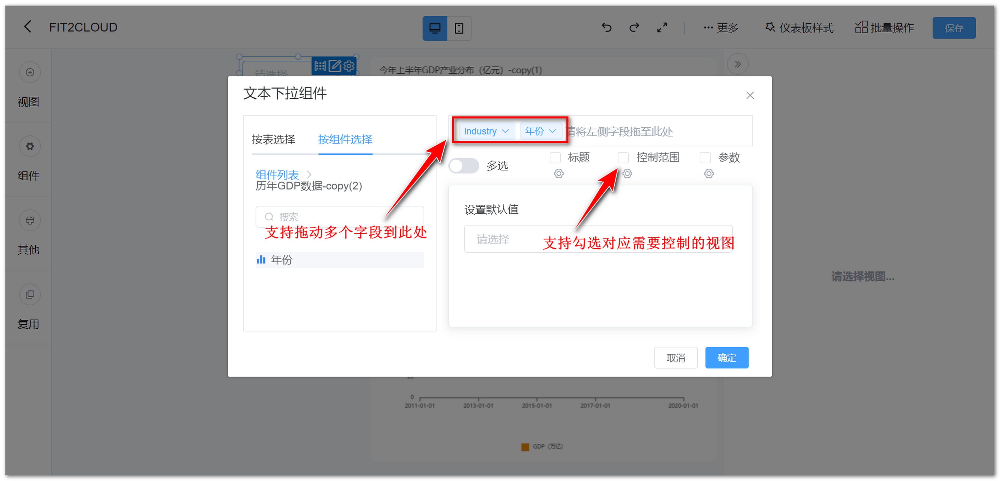{ width="900px" }

!!! Abstract ""
	所有筛选类组件的标题支持位置设置，可调整组件标题的水平位置及垂直位置，下图以“文本下拉组件”为示例。

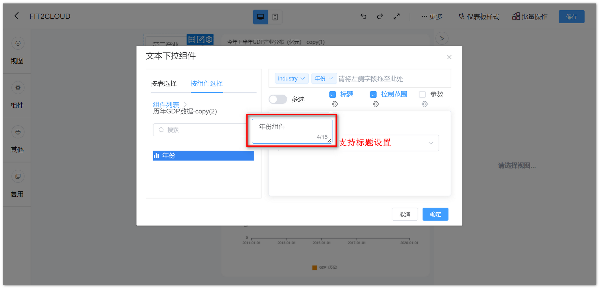{ width="900px" }

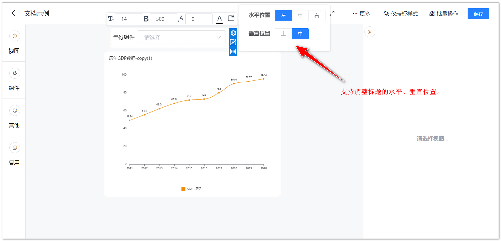{ width="900px" }

!!! Abstract ""
	所有过滤组件输入框均支持边框、文字、背景色设置。  
	途径一：如下图所示，在组件操作中设置。

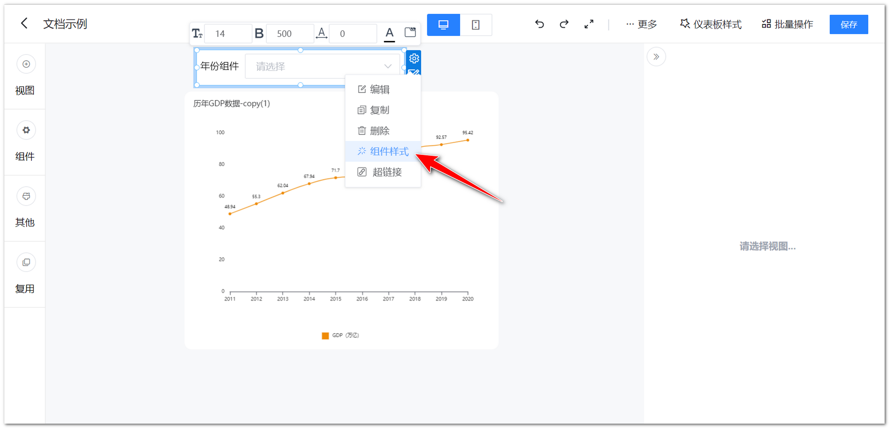{ width="900px" }

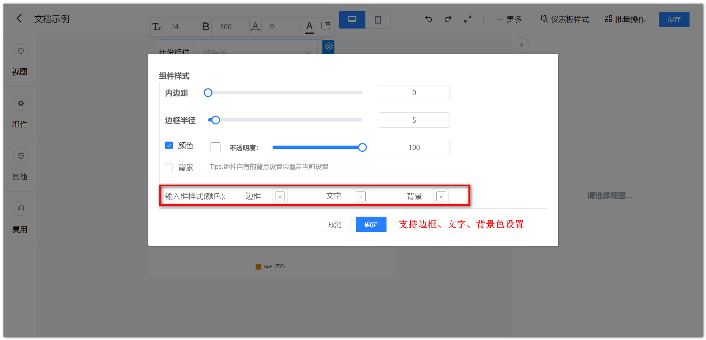{ width="900px" }

!!! Abstract ""
	途径二：如下图所示，在仪表板公共样式中设置。

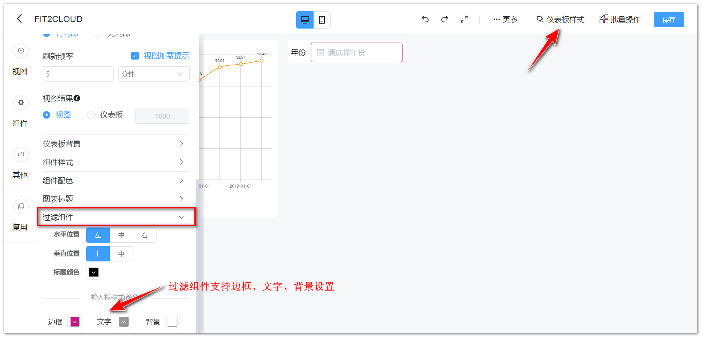{ width="900px" }

!!! Abstract ""
	v1.12.0 版本开始，过滤组件支持排序。  
	**提示：** 当有多个字段时，除第一个外其他字段排序设置为“不可用”状态。

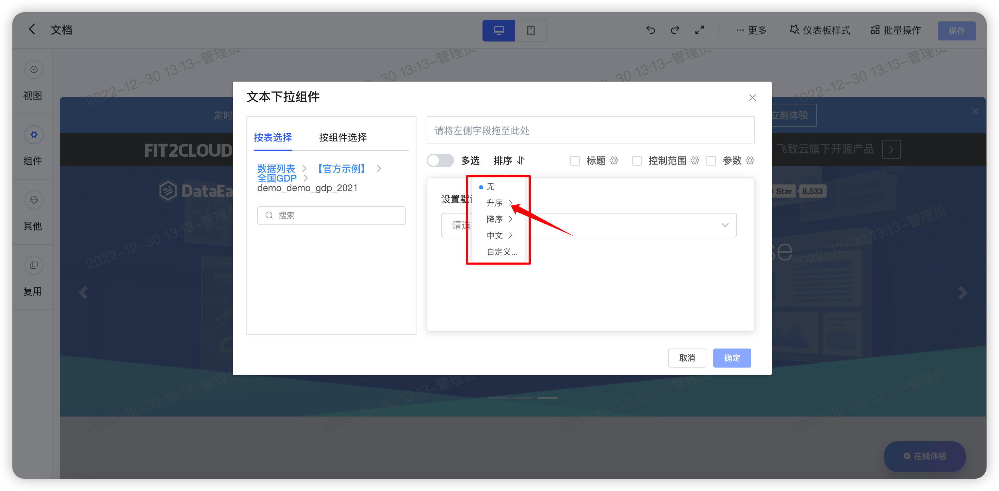{ width="900px"}

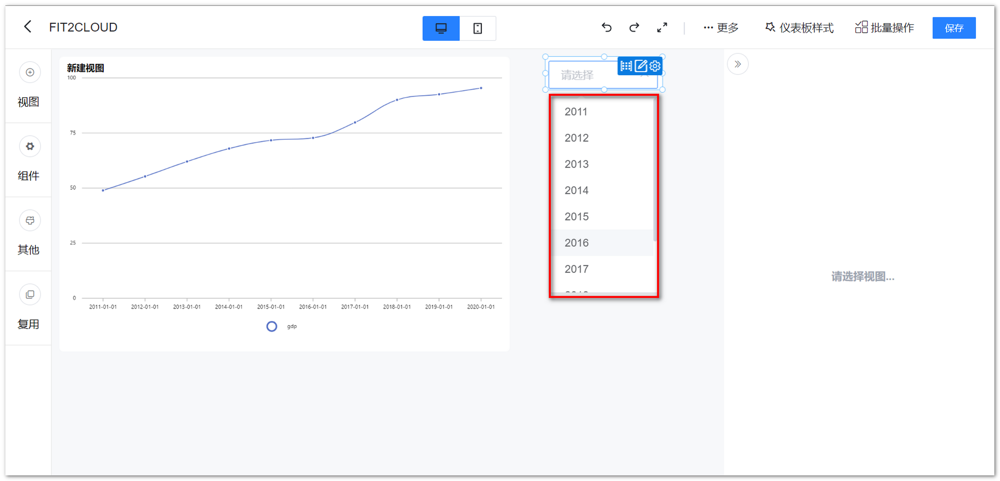{ width="900px"}

## 1 年份组件

!!! Abstract ""
	可通过与视图组件的日期字段绑定，按年过滤视图组件的数据。  
	年份组件支持固定年份与动态年份，动态年份可根据设置自动使用相对年份。

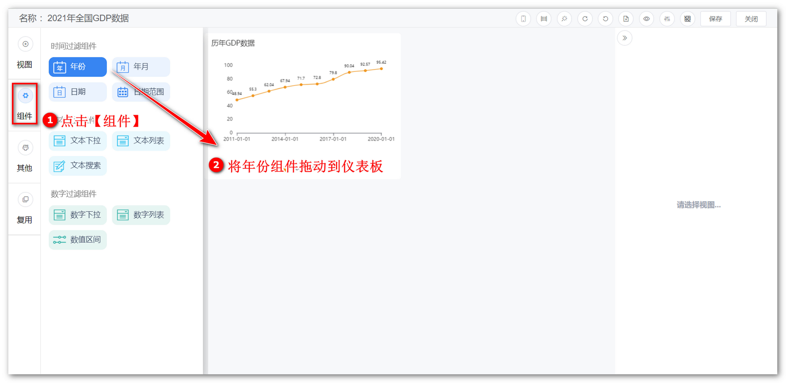{ width="900px" }  
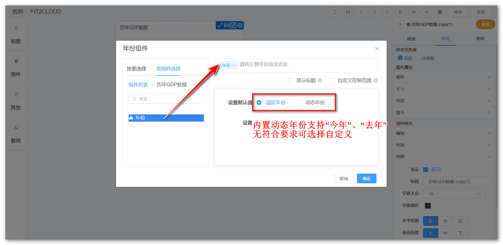{ width="900px" }  
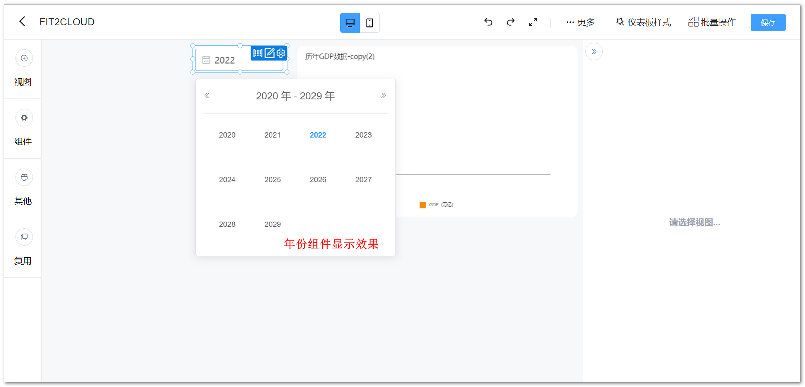{ width="900px" }

## 2 年月组件

!!! Abstract ""
	可通过与视图组件的日期字段绑定，按年份和月份过滤视图组件的数据。  
	年月组件支持固定年月与动态年月，动态年月根据设置自动使用相对月份。

{ width="900px" }  
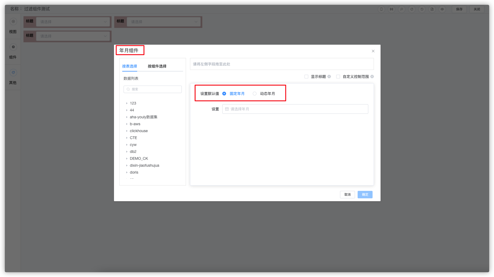{ width="900px" }  
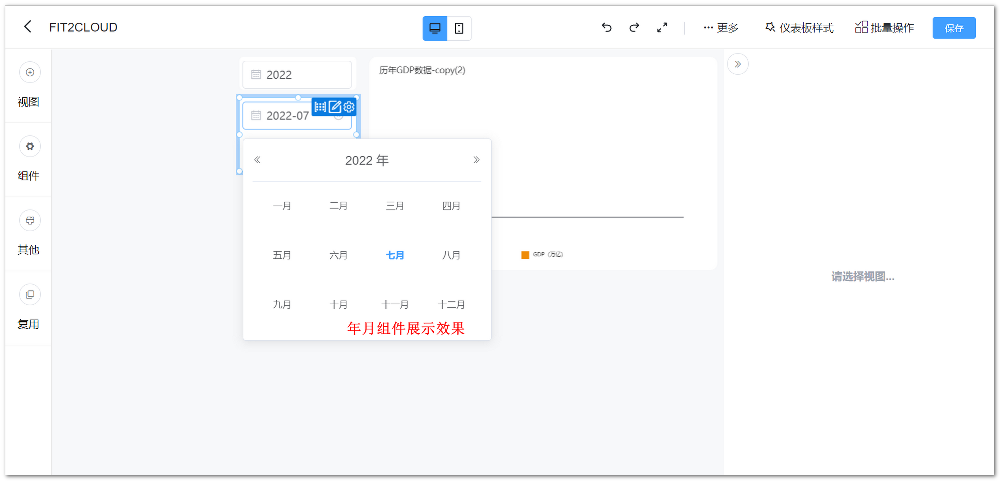{ width="900px" }

## 3 日期组件

!!! Abstract ""
	可通过与视图组件的日期字段绑定，按日期过滤视图组件的数据。支持动态设置默认日期，比如需要看当天的数据，即可将该组件的默认值设置为当天，那么不论何时打开仪表板，均展示当天数据。

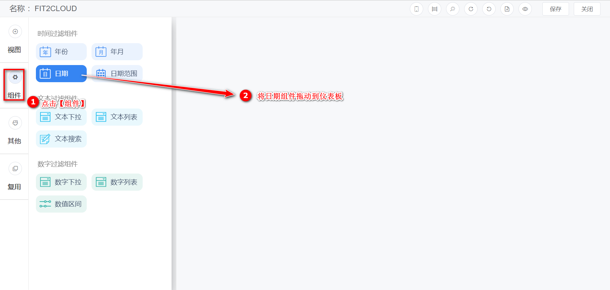{ width="900px" }  
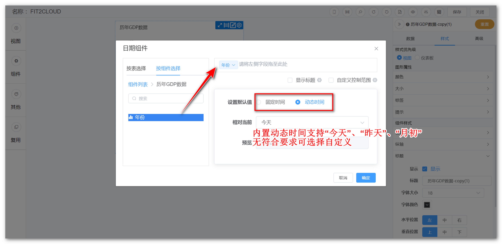{ width="900px" }  
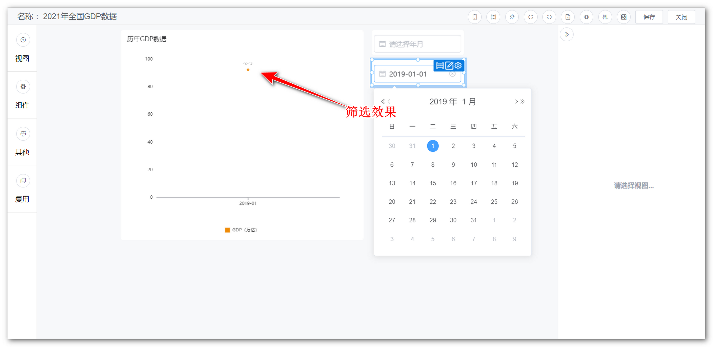{ width="900px" }

!!! Abstract ""
	日期过滤组件支持时分秒级别的设置。

{ width="900px" }
{ width="900px" }

## 4 日期范围组件

!!! Abstract ""
	可通过与视图组件的日期字段绑定，自定义日期范围过滤视图组件的数据。支持动态设置日期范围，比如需要看本月的数据，可通过设置组件的默认起始日期来实现，那么不论何时打开仪表板，均展示当月数据。

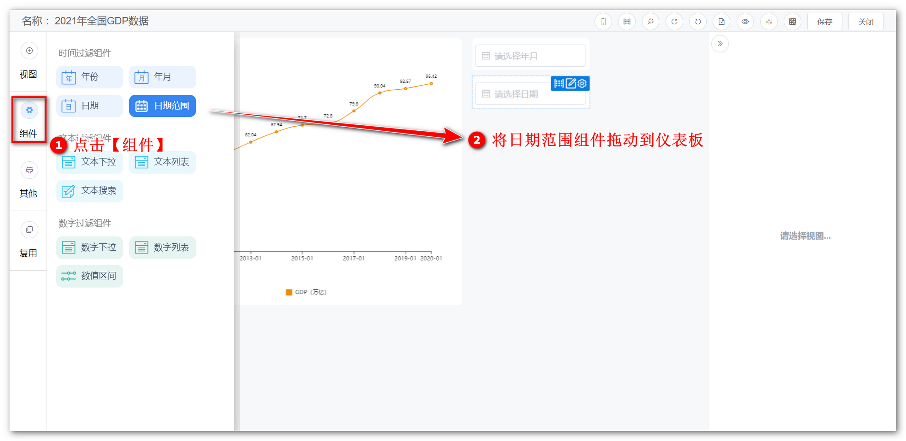{ width="900px" }  
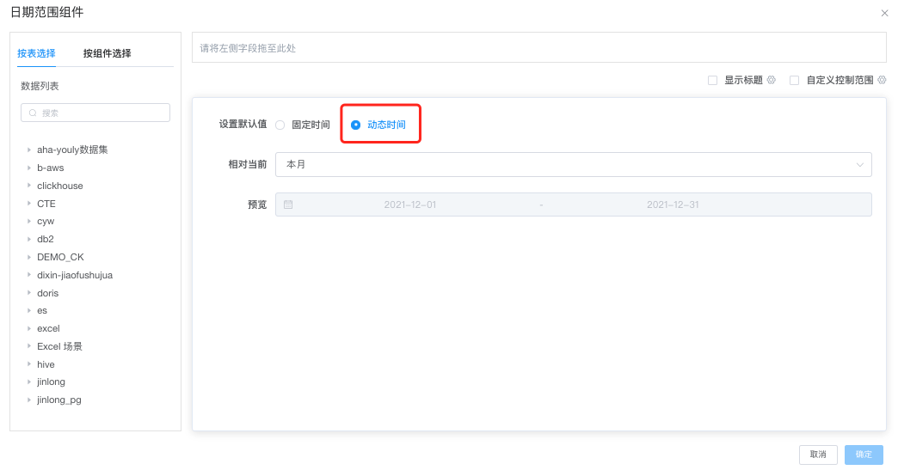{ width="900px" }  
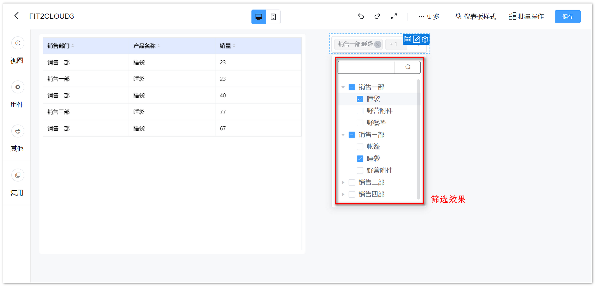{ width="900px" }

!!! Abstract ""
	日期范围组件支持常用时间范围的快捷选项，比如本周、当月、本季、今年、上周、上月、上季、去年等，极大方便查询使用；  
	与日期过滤组件一样，日期范围组件也支持时分秒级别的设置。

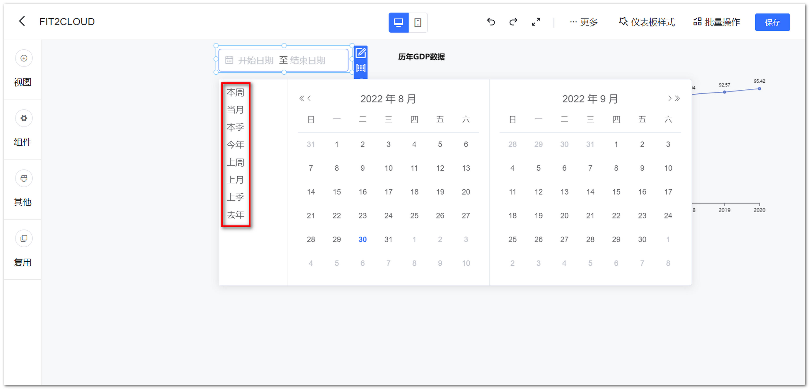{ width="900px" }

