## 1 年份组件

!!! Abstract ""
	可通过与图表的日期字段绑定，按年过滤图表的数据。  
	年份组件支持默认设置，可根据设置相对年份。

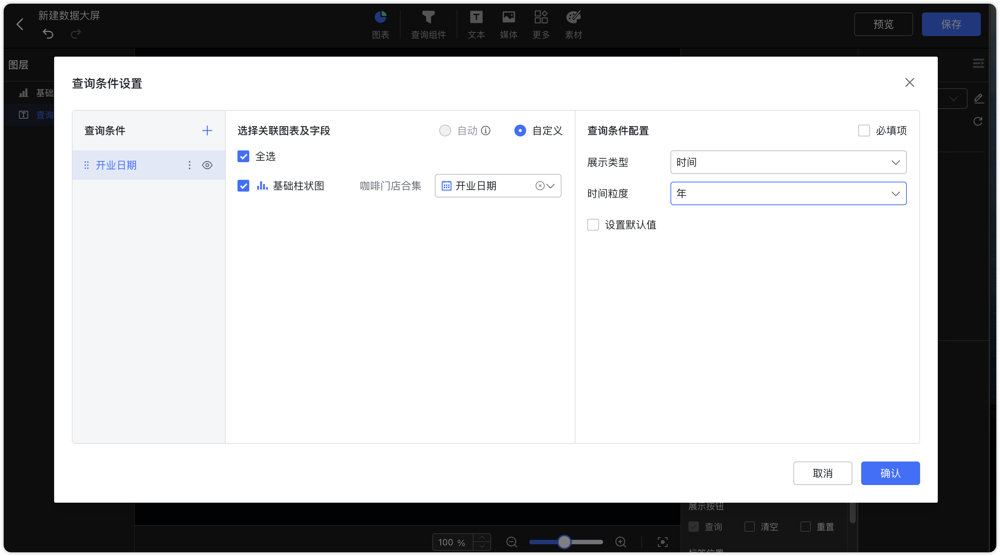{ width="900px" }  
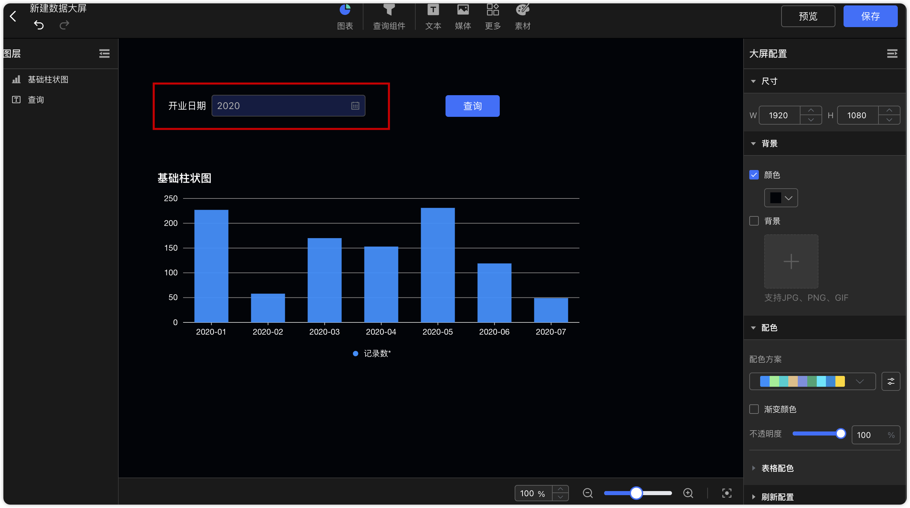{ width="900px" }  

## 2 年月组件

!!! Abstract ""
	可通过与图表的日期字段绑定，按年份和月份过滤图表的数据。  
	年月组件支持默认设置，可根据设置相对月份。

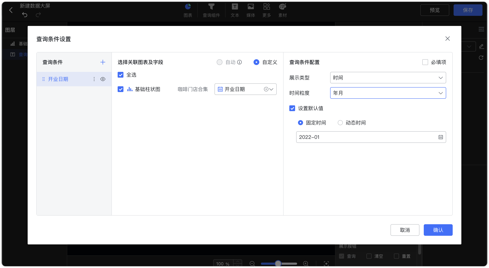{ width="900px" }  
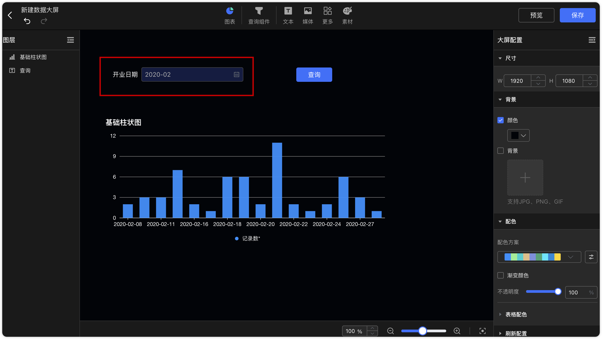{ width="900px" }

## 3 日期组件

!!! Abstract ""
	可通过与图表的日期字段绑定，按日期过滤图表的数据。支持设置默认日期，展示展示具体日期的数据。

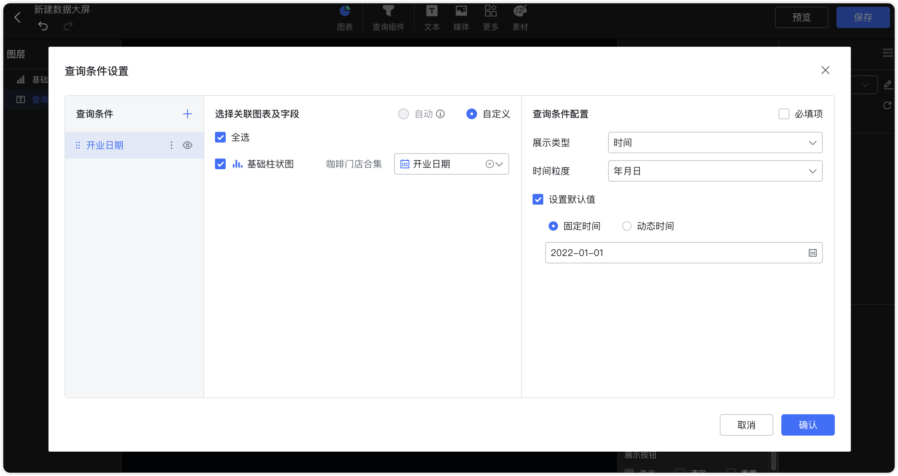{ width="900px" }  
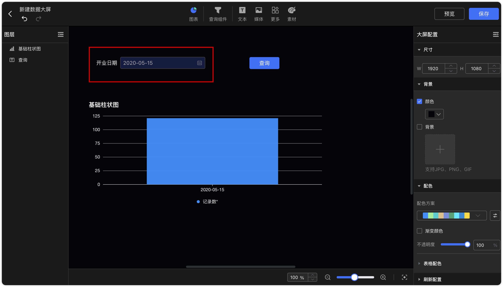{ width="900px" }

!!! Abstract ""
	日期过滤组件支持时分秒级别的设置。
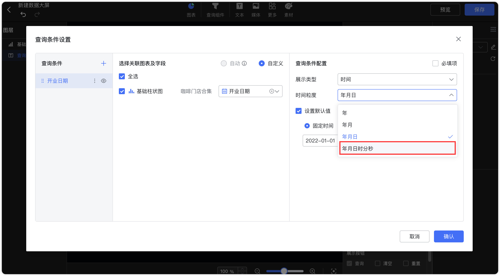{ width="900px" }  

## 4 日期范围组件

!!! Abstract ""
	可通过与图表的日期字段绑定，自定义日期范围过滤图表的数据。可选择年、年月、年月日时分秒时间粒度，支持设置固定时间和动态时间范围。
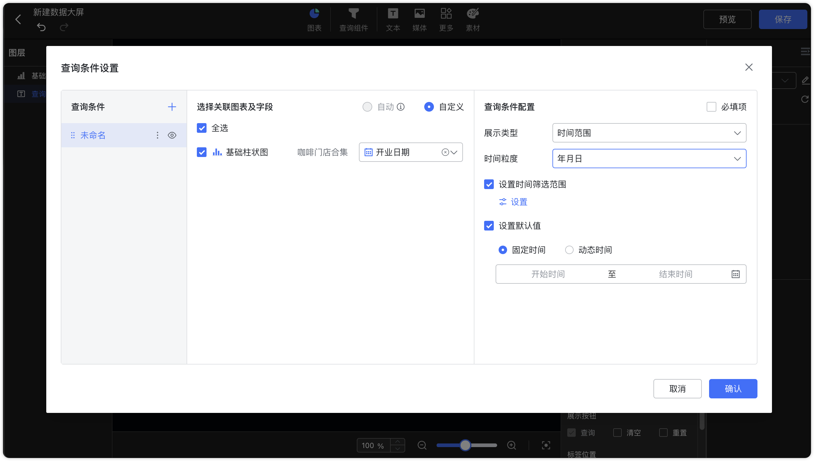{ width="900px" }

!!! Abstract ""
	查询组件中的日期范围组件支持常用区间值选择.在使用日期范围类型且选择动态时间时，下拉选项提供了更多常用区间值。
{ width="900px" }

!!! Abstract ""
	**区间类型支持以下设置：开始于、结束于、时间区间、动态查询时间窗口（单次查询对多 N 天）。**
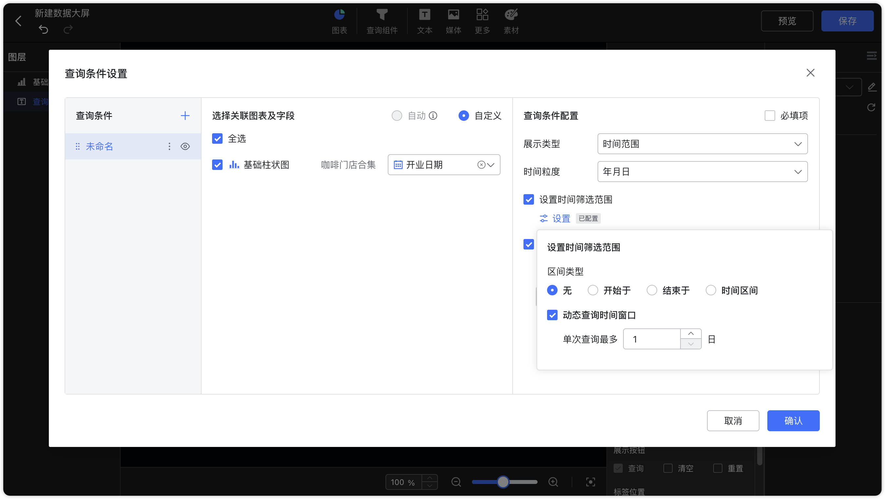{ width="900px" }

!!! Abstract ""
	开始于：【开始于】日期前的日期无法被选择，支持设置【固定时间】与【动态时间】。比如，以下设置【开始于】日期为 2024-03-29，则 2024-03-29 前的日期无法再被选择。
{ width="900px" }
{ width="900px" }

!!! Abstract ""
	结束于：【结束于】日期后的日期无法被选择，支持设置【固定时间】与【动态时间】。比如，以下设置【结束于】日期为 2024-03-29，则 2024-03-29 后的日期无法再被选择。
{ width="900px" }
{ width="900px" }

!!! Abstract ""
	时间区间：只能选择该区间内的日期进行查询，支持设置【固定时间】与【动态时间】。比如如下设置了一个月的动态时间，则查询组件只能选今天起前一个月内的日期。
{ width="900px" }
{ width="900px" }

!!! Abstract ""
	动态查询窗口：一次最多只能查询 N 天的日期范围，如下所示，设置单次查询时间最多 5 天，则在使用日期范围组件时，无法一次性选择大于 5 天的时间范围。
{ width="900px" }
{ width="900px" }

!!! Abstract ""
	当选择时间类型参数时，系统默认设置为时间类型。点击【时间】后的编辑按钮，可以进一步选择该参数为开始时间或结束时间。

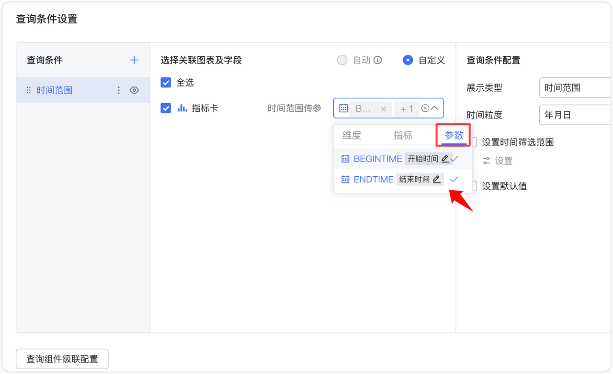{ width="900px" }

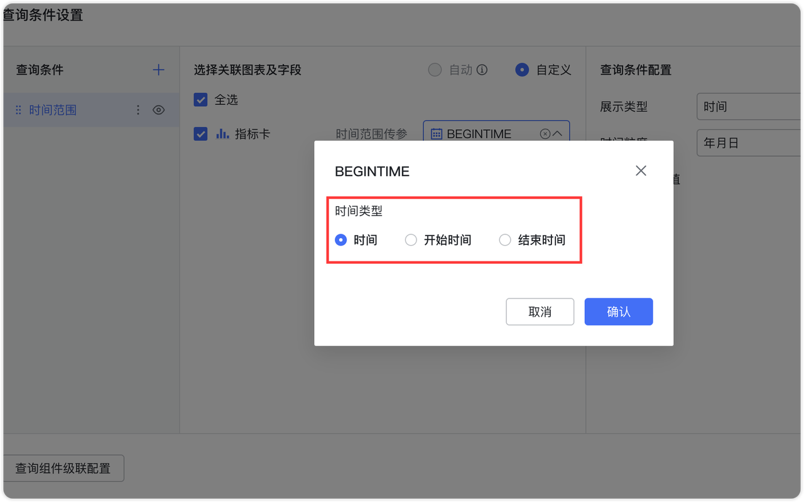{ width="900px" }

!!! Abstract ""
	当选择时间类型参数时，系统默认设置为时间类型。点击【时间】后的编辑按钮，可以进一步选择该参数为开始时间或结束时间。

{ width="900px" }

{ width="900px" }

