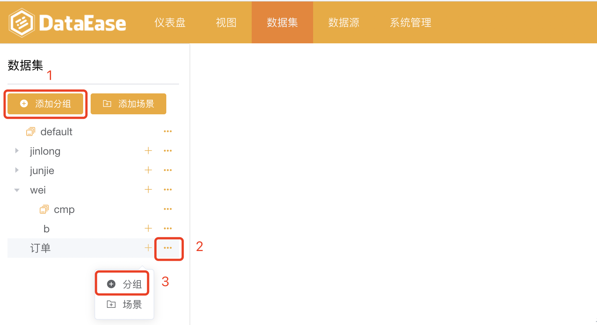
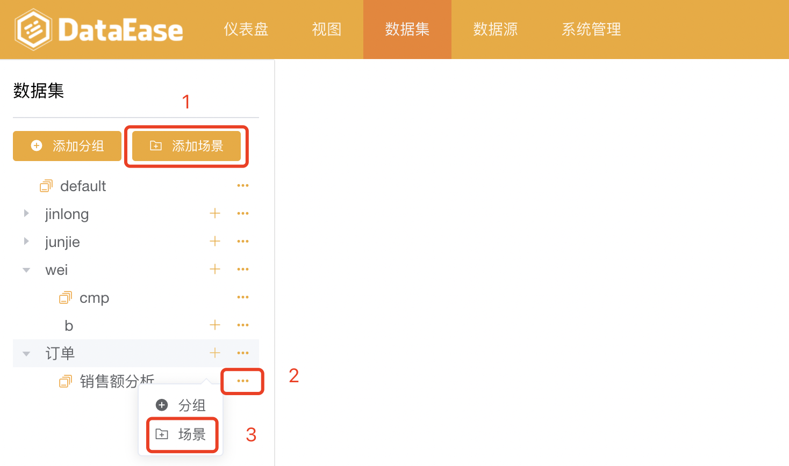

## 通用功能

## 一、添加分组
> 在根目录中添加分组（序号1）；在当前目录下添加子分组（序号3）；

## 二、添加场景
> 在根目录中添加场景（序号1）；在当前目录下添加场景（序号3）；

## 三、重命名
> 第一步，点击如下图所示位置，选择"重命名"

> 第二步，在下图所示输入框中输入新名称后，点击确认，完成重命名操作

## 四、删除
> 第一步，点击如下图所示位置，选择"删除"

> 第二步，弹出提醒框，如果选择"确认"，那么成功删除；如果选择"取消"，删除操作取消

## 五、搜索
> 支持两种搜索方式： 第一种、输入名称进行模糊搜索； 点击下图箭头，使用高级搜索功能。

