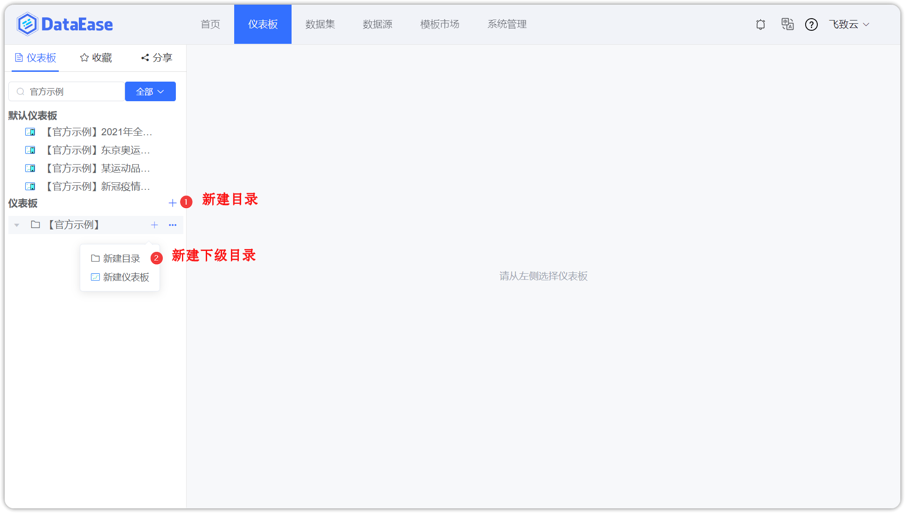
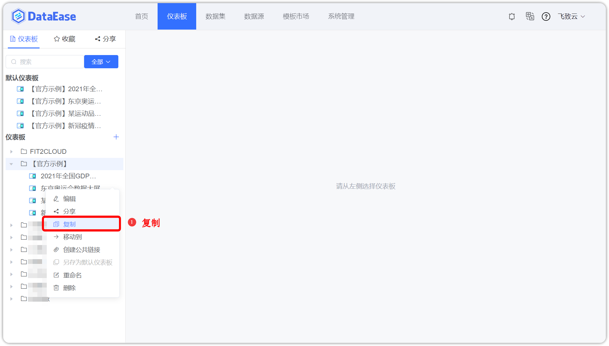

## 1 语言切换

!!! Abstract ""
    点击页面右上方的语言下拉菜单，进行指定语言的切换，目前支持切换简体中文、繁体中文、英文；  
    **提示：切换的语言范围仅限于系统内置文字，用户在使用过程中产生的文字始终展示为用户实际输入的内容。**

{ width="900px" }

## 2 新建文件夹

!!! Abstract ""
    1. 在根目录中新建文件夹（序号1）；
    2. 在当前目录下添加子文件夹（序号2）。

{ width="900px" }

## 3 新建目录

!!! Abstract ""
    1. 新建根目录（序号1）；
    2. 在根目录下新建二级目录（序号2）。

{ width="900px" }

## 4 重命名

!!! Abstract ""
    1. 点击如下图所示位置，选择"重命名";
    2. 在输入框中输入新名称后，点击确认，完成重命名操作。

{ width="900px" }  
{ width="900px" }

## 5 移动

!!! Abstract ""
    1. 如下图，点击移动，将分组移动至另一个分组下;
    2. 选择目标分组后，点击【确认】提交，分组移动成功。

{ width="900px" }  
{ width="900px" }

## 6 删除

!!! Abstract ""
    1. 点击如下图所示位置，选择"删除";
    2. 弹出提醒框，如果选择"确认"，那么成功删除；如果选择"取消"，删除操作取消。

{ width="900px" }  
{ width="900px" }

## 7 搜索

!!! Abstract ""
    支持两种搜索方式： 
    
    - 输入名称进行模糊搜索
    - 高级筛选模式  

    **点击图中【筛选】按钮，使用高级筛选功能。**

{ width="900px" }

## 8 翻页

!!! Abstract ""
    - 该区域记录数据总条数，当前页码；
    - 可点击下拉框，选择每页展示的条数；
    - 可输入页码，直接展示目标页的数据记录。

{ width="900px" }

## 9 复制

!!! Abstract ""
    1. 点击下图所示的位置，选择"复制"；
    2. 弹出对话框，填写新仪表板的名称，点击确定。

{ width="900px" }

