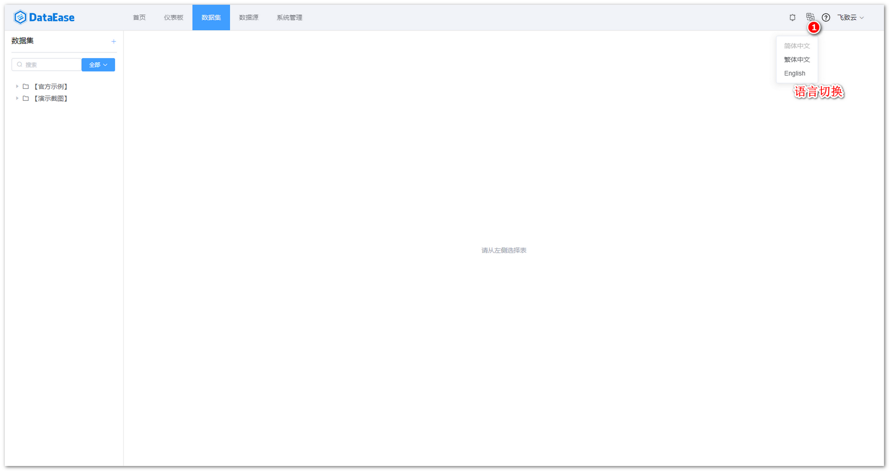
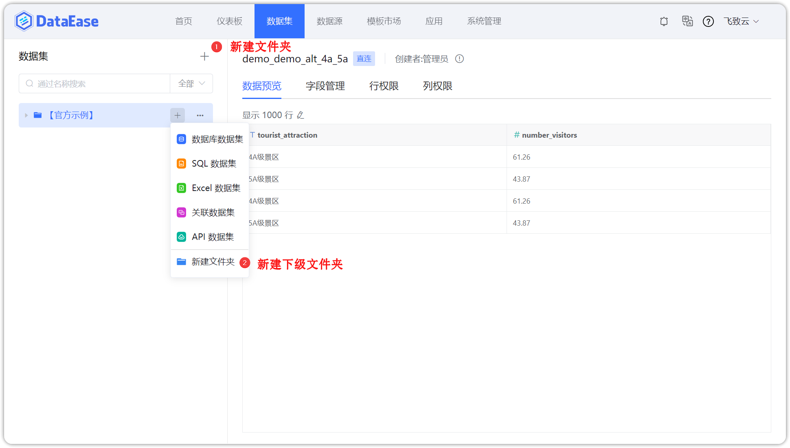
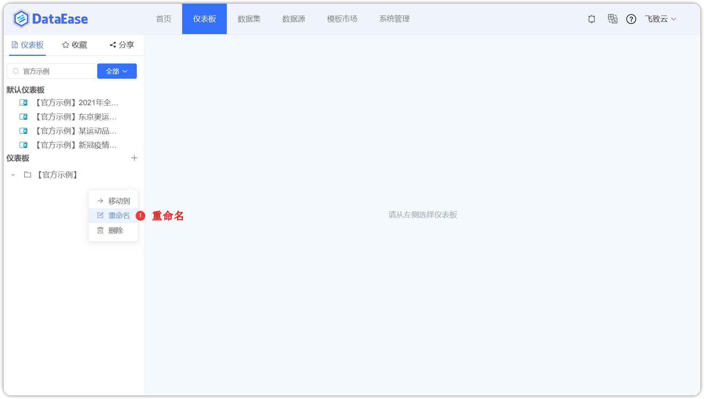
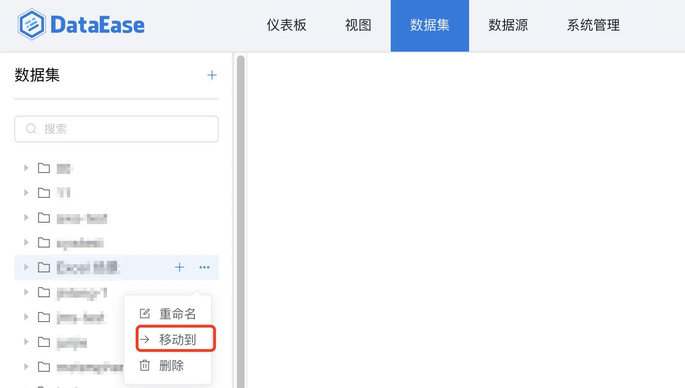
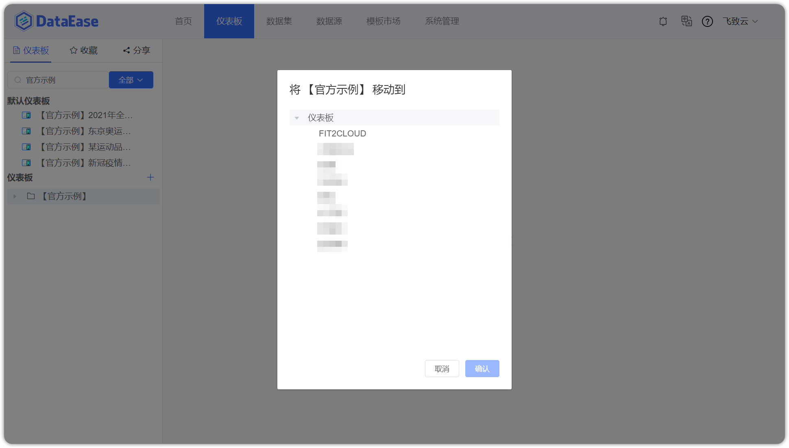
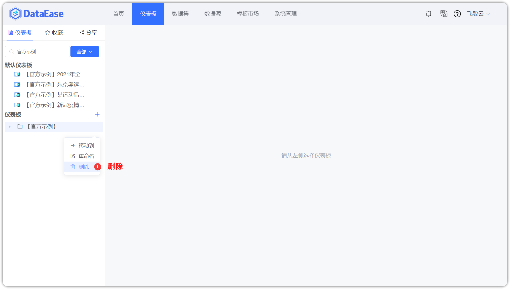
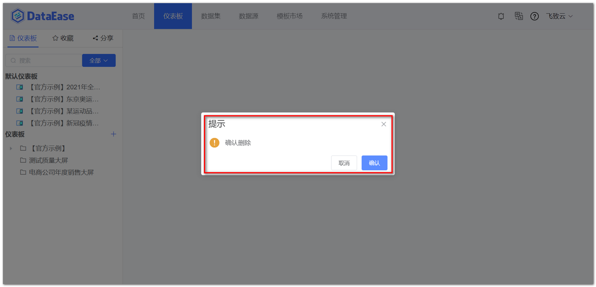
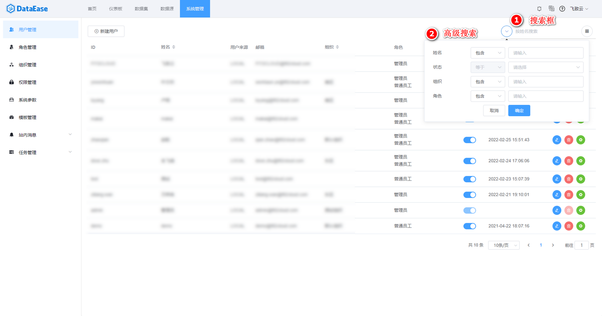
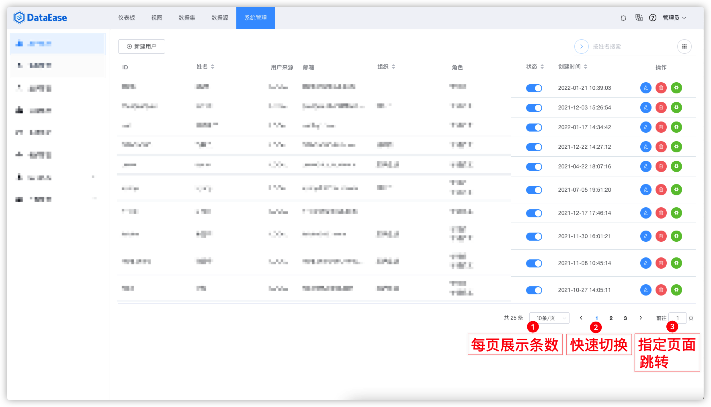

## 一、语言切换
> 点击页面右上方的语言下拉菜单，进行指定语言的切换，目前支持切换简体中文、繁体中文、英文等；

## 二、添加分组
> 在根目录中添加分组（序号1）；在当前目录下添加子分组（序号2）；

## 三、重命名
> 第一步，点击如下图所示位置，选择"重命名"

> 第二步，在下图所示输入框中输入新名称后，点击确认，完成重命名操作

## 四、移动
> 如下图，点击移动，将分组移动至另一个分组下。

> 选择目标分组后，点击【确认】提交，分组移动成功。

## 五、删除
> 第一步，点击如下图所示位置，选择"删除"

> 第二步，弹出提醒框，如果选择"确认"，那么成功删除；如果选择"取消"，删除操作取消

## 六、搜索
支持两种搜索方式：

- 输入连接名称进行模糊搜索
- 高级搜索模式

点击下图箭头，使用高级搜索功能：

## 七、翻页
> 该区域记录数据总条数，当前页码；可点击下拉框，选择每页展示的条数；也可输入页码，直接展示目标页的数据记录。

